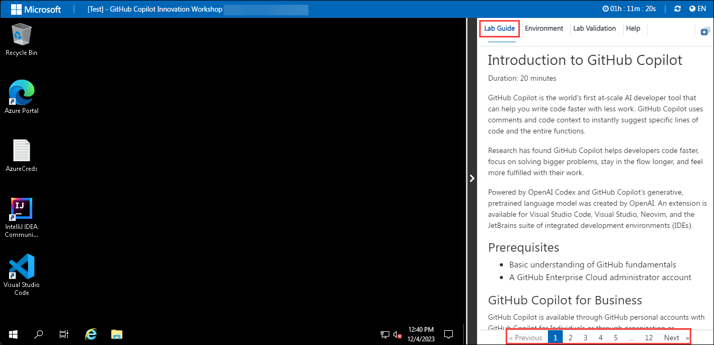
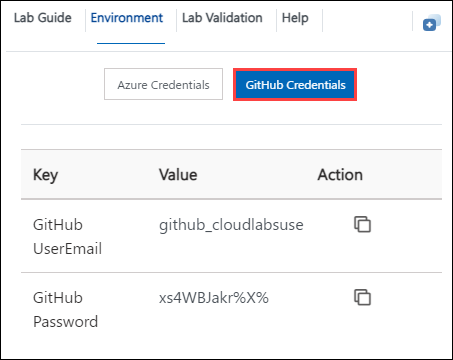
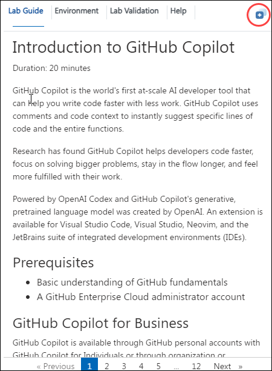
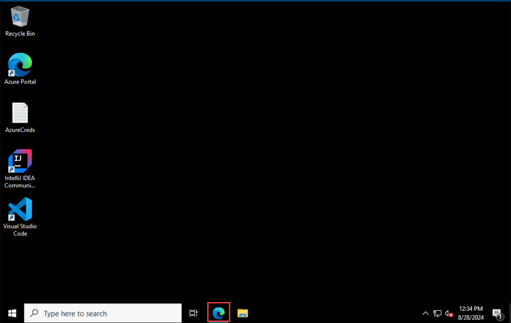

# **Getting Started with Your Github-Copilot Workshop**
 
Welcome to your Github-Copilot workshop! We've prepared a seamless environment for you to explore and learn about Azure services. Let's begin by making the most of this experience:
 
## **Accessing Your Lab Environment**
 
Once you're ready to dive in, your virtual machine and lab guide will be right at your fingertips within your web browser.
 
   

### **Virtual Machine & Lab Guide**
 
Your virtual machine is your workhorse throughout the workshop. The lab guide is your roadmap to success.
 
## **Exploring Your Lab Resources**
 
To get a better understanding of your lab resources and credentials, navigate to the **Environment Details** tab.
 
   
 
## **Utilizing the Split Window Feature**
 
For convenience, you can open the lab guide in a separate window by selecting the **Split Window** button from the Top right corner.
 
   
 
## **Managing Your Virtual Machine**
 
Feel free to start, stop, or restart your virtual machine as needed from the **Resources** tab. Your experience is in your hands!
 
   
 
## Login to GitHub

1. In the LABVM desktop double-click on the **Microsoft Edge** shortcut.

   

1. Navigate to GitHub login page using the provided URL below:
   ```
   https://github.com/login
   ```
   
1. On the **Sign in to GitHub** tab, you will see the login screen. In that screen, enter the following **email** **(1)** and **password** **(2)**. Then click on **Sign in** **(3)**. 

   >**Note**: To get GitHub credentials navigate to the **Environment Details** tab and click on the **GitHub Credentials** option to view the key-value pairs of the **GitHub UserEmail**, and **GitHub Password**. You can use the copy buttons under the actions column to have the values copied instantly. Alternatively, it is suggested to have the values copied over onto a notepad for easy accessibility. 
   
   
          
1. Next, to get the authentication code, sign in to Outlook (https://outlook.office365.com/mail/) with the git credentials within the Environment tab from the previous step. Once you have logged into Outlook, find the recent email containing the verification code. Enter the verification code, and it will verify automatically.

   >**Note:** The email containing the verification code can sometimes creep into the archive/spam folders within your Outlook.

   

1. Right-click on the **Start course** given below, click on the **Copy link**, and navigate to the link inside LabVM in the Edge browser where you have logged into GitHub in the previous steps.

   <!-- For start course, run in JavaScript:
   'https://github.com/new?' + new URLSearchParams({
     template_owner: 'skills',
     template_name: 'copilot-codespaces-vscode',
     owner: '@me',
     name: 'skills-copilot-codespaces-vscode',
     description: 'My clone repository',
     visibility: 'public',
   }).toString()
   -->

   [](https://github.com/new?template_owner=skills&template_name=copilot-codespaces-vscode&owner=%40me&name=skills-copilot-codespaces-vscode&description=My+clone+repository&visibility=public)
   
1. In the new tab, most of the prompts will automatically fill in for you. Leave default for the owner, as you have already logged into GitHub to host the repository **(1)**. Select **Public** repository **(2)** and click the **Create repository** **(3)** button at the bottom of the form.

   

   >**Note**: If the repository is already existing, please delete the existing one and perform the above step again.

1. After your new repository is created, wait about 20 seconds and then refresh the page.

1. Once the repository is created, click on your profile picture and then select **Your organizations**.

   

1. In "Your organization", from the left navigation pane, select **Codespaces**.

   

1. Scroll down and make sure, **Visual Studio Code** is selected, under the **Editor preference** .

     

1. Now, click on **Next** from the lower right corner to move on to the next page.
 
Now you're all set to explore the powerful world of technology. Feel free to reach out if you have any questions along the way. Enjoy your workshop!
