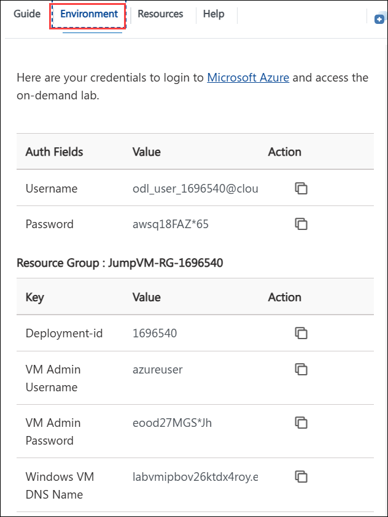
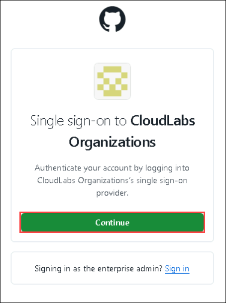
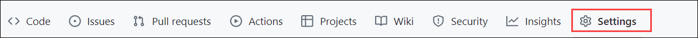
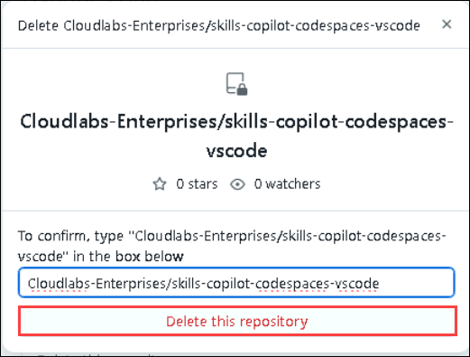

# Getting Started with the Lab

1. You can see a virtual machine desktop 💻 (**LABVM**) loaded on the left side of your browser. Use this virtual machine throughout the workshop to perform the lab. You can also connect to the virtual machine using any RDP client using the **LABVM** credentials provided in the **Environment** tab.
   
   

1. To get a better understanding of your lab resources and credentials, navigate to the **Environment** tab.
 
   
 
## Login to GitHub

1. In the LABVM desktop search for **Microsoft Edge** **(1)**, click on **Microsoft Edge** **(2)** browser.

   

1. Navigate to GitHub login page using the provided URL below:
   ```
   https://github.com/login
   ```

1. On the **Sign in to GitHub** tab, you will see the login screen. enter your GitHub username as **odl-user-<inject key="Deployment ID" enableCopy="false"/>_clabs** **(1)**, then click on **Sign in with your identity provider** to continue **(2)**.

   

1. Click on **Continue** on the **Single sign-on to CloudLabs Organizations** page to proceed.

   

2. You'll see the **Sign in** tab. Here, enter your credentials:
 
   - **Email/Username:** <inject key="AzureAdUserEmail"></inject>
 
       
 
3. Next, provide your password to login:
 
   - **Password:** <inject key="AzureAdUserPassword"></inject>
 
      

1. If prompted to stay signed in, you can click **No**.

1. Right-click on the **Start course** given below, click on the **Copy link**, and navigate to the link inside LabVM in the Edge browser where you have logged into GitHub in the previous steps.

   <!-- For start course, run in JavaScript:
   'https://github.com/new?' + new URLSearchParams({
     template_owner: 'skills',
     template_name: 'copilot-codespaces-vscode',
     owner: '@me',
     name: 'skills-copilot-codespaces-vscode',
     description: 'My clone repository',
     visibility: 'public',
   }).toString()
   -->

   [](https://github.com/new?template_owner=skills&template_name=copilot-codespaces-vscode&owner=%40me&name=skills-copilot-codespaces-vscode&description=My+clone+repository&visibility=public)
   
1. In the new tab, most of the fields will be pre-filled for you. Just make sure to change the **Owner** to **Cloudlabs-Enterprises** **(1)**, then scroll down and click on the **Create repository** **(2)** button to proceed.

   

1. If the repository already exists, please delete the existing one and perform the above step again. To delete the repository, 
follow from step 11 to step 17. In the absence of an existing repository, skip to step 18.

1. Select **Your organizations**.

   

1. Select **Cloudlabs-Enterprise** from organizations.

   

1. From the **Repositories** section, navigate to the **skills-copilot-codespaces-vscode** repository.
      
1. Click on **Settings**.

   

1. Scroll down to the **Danger Zone** pane and click on **Delete this repository**.

     

1. Click on **I want to delete this repository** and accept that you have read and understood the effects.

    

1. Give the name of the repository and click on **Delete this repository**.

    

1. After your new repository is created, wait about 20 seconds and then refresh the page.

1. Once the repository is created, click on your profile picture and then select **Your organizations**.

   

1. In Your organization, select **Codespaces** from the left navigation pane.

   

1. Scroll down and make sure, **Visual Studio Code** is selected, under the **Editor preference** .

     

1. Now, click on **Next** from the lower right corner to move on to the next page.
