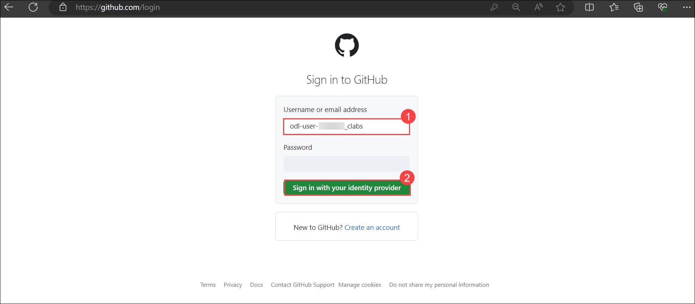
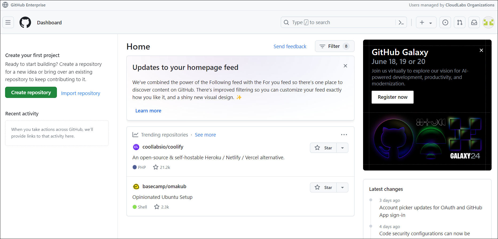

## Login to GitHub

1. In the LABVM desktop search for **Microsoft Edge** **(1)**, click on **Microsoft Edge** **(2)** browser.

   

1. Navigate to GitHub login page using the provided URL below:
   ```
   https://github.com/login
   ```
   
1. On the **Sign in to GitHub** tab, you will see the login screen. In that screen, enter the following **email: odl-user-<inject key="DeploymentID" enableCopy="false"/>_clabs**. Then click on **Sign in with your identity provider** **(2)**. 
   
   
          
1. Next, On the **Single sign-on to CLoudLabs Organizations** select **Continue**.

   

1. On the **Sign in** page, enter the following and select **Sign in**. You will be logged into the GitHub Admin page.

    - **Email**: <inject key="AzureAdUserEmail"></inject>
    - **Password**: <inject key="AzureAdUserPassword"></inject>

        >**Note:** If the **Stay signed in?** pop-ups, select **No**.
   
        

