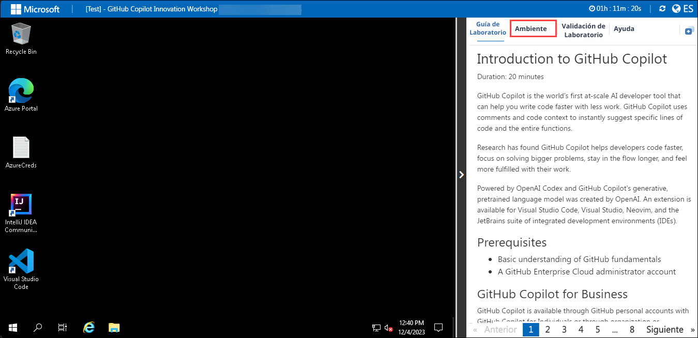
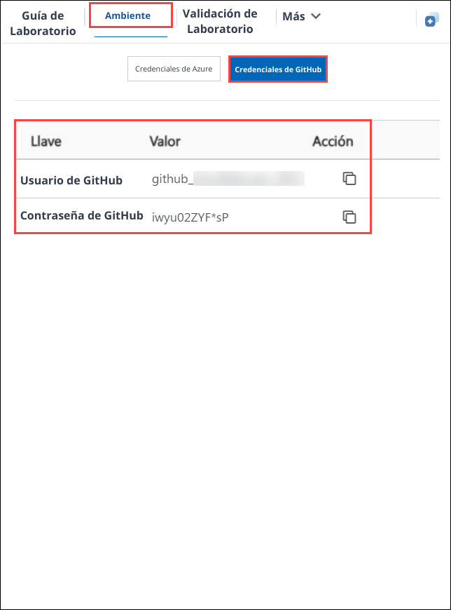

# GitHub Copilot Innovation Workshop

### Overall Estimated Duration: 4 Hours

## Overview

The purpose of this lab is to explore how AI tools like GitHub Copilot and GitHub Codespaces enhance the development process. By providing contextual suggestions and creating consistent, cloud-hosted development environments, these tools streamline coding and improve efficiency. The lab focuses on various features and applications of GitHub Copilot, demonstrating how it can assist with real-time code completions, bug detection, and optimizations across different programming languages and development tasks.

The utilized technical specifications are as follows:

   1. **Tools Used**: GitHub Copilot, GitHub Codespaces, GitHub Copilot Chat, Accessibility Insights for Web
   1. **Supported Programming Languages**: Python, JavaScript, C#
   1. **Compatible Editors/IDEs**: Visual Studio Code, IntelliJ

## Objective

By the end of this lab, you will improve your coding workflow by leveraging AI-powered tools. You will:

- **Leverage Codespaces with VS Code for Copilot**: GitHub Copilot, powered by OpenAI Codex, suggests code from comments and context, supports multiple editors and languages, and integrates with GitHub Codespaces for collaborative coding. As a result of enabling Copilot in Codespaces, you will experience increased productivity with real-time code suggestions, improved code quality, and accelerated learning and onboarding.
- **Exploring AI-Driven Code Suggestions in JavaScript** : Examines how AI enhances JavaScript coding with real-time completions, bug detection, optimizations, and efficiency improvements. By enabling Copilot in a Codespace, you will experience increased productivity with real-time code suggestions while adding and writing a JavaScript file, streamlining the process of pushing code to their repository, and adhering to best practices, enhancing overall code quality and reducing errors.
- **Exploring Python with GitHub Copilot** : GitHub Copilot offers excellent suggestions for languages like Python, JavaScript, Ruby, and more, and assists with database queries. As a result of this exercise, you would have successfully added Python method code with real-time suggestions from GitHub Copilot, viewed multiple code suggestions in the Copilot tab, and pushed the refined code to their repository from the VS Code Codespace.
- **Using GitHub Copilot Chat to generate ARM and Terraform code with Copilot** : Provides coding assistance directly within supported IDEs, offering code suggestions, explanations, unit tests, and bug fixes. Enabling Copilot in Codespaces will result in increased productivity with real-time code suggestions and enhanced code quality while generating ARM, Terraform and PowerShell scripts to deploy resources to Azure.
- **Using GitHub Copilot for Code Refactoring** : Enhances code quality by restructuring for readability, maintainability, and performance without altering external behavior, reducing technical debt and bugs.
- **Using IDEs such as JetBrains IntelliJ for Java** : GitHub Copilot enhances Java coding in IntelliJ by offering intelligent suggestions and auto-completion, elevating productivity and code quality.
- **Enhancing Web Accessibility with GitHub Copilot Chat and Accessibility Insights** : GitHub Copilot Chat accelerates coding with AI-powered suggestions, while Accessibility Insights for Web ensures inclusive, accessible web content.
- **Using GitHub Copilot for T-SQL and YAML Code [Optional]** : Leverage GitHub Copilot to generate code in T-SQL and YAML, using comments to guide its suggestions.
- **Generating Documentation Using GitHub Copilot [Optional]** : Streamlines documentation by auto-generating comments, Markdown, and ensuring consistency, enhancing project accessibility.
- **Working with the Copilot for Machine Learning [Optional]** : Using GitHub Copilot with ML frameworks for tasks such as data preprocessing, model building, and evaluation.
- **Creating a Mini Game with GitHub Copilot [Optional]** : Build a mini game, refining Python skills in console app development.

## Pre-requisites

Fundamental knowledge of **Visual Studio Code** and popular **programming languages** such as Python, Javascript, C# etc.

## Architecture

GitHub Copilot is an AI-powered code completion tool that assists developers by suggesting code snippets and completing code based on the context provided. GitHub Copilot Chat complements this by offering an interactive chat interface where developers can ask questions and receive code suggestions and debugging assistance. Integrated with Visual Studio Code Codespaces, GitHub Copilot benefits from cloud-hosted development environments, ensuring consistency and reliability from anywhere. To enhance web development, Accessibility Insights for Web helps identify and resolve accessibility issues, ensuring inclusive web applications. GitHub Copilot supports various programming languages like Python, JavaScript, and C#, making it a versatile tool for a wide range of coding tasks.

## Architecture Diagram

   

## Explanation of Components

1. **GitHub Copilot**: An AI-powered code completion tool that helps developers by suggesting code snippets and completing code based on the context provided. 

1. **GitHub Copilot Chat**: An interactive chat interface that allows developers to ask questions and receive code suggestions and debugging assistance from GitHub Copilot. 

1. **Codespaces**: Visual Studio Code Codespaces provides cloud-hosted development environments that are accessible from anywhere, ensuring consistency and reliability.

1. **Accessibility Insights for Web**: A browser extension that helps developers find and fix accessibility issues in web applications. 

1. **Programming languages**: They are tools used to write instructions for computers to execute such as Python, Javascript, C# etc.

# Getting Started with the Lab

1. You can see a virtual machine desktop 💻 (**LABVM**) loaded on the left side of your browser. Use this virtual machine throughout the workshop to perform the lab. You can also connect to the virtual machine using any RDP client using the **LABVM** credentials provided in the **Environment** tab.
   
   

1. Once you are in the **Environment** tab click on the **GitHub Credentials** option to get GitHub user credentials. The credentials will also be emailed to your registered email address. You can also open the Lab Guide in a separate, and full window by selecting **Split Window** from the upper right corner. Also, you can start, stop, and restart virtual machines from the **Resources** tab.
 
   
 
## Login to GitHub

1. In the LABVM desktop search for **Microsoft Edge** **(1)**, click on **Microsoft Edge** **(2)** browser.

   

1. Navigate to GitHub login page using the provided URL below:
   ```
   https://github.com/login
   ```
   
1. On the **Sign in to GitHub** tab, you will see the login screen. In that screen, enter the following **email** **(1)** and **password** **(2)**. Then click on **Sign in** **(3)**. 

   >**Note**: To get GitHub credentials navigate to the **Environment** tab and click on the **GitHub Credentials** option to view the key-value pairs of the **GitHub UserEmail**, and **GitHub Password**. You can use the copy buttons under the actions column to have the values copied instantly. Alternatively, it is suggested to have the values copied over onto a notepad for easy accessibility. 
   
   
          
1. Next, to get the authentication code, sign in to Outlook (https://outlook.office365.com/mail/) with the git credentials within the Environment tab from the previous step. Once you have logged into Outlook, find the recent email containing the verification code. Enter the verification code and click on **Verify**.

   >**Note:** The email containing the verification code can sometimes creep into the archive/spam folders within your Outlook.

   

1. Right-click on the **Start course** given below, click on the **Copy link**, and navigate to the link inside LabVM in the Edge browser where you have logged into GitHub in the previous steps.

   <!-- For start course, run in JavaScript:
   'https://github.com/new?' + new URLSearchParams({
     template_owner: 'skills',
     template_name: 'copilot-codespaces-vscode',
     owner: '@me',
     name: 'skills-copilot-codespaces-vscode',
     description: 'My clone repository',
     visibility: 'public',
   }).toString()
   -->

   [](https://github.com/new?template_owner=skills&template_name=copilot-codespaces-vscode&owner=%40me&name=skills-copilot-codespaces-vscode&description=My+clone+repository&visibility=public)
   
1. In the new tab, most of the prompts will automatically fill in for you. Leave default for the owner, as you have already logged into GitHub to host the repository **(1)**. Select **Public** repository **(2)** and click the **Create repository** **(3)** button at the bottom of the form.

   

1. If the repository already exists, please delete the existing one and perform the above step again. To delete the repository, 
follow from step 08 to step 12. In the absence of an existing repository, skip to step 13.

1. Navigate to the existing repository that must be deleted

   
   
   
      
1. Click on **Settings**.

     

1. Scroll down to the **Danger Zone** pane and click on **Delete this repository**.

     

1. Click on **I want to delete this repository** and accept that you have read and understood the effects.

     

1. Give the name of the repository and click on **Delete this repository**.

     

1. After your new repository is created, wait about 20 seconds and then refresh the page.

1. Once the repository is created, click on your profile picture and then select **Your organizations**.

   

1. In Your organization, select **Codespaces** from the left navigation pane.

   

1. Scroll down and make sure, **Visual Studio Code** is selected, under the **Editor preference** .

     

1. Now, click on **Next** from the lower right corner to move on to the next page.

This hands-on lab demonstrates how GitHub Copilot and GitHub Codespaces enhance development through real-time code suggestions and consistent cloud environments.

## Happy Learning!!
