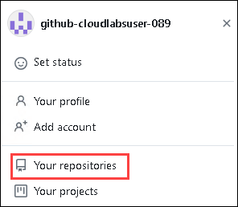
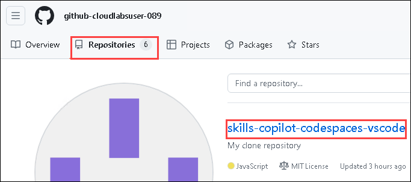
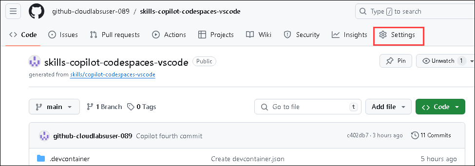
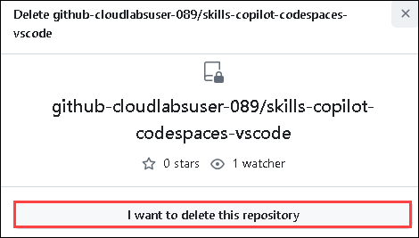

## Getting Started with the Lab

Duration: 10 minutes

1. You can see a virtual machine desktop 💻 (**LABVM**) loaded on the left side of your browser. Use this virtual machine throughout the workshop to perform the lab. You can also connect to the virtual machine using any RDP client using the **LABVM** credentials provided in the **Environment Details** tab.
   
   

1. Once you are in the **Environment Details** tab, the credentials will also be emailed to your registered email address. Click on the **GitHub Credentials** option to get GitHub user credentials. You can also open the Lab Guide in a separate, and full window by selecting **Split Window** from the lower right corner. Also, you can start, stop, and restart virtual machines from the **Resources** tab.
 
   
 
## Login to GitHub

1. In the LABVM desktop search for **Microsoft Edge** **(1)**, click on **Microsoft Edge** **(2)** browser.

   

1. Navigate to GitHub login page using the provided URL below:
   ```
   https://github.com/login
   ```
   
1. On the **Sign in to GitHub** tab, you will see the login screen. In that screen, enter the following **email** **(1)** and **password** **(2)**. Then click on **Sign in** **(3)**. 

   >**Note**: To get GitHub credentials navigate to the **Environment Details** tab and click on the **GitHub Credentials** option to view the key-value pairs of the **GitHub UserEmail**, and **GitHub Password**. You can use the copy buttons under the actions column to have the values copied instantly. Alternatively, it is suggested to have the values copied over onto a notepad for easy accessibility. 
   
   
          
1. Next, to get the authentication code, sign in to Outlook (https://outlook.office365.com/mail/) with the git credentials within the Environment tab from the previous step. Once you have logged into Outlook, find the recent email containing the verification code. Enter the verification code, and click on **Verify**.

   >**Note:** The email containing the verification code can somtimes creep into the archive/spam folders within your Outlook.

   

1. Right-click on the **Start course** given below, click on the **Copy link**, and navigate to the link inside LabVM in the Edge browser where you have logged into GitHub in the previous steps.

   <!-- For start course, run in JavaScript:
   'https://github.com/new?' + new URLSearchParams({
     template_owner: 'skills',
     template_name: 'copilot-codespaces-vscode',
     owner: '@me',
     name: 'skills-copilot-codespaces-vscode',
     description: 'My clone repository',
     visibility: 'public',
   }).toString()
   -->

   [](https://github.com/new?template_owner=skills&template_name=copilot-codespaces-vscode&owner=%40me&name=skills-copilot-codespaces-vscode&description=My+clone+repository&visibility=public)
   
1. In the new tab, most of the prompts will automatically fill in for you. Leave default for the owner, as you have already logged into GitHub to host the repository **(1)**. Select **Public** repository **(2)** and click the **Create repository** **(3)** button at the bottom of the form.

   

   >**Note**: If the repository already exists, please delete the existing one and perform the above step again. To delete the repository, follow the below steps:
    - Navigate to the existing repository that has to be deleted

         
         
      
   - Click on **Settings**.

     

   - Scroll down to the **Danger Zone** pane and click on **Delete this repository**.

     

   - Click on **I want to delete this repository** and accept that you have read and understood the effects.

     

   - Give the name of the repository and click on **Delete this repository**.

     

1. After your new repository is created, wait about 20 seconds and then refresh the page.

1. Once the repository is created, click on your profile picture and then select **Your organizations**.

   

1. In "Your organization", from the left navigation pane, select **Codespaces**.

   

1. Scroll down and make sure, **Visual Studio Code** is selected, under the **Editor preference** .

     

1. Now, click on **Next** from the lower right corner to move on to the next page.
