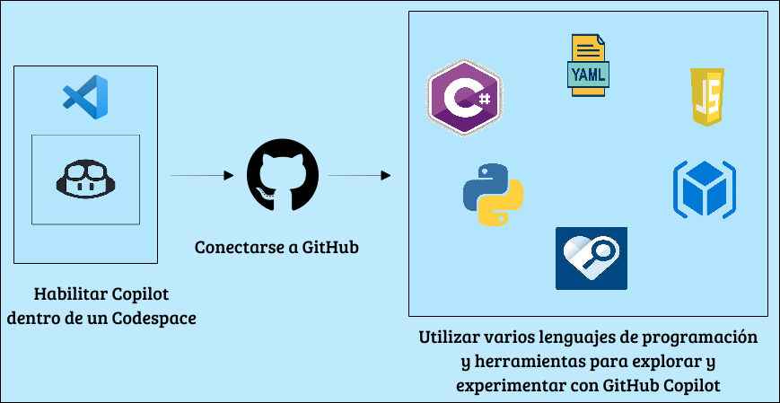

# GitHub Copilot Innovation Workshop

### Overall Estimated Duration: 4 Hours

## Overview

The purpose of this lab is to explore how AI tools like GitHub Copilot and GitHub Codespaces enhance the development process. By providing contextual suggestions and creating consistent, cloud-hosted development environments, these tools streamline coding and improve efficiency. The lab focuses on various features and applications of GitHub Copilot, demonstrating how it can assist with real-time code completions, bug detection, and optimizations across different programming languages and development tasks.

The utilized technical specifications are as follows:

   1. **Tools Used**: GitHub Copilot, GitHub Codespaces, GitHub Copilot Chat, Accessibility Insights for Web
   1. **Supported Programming Languages**: Python, JavaScript, C#
   1. **Compatible Editors/IDEs**: Visual Studio Code, IntelliJ

## Objective

By the end of this lab, you will improve your coding workflow by leveraging AI-powered tools. You will:

- **Leverage Codespaces with VS Code for Copilot**: GitHub Copilot, powered by OpenAI Codex, suggests code from comments and context, supports multiple editors and languages, and integrates with GitHub Codespaces for collaborative coding.
- **Exploring AI-Driven Code Suggestions in JavaScript** : Examines how AI enhances JavaScript coding with real-time completions, bug detection, optimizations, and efficiency improvements.
- **Exploring Python with GitHub Copilot** : GitHub Copilot offers excellent suggestions for languages like Python, JavaScript, Ruby, and more, and assists with database queries.
- **Using GitHub Copilot Chat to generate ARM and Terraform code with Copilot** : Provides coding assistance directly within supported IDEs, offering code suggestions, explanations, unit tests, and bug fixes.
- **Using GitHub Copilot for Code Refactoring** : Enhances code quality by restructuring for readability, maintainability, and performance without altering external behavior, reducing technical debt and bugs.
- **Using IDEs such as JetBrains IntelliJ for Java** : GitHub Copilot enhances Java coding in IntelliJ by offering intelligent suggestions and auto-completion, elevating productivity and code quality.
- **Enhancing Web Accessibility with GitHub Copilot Chat and Accessibility Insights** : GitHub Copilot Chat accelerates coding with AI-powered suggestions, while Accessibility Insights for Web ensures inclusive, accessible web content.
- **Using GitHub Copilot for T-SQL and YAML Code [Optional]** : Leverage GitHub Copilot to generate code in T-SQL and YAML, using comments to guide its suggestions.
- **Generating Documentation Using GitHub Copilot [Optional]** : Streamlines documentation by auto-generating comments, Markdown, and ensuring consistency, enhancing project accessibility.
- **Working with the Copilot for Machine Learning [Optional]** : Using GitHub Copilot with ML frameworks for tasks such as data preprocessing, model building, and evaluation.
- **Creating a Mini Game with GitHub Copilot [Optional]** : Build a mini game, refining Python skills in console app development.

## Pre-requisites

Fundamental knowledge of **Visual Studio Code** and popular **programming languages** such as Python, Javascript, C# etc.

## Architecture

GitHub Copilot is an AI-powered code completion tool that assists developers by suggesting code snippets and completing code based on the context provided. GitHub Copilot Chat complements this by offering an interactive chat interface where developers can ask questions and receive code suggestions and debugging assistance. Integrated with Visual Studio Code Codespaces, GitHub Copilot benefits from cloud-hosted development environments, ensuring consistency and reliability from anywhere. To enhance web development, Accessibility Insights for Web helps identify and resolve accessibility issues, ensuring inclusive web applications. GitHub Copilot supports various programming languages like Python, JavaScript, and C#, making it a versatile tool for a wide range of coding tasks.

## Architecture Diagram

   

## Explanation of Components

1. **GitHub Copilot**: An AI-powered code completion tool that helps developers by suggesting code snippets and completing code based on the context provided. 

1. **GitHub Copilot Chat**: An interactive chat interface that allows developers to ask questions and receive code suggestions and debugging assistance from GitHub Copilot. 

1. **Codespaces**: Visual Studio Code Codespaces provides cloud-hosted development environments that are accessible from anywhere, ensuring consistency and reliability.

1. **Accessibility Insights for Web**: A browser extension that helps developers find and fix accessibility issues in web applications. 

1. **Programming languages**: They are tools used to write instructions for computers to execute such as Python, Javascript, C# etc.

This hands-on lab demonstrates how GitHub Copilot and GitHub Codespaces enhance development through real-time code suggestions and consistent cloud environments.

## Happy Learning!!
