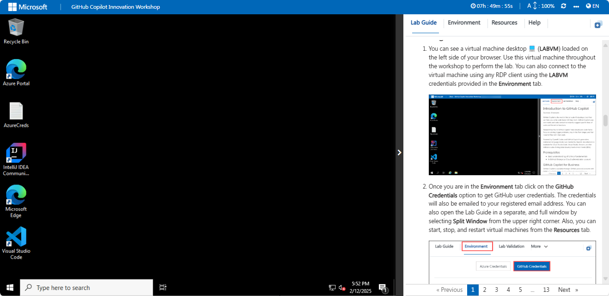

# GitHub Copilot Innovation Workshop

### Overall Estimated Duration: 4 Hours

## Overview

The purpose of this lab is to explore how AI tools like GitHub Copilot and GitHub Codespaces enhance the development process. By providing contextual suggestions and creating consistent, cloud-hosted development environments, these tools streamline coding and improve efficiency. The lab focuses on various features and applications of GitHub Copilot, demonstrating how it can assist with real-time code completions, bug detection, and optimizations across different programming languages and development tasks.

## Objective

By the end of this lab, you will improve your coding workflow by leveraging AI-powered tools. You will:

- **Leverage Codespaces with VS Code for Copilot**: This hands-on exercise suggests code from comments and context, supports multiple editors and languages, and integrates with GitHub Codespaces for collaborative coding. As a result of enabling Copilot in Codespaces, you will experience increased productivity with real-time code suggestions, improved code quality, and accelerated learning and onboarding.
- **Exploring AI-Driven Code Suggestions in JavaScript** : This hands-on exercise aims to examine how AI enhances JavaScript coding with real-time completions, bug detection, optimizations, and efficiency improvements. By enabling Copilot in a Codespace, you will experience increased productivity with real-time code suggestions while adding and writing a JavaScript file, streamlining the process of pushing code to their repository, and adhering to best practices, enhancing overall code quality and reducing errors.
- **Exploring Python with GitHub Copilot** : This hands-on exercise aims to offer excellent suggestions for languages like Python, JavaScript, Ruby, and more, and assists with database queries. As a result of this exercise, you would have successfully added Python method code with real-time suggestions from GitHub Copilot, viewed multiple code suggestions in the Copilot tab, and pushed the refined code to their repository from the VS Code Codespace.
- **Using GitHub Copilot Chat to generate ARM and Terraform code with Copilot** : This hands-on exercise aims to provide coding assistance directly within supported IDEs, offering code suggestions, explanations, unit tests, and bug fixes. Enabling Copilot in Codespaces will result in increased productivity with real-time code suggestions and enhanced code quality while generating ARM, Terraform and PowerShell scripts to deploy resources to Azure.
- **Using GitHub Copilot for Code Refactoring** : This hands-on exercise aims to enhance code quality by restructuring for readability, maintainability, and performance without altering external behavior, reducing technical debt and bugs. By using GitHub Copilot to refactor the code and employing Copilot Chat with code, you enhanced the code’s quality and productivity. This exercise also facilitates better understanding of the refactored code, sped up unit test creation, and streamlined pushing code to your repository.
- **Using IDEs such as JetBrains IntelliJ for Java** : This hands-on exercise aims to enhance Java coding in IntelliJ by offering intelligent suggestions and auto-completion, elevating productivity and code quality. Installed the GitHub Copilot plugin and created a basic Java project in IntelliJ IDEA. Utilized Copilot to get enhanced code suggestions and generate code from comments.
- **Enhancing Web Accessibility with GitHub Copilot Chat and Accessibility Insights** : This hands-on exercise aims to accelerate coding with AI-powered suggestions, while Accessibility Insights for Web ensures inclusive, accessible web content. By completing the exercise, you have successfully set up the Accessibility Insights for Web extension in Microsoft Edge, which now allows you to effectively evaluate and address accessibility issues in web projects.
- **Using GitHub Copilot for T-SQL and YAML Code [Optional]** : This hands-on exercise aims to leverage GitHub Copilot to generate code in T-SQL and YAML, using comments to guide its suggestions. As a result of completing the exercise, the user successfully generated a SQL query and YAML configuration using GitHub Copilot, leveraging comments to guide the AI’s assistance.
- **Generating Documentation Using GitHub Copilot [Optional]** : This hands-on exercise aims to streamline documentation by auto-generating comments, Markdown, and ensuring consistency, enhancing project accessibility. As an outcome of this exercise, you will effectively generate documentation using GitHub Copilot
- **Working with the Copilot for Machine Learning [Optional]** : This hands-on exercise aims to use GitHub Copilot with ML frameworks for tasks such as data preprocessing, model building, and evaluation. By the end of this exercise, you have set up a environment, experimented with code auto-completion, applied mathematical and machine learning techniques, performed data visualization and transformation, and trained a sample model.
- **Creating a Mini Game with GitHub Copilot [Optional]** : This hands-on exercise aims to build a mini game, refining Python skills in console app development. After completing the exercise, you will have successfully set up your environment, tested your GitHub Codespace to ensure it's functioning correctly, and created the game logic, providing a fully operational setup for your project.

## Pre-requisites

Fundamental knowledge of **Visual Studio Code** and popular **programming languages** such as Python, Javascript, C# etc.

## Architecture

GitHub Copilot is an AI-powered code completion tool that assists developers by suggesting code snippets and completing code based on the context provided. GitHub Copilot Chat complements this by offering an interactive chat interface where developers can ask questions and receive code suggestions and debugging assistance. Integrated with Visual Studio Code Codespaces, GitHub Copilot benefits from cloud-hosted development environments, ensuring consistency and reliability from anywhere. To enhance web development, Accessibility Insights for Web helps identify and resolve accessibility issues, ensuring inclusive web applications. GitHub Copilot supports various programming languages like Python, JavaScript, and C#, making it a versatile tool for a wide range of coding tasks.

## Architecture Diagram

   

## Explanation of Components

1. **GitHub Copilot**: An AI-powered code completion tool that helps developers by suggesting code snippets and completing code based on the context provided. 

1. **GitHub Copilot Chat**: An interactive chat interface that allows developers to ask questions and receive code suggestions and debugging assistance from GitHub Copilot. 

1. **Codespaces**: Visual Studio Code Codespaces provides cloud-hosted development environments that are accessible from anywhere, ensuring consistency and reliability.

1. **Accessibility Insights for Web**: A browser extension that helps developers find and fix accessibility issues in web applications. 

1. **Programming languages**: They are tools used to write instructions for computers to execute such as Python, Javascript, C# etc.

# Getting Started with the Lab

Welcome to your GitHub Copilot Innovation workshop! We've prepared a seamless environment for you to explore and learn GitHub Copilot Services. Let's begin by making the most of this experience:

## Accessing Your Lab Environment
 
Once you're ready to dive in, your virtual machine and lab guide will be right at your fingertips within your web browser.
   
   

### Virtual Machine & Lab Guide
 
Your virtual machine is your workhorse throughout the workshop. The lab guide is your roadmap to success.

## Exploring Your Lab Resources
 
1. To get a better understanding of your lab resources and credentials, navigate to the **Environment** tab.
 
   

## Utilizing the Split Window Feature
 
For convenience, you can open the lab guide in a separate window by selecting the **Split Window** button from the top right corner.
 

 
## Utilizing the Zoom In/Out Feature

To adjust the zoom level for the environment page, click the A↕ : 100% icon located next to the timer in the lab environment.


## Managing Your Virtual Machine
 
Feel free to **start**, **stop**, or **restart** your virtual machine as needed from the **Resources** tab. Your experience is in your hands!
 


## Login to GitHub

1. In the LABVM desktop search for **Microsoft Edge** **(1)**, click on **Microsoft Edge** **(2)** browser.

   

1. Navigate to GitHub login page using the provided URL below:
   ```
   https://github.com/login
   ```

1. On the **Sign in to GitHub** tab, you will see the login screen. enter your GitHub username as **<inject key="GitHub User Name" enableCopy="true"/>_clabs** **(1)**, then click on **Sign in with your identity provider** to continue **(2)**.

   

1. Click on **Continue** on the **Single sign-on to CloudLabs Organizations** page to proceed.

   

2. You'll see the **Sign in** tab. Here, enter your Azure Entra credentials:
 
   - **Email/Username:** <inject key="AzureAdUserEmail"></inject>
 
       
 
3. Next, provide your password to login:
 
   - **Password:** <inject key="AzureAdUserPassword"></inject>
 
      

1. If prompted to stay signed in, you can click **No**.

1. Right-click on the **Start course** button below, select **Copy link**, and open the copied link in the Edge browser on the LabVM where you previously signed in to GitHub.

   <!-- For start course, run in JavaScript:
   'https://github.com/new?' + new URLSearchParams({
     template_owner: 'skills',
     template_name: 'copilot-codespaces-vscode',
     owner: '@me',
     name: 'skills-copilot-codespaces-vscode',
     description: 'My clone repository',
     visibility: 'public',
   }).toString()
   -->

   [](https://github.com/new?template_owner=skills&template_name=copilot-codespaces-vscode&owner=%40me&name=skills-copilot-codespaces-vscode&description=My+clone+repository&visibility=public)

1. In the new tab, most fields will be pre-filled. Just update the **Owner** to **Cloudlabs-Enterprises** **(1)**, change the Repository name to **skills-copilot-codespaces-vscode-<inject key="DeploymentID" enableCopy="false"/>** **(2)** to make it unique, and then click **Create repository** **(3)** to continue.


   

   >**Note:** If you receive the pop-up **The Repository already exists**, please delete the existing one and perform the above step again. To delete the existing repository, navigate to the following link:
      
   - [Delete the Repository](#delete-the-repository)
      
   >**Note:**  In the absence of an existing repository, skip to the next step.

1. After your new repository is created, wait about 20 seconds and then refresh the page.

1. Once the repository is created, click on your profile picture and then select **Your organizations**.

   

1. In Your organization, select **Codespaces** from the left navigation pane.

   

1. Scroll down and make sure, **Visual Studio Code** is selected, under the **Editor preference** .

     

1. Now, click on **Next** from the lower right corner to move on to the next page.

## Delete the Repository

   > **Note**: If the repository is already forked, please skip the steps below and proceed with the next exercise.

1. Select **Your organizations**.

   

1. Select **Cloudlabs-Enterprise** from organizations.

   

1. From the **Repositories** section, navigate to the **skills-copilot-codespaces-vscode** repository.
      
1. Click on **Settings**.

   

1. Scroll down to the **Danger Zone** pane and click on **Delete this repository**.

     

1. Click on **I want to delete this repository** and accept that you have read and understood the effects.

    

1. Give the name of the repository and click on **Delete this repository**.

   

   > **Note:** Once the existing repository has been deleted, please repeat the step-09 in the previous task.

This hands-on lab demonstrates how GitHub Copilot and GitHub Codespaces enhance development through real-time code suggestions and consistent cloud environments.

## Support Contact

1. The CloudLabs support team is available 24/7, 365 days a year, via email and live chat to ensure seamless assistance at any time. We offer dedicated support channels tailored specifically for both learners and instructors, ensuring that all your needs are promptly and efficiently addressed.

   Learner Support Contacts:

   - Email Support: cloudlabs-support@spektrasystems.com
   - Live Chat Support: https://cloudlabs.ai/labs-support

1. Now, click on Next from the lower right corner to move on to the next page.
   
## Happy Learning!!
