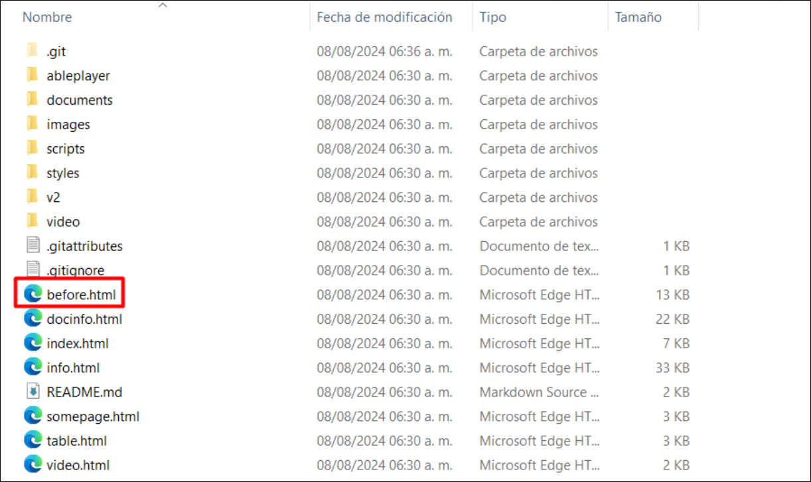

# GitHub Copilot + Accessibility Insights for Web

Duration: 90 minutes

**Accessibility Insights for Web** is a powerful, user-friendly tool that helps in making web content accessible to all users, including those with disabilities. By integrating this tool into the development and testing process, web developers can ensure their websites meet accessibility standards, enhancing usability and inclusivity.

Accessible University (AU) is a fictional university home page designed to demonstrate a variety of common web design problems that result in visitors with disabilities being unable to access content or features

Use the AU site to:

1. demonstrate common web accessibility principles at trainings, presentations, and workshops on accessible web design.
   
1. learn common web accessibility problems and solutions in an easy-to-understand way.

Refer to the link for more information [Accessible University](https://www.washington.edu/accesscomputing/AU/).

## Task 1: Setting up Accessibility Insights for web

1. Navigate to the [Accessibility Insights for web](https://accessibilityinsights.io/docs/web/overview/)

1. Navigate to **Accessibility Insights for web** page using the provided URL below:
   
     ```
    https://accessibilityinsights.io/docs/web/overview/
     ```
     
1. From Accessibility Insights for Web page, click on the **Download for Web** option.

   

1. Click the **+ Add to Microsoft Edge** link from the Download Accessibility Insights page.

   

1. Select the **Get** option.
   
   

1. A pop-up appears; select the **Add extension** option from there. It will start downloading a extension in your web browser.

   

1.  Click on the **extension (1)** symbol from the browser, from Accessibility Insights for Web, select **(...)** **(2)** option and  click on the **Manage extension** option.
   
    

1. On the Mangae extension page, scroll down and click on **Allow access to file URLs** checkbox.

   

## Task 2: 

### Verify GitHub Copilot Chat extension in VS Code

1. Start **Visual Studio Code** from the desktop.

    

1. To Verify the GitHub Copilot Chat extension, the following steps are to be performed within Visual Studio Code:
    - Click on the **Extensions (1)** icon in the activity bar present on the left side of the Visual Studio Code Window.
    - In the "Search Extensions in Marketplace" search box, type and search for the **GitHub Copilot Chat (2)** extension.
    - Select **GitHub Copilot Chat (3)** from the list of results that show up, and verify that **GitHub Copilot Chat** has been installed.
    - If not, click on the **Install (4)** button.

   

1. Once the installation is complete, in the left navigation pane you will able to see the icon for GitHub Copilot Chat as shown below.

   

1. Go to **Account** icon from bottom and click on **Sign in with GitHub**.

    

1. Sign in with GitHub Credentials and on the **Authorize GitHub for VS Code** page click on the **Authorize Visual-Studio-Code.**

    

1. If you get the pop-up, The site is trying to open the Visual Studio Code then click on **Open**. It will navigate back to the Visual Studio.

    

1. In the Visual Studio Code terminal, click on **(...)** (1) and select the **Terminal** (2) menu, select **New Terminal** (3). The terminal window usually opens in the lower half of your screen.

    
    
1. Clone the repository by running the following command:

    ```
   git clone https://github.com/CloudLabsAI-Azure/AU.git
    ```

    

1. Go to the **Explorer** in the upper left corner, select **Open Folder**, select the folder you cloned.
   
   

1. Select **Yes, I trust the authors**.

   

1. Once the folder is open, select **before.html** file to open.

1. Now go to the file explorer and open the folder you have cloned, from ther double click on the before.html file it will open in your web browser where you already add Accessibility Insights for Web.

   

   

1. Now click on the extension and select **Accessibility Insights for Web**, then click on the **FastPass** it will one in new windows.

- **FastPass:** [FastPass](https://accessibilityinsights.io/docs/web/getstarted/fastpass/) is a lightweight, two-step process that helps developers identify common, high-impact accessibility issues in less than five minutes.

   

   

1. Now expand the colour contrast issue to check their details.

- **Automated checks:** The tool automatically checks for compliance with dozens of accessibility requirements 

- **Tab stops:** The tool provides clear instructions, partial automation, and a visual helper that makes it easy to identify critical accessibility issues related to keyboard access, such as missing tab stops, keyboard traps, and incorrect tab order.

- **Needs review:** The tool provides instances that need to be reviewed by a human to determine whether they pass or fail.

   

1. Copy the **How to fix** part and navigate back to your vs code.

   

1. Click on the Chat window and paste your issues by adding a giving the prompt, click on enter.

   ```
   Fix the color contrast issue for the nth-child by considering html and css files
   ```

   

1. Review the suggestion from GitHub Copilot which were generated based on the context and ensure it meets your requirements.

   

   >**Note:** It should be noted that the code suggestions offered by GitHub Copilot might not exactly match the screenshots shown within the labguide. GitHub Copilot is an AI-powered tool that generates code based on context and patterns, and its suggestions can be influenced by various factors.

   >**Note:** If the suggestions do not appear, consider restarting Visual Studio Code and redoing the process.

1. Now open the **before-menu.css** file and replace the **Color** with the suggested code given by the Github copilot over the line number 30. **Save** the file by **Ctrl + s**.

   ```
   color: #5e6572;
   ```

   

1. Now refresh your **Accessible  University** page and click on **Start over** for  **Accessibility Insights for Web**. you will find your get reducued now.

   

   

   >**Note:** If its did not reload the data, then perform the step 13.

1. Click on the **html-has-lang** to view the error.

    

1. Copy the **How to fix** part and navigate back to your vs code.

1. Click on the Chat window and paste your issue, click on enter. 

1. Review the suggestion from GitHub Copilot which were generated based on the context and ensure it meets your requirements.

   

1. Change your **before.html** file according to the provided suggestion by GitHub Copilot. **Save** the file by **Ctrl + s**.

   

1. Now refresh your **Accessible  University** page and click on **Start over** for  **Accessibility Insights for Web**. you will find your get reducued now.

1. Now expand the **image-alt** to view the error message.

1. Copy the **How to fix** part, with the given **Snippet** for both error and navigate back to your vs code.

1. Click on the Chat window and paste your **How to fix** and **Snippet** part by adding a giving the prompt, click on enter.

   ```
   fix the image-alt issue for
   ```

   

   >**Note:** Here you added the **Snippet** for both error with the given prompt.

1. Review the suggestion from GitHub Copilot which were generated based on the context and ensure it meets your requirements.

   

1. Update your **before.html** file according to the provided suggestion by GitHub Copilot.

1. Code updation for **carousel**. Refer the provided screenshots for **before** and **after** updation of code. 

   

   

1. Code updation for **captcha**. Refer the provided screenshots for **before** and **after** updation of code. 

   

   

1. **Save** the file by **Ctrl + s**.

1. Now refresh your **Accessible  University** page and click on **Start over** for **Accessibility Insights for Web**. you will notice error gets reducued now.

1. Now expand the **image-alt** to view the error message.

1. Navigate back to your vs code.

1. Click on the Chat window and provide the given prompt, click on enter.

   ```
   fix the label issue for all the labels in before.html file
   ```

1. It will generate a bunch of code that helps to resolve all the **label** issue in before.html file. 

   ```
           <!-- container for displaying form errors -->
           <div id="error"></div>
   
           <div class="required">
             <label for="name">Name:</label>
             <input type="text" id="name" name="name"/>
           </div>
           
           <div class="required">
             <label for="email">Email:</label>
             <input type="text" id="email" name="email"/>
           </div>
           
           <div>
             <label for="country">Country:</label>
             <input type="text" id="country" name="country"/>
           </div>
           
           <div><b>Desired major(s):</b></div>
           
           <div id="majors">
             <div class="major"><label for="major_cs">Computer Science</label> <input type="checkbox" id="major_cs" name="major_cs"/></div>
             <div class="major"><label for="major_eng">Engineering</label> <input type="checkbox" id="major_eng" name="major_eng"/></div>
             <div class="major"><label for="major_econ">Economics</label> <input type="checkbox" id="major_econ" name="major_econ"/></div>
             <div class="major"><label for="major_phy">Physics</label> <input type="checkbox" id="major_phy" name="major_phy"/></div>
             <div class="major"><label for="major_psy">Psychology</label> <input type="checkbox" id="major_psy" name="major_psy"/></div>
             <div class="major"><label for="major_sp">Spanish</label> <input type="checkbox" id="major_sp" name="major_sp"/></div>
           </div>
   
           <div id="captcha-container">
             <b>Security Test</b>
             <p>Please enter the two words you see below, separated by a space</p>
             <label for="captcha-input">Security Test:</label>
             <input type="text" id="captcha-input" name="captcha"/>
             
           </div>
   
   ```

   **Note:** It is possible that it will not include all of the labels found in **before.html**. In that scenario, you can give the prompt for that specific label again.

1. **Save** the file by **Ctrl + s**.

1. Now refresh your **Accessible  University** page and click on **Start over** for **Accessibility Insights for Web**. you will notice error gets reducued now.

1. Now expand the **link-in-text-block** to view the error message.

   

1. Copy the **How to fix** part, with the given **Snippet** and navigate back to your vs code.

1. Click on the Chat window and paste your **How to fix** and **Snippet** part by adding a giving the prompt, click on enter.

   ```
   fix the link-in-text-block issue for 
   ```

   
   
   >**Note:** Here you added the **Snippet** for all three error with the given prompt.

1. Review the suggestion from GitHub Copilot which were generated based on the context and ensure it meets your requirements.

   

1. Change your **before.html** file according to the provided suggestion by GitHub Copilot.

   

1. **Save** the file by **Ctrl + s**.

1. Now refresh your **Accessible  University** page and click on **Start over** for **Accessibility Insights for Web**. you will notice tha their is no issue left.

   

### Summary

In this exercise, you have worked on GitHub Copilot + Accessibility Insights for Web extension and its related features.
