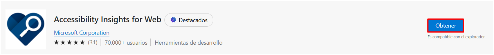
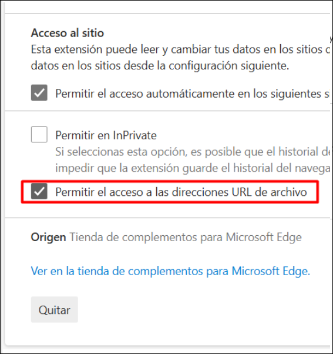
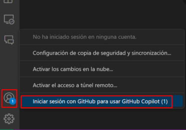
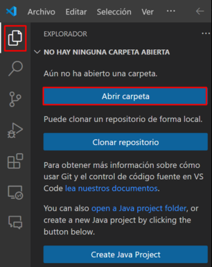

# GitHub Copilot + Accessibility Insights for Web

Duration: minutes

**Accessibility Insights for Web** is a tool to help web developers and testers ensure their websites and web applications are accessible to people with disabilities. The primary goal of Accessibility Insights for Web is to assist in identifying and fixing accessibility issues based on established web standards and best practices.

**Accessibility Insights for Web** is a powerful, user-friendly tool that helps in making web content accessible to all users, including those with disabilities. By integrating this tool into the development and testing process, web developers can ensure their websites meet accessibility standards, enhancing usability and inclusivity.

Accessible University (AU) is a fictional university home page designed to demonstrate a variety of common web design problems that result in visitors with disabilities being unable to access content or features

Use the AU site to:

1. demonstrate common web accessibility principles at trainings, presentations, and workshops on accessible web design.
   
1. learn common web accessibility problems and solutions in an easy-to-understand way.

## Task 1: Setting up Accessibility Insights for web

1. Navigate to the [Accessibility Insights for web](https://accessibilityinsights.io/docs/web/overview/)

1. Navigate to **Accessibility Insights for web** page using the provided URL below:
   
     ```
    https://accessibilityinsights.io/docs/web/overview/
     ```
     
1. From Accessibility Insights for Web page, click on the **Download for Web** option.

   

1. Click the **+ Add to Microsoft Edge** link from the Download Accessibility Insights page.

   

1. Select the **Get** option.
   
   

1. A pop-up appears; select the **Add extension** option from there. It will start downloading a extension in your web browser.

   

1.  Click on the **extension (1)** symbol from the browser, from Accessibility Insights for Web, select **(...)** **(2)** option and  click on the **Manage extension** option.
   
    

1. On the Mangae extension page, scroll down and click on **Allow access to file URLs** checkbox.

   

## Task 2: 

### Verify GitHub Copilot Chat extension in VS Code

1. Start **Visual Studio Code** from the desktop.

    

1. To Verify the GitHub Copilot Chat extension, the following steps are to be performed within Visual Studio Code:
    - Click on the **Extensions (1)** icon in the activity bar present on the left side of the Visual Studio Code Window.
    - In the "Search Extensions in Marketplace" search box, type and search for the **GitHub Copilot Chat (2)** extension.
    - Select **GitHub Copilot Chat (3)** from the list of results that show up, and verify that **GitHub Copilot Chat** has been installed.
    - If not, click on the **Install (4)** button.

   

1. Once the installation is complete, in the left navigation pane you will able to see the icon for GitHub Copilot Chat as shown below.

   

1. Go to **Account** icon from bottom and click on **Sign in with GitHub**.

    

1. Sign in with GitHub Credentials and on the **Authorize GitHub for VS Code** page click on the **Authorize Visual-Studio-Code.**

    

1. If you get the pop-up, The site is trying to open the Visual Studio Code then click on **Open**. It will navigate back to the Visual Studio.

    

1. In the Visual Studio Code terminal, click on **(...)** (1) and select the **Terminal** (2) menu, select **New Terminal** (3). The terminal window usually opens in the lower half of your screen.

    
    
1. Clone the repository by running the following command:

    ```
   git clone https://github.com/CloudLabsAI-Azure/AU.git
    ```

    

1. Go to the **Explorer** in the upper left corner, select **Open Folder**, select the folder you cloned.
   
   

1. Select **Yes, I trust the authors**.

   

1. Once the folder is open, select **before.html** file to open.

1. Now go to the file explorer and open the folder you have cloned, from ther double click on the before.html file it will open in your web browser where you already add Accessibility Insights for Web.

   

   

1. Now click on the extension and select **Accessibility Insights for Web**, then click on the **FastPass** it will onen in new windows.

   

   

1. Now expand the colour contrast issue to check their details.

   

1. Copy the **How to fix** part and navigate back to your vs code.

   

1. Click on the Chat window and paste your issues by giving the prompt, click on enter.

   ```
   Fix the color contrast issue for the nth-child by considering html and css files
   ```

   

1. Review the suggestion from GitHub Copilot which were generated based on the context and ensure it meets your requirements.

   

   >**Note:** It should be noted that the code suggestions offered by GitHub Copilot might not exactly match the screenshots shown within the labguide. GitHub Copilot is an AI-powered tool that generates code based on context and patterns, and its suggestions can be influenced by various factors.

   >**Note:** If the suggestions do not appear, consider restarting Visual Studio Code and redoing the process.

1. 


