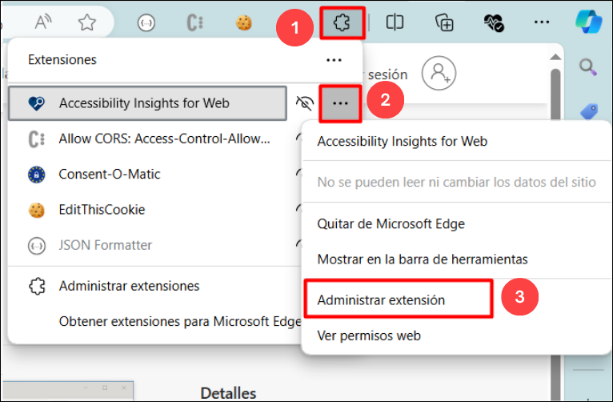

# GitHub Copilot + Accessibility Insights for Web

Duration: minutes

**Accessibility Insights for Web** is a tool to help web developers and testers ensure their websites and web applications are accessible to people with disabilities. The primary goal of Accessibility Insights for Web is to assist in identifying and fixing accessibility issues based on established web standards and best practices.

**Accessibility Insights for Web** is a powerful, user-friendly tool that helps in making web content accessible to all users, including those with disabilities. By integrating this tool into the development and testing process, web developers can ensure their websites meet accessibility standards, enhancing usability and inclusivity.

Accessible University (AU) is a fictional university home page designed to demonstrate a variety of common web design problems that result in visitors with disabilities being unable to access content or features

Use the AU site to:

1. demonstrate common web accessibility principles at trainings, presentations, and workshops on accessible web design.
   
1. learn common web accessibility problems and solutions in an easy-to-understand way.

## Task 1: Setting up Accessibility Insights for web

1. Navigate to the [Accessibility Insights for web](https://accessibilityinsights.io/docs/web/overview/)

1. Navigate to **Accessibility Insights for web** page using the provided URL below:
   
     ```
    https://accessibilityinsights.io/docs/web/overview/
     ```
     
1. From Accessibility Insights for Web page, click on the **Download for Web** option.

   

1. Click the **+ Add to Microsoft Edge** link from the Download Accessibility Insights page.

   

1. Select the **Get** option.
   
   

1. A pop-up appears; select the **Add extension** option from there. It will start downloading a extension in your web browser.

   

1.  Click on the **extension (1)** symbol from the browser, from Accessibility Insights for Web, select **(...)** **(2)** option and  click on the **Manage extension** option.
   
    

1. On the Mangae extension page, scroll down and click on **Allow access to file URLs** checkbox.

   

1. 
   

1. 
