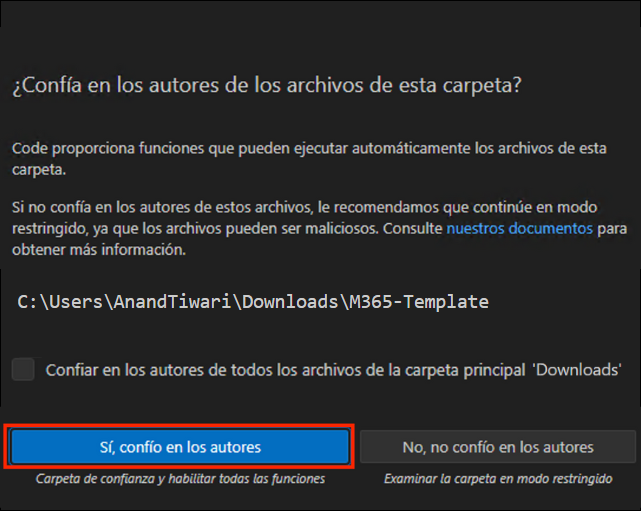
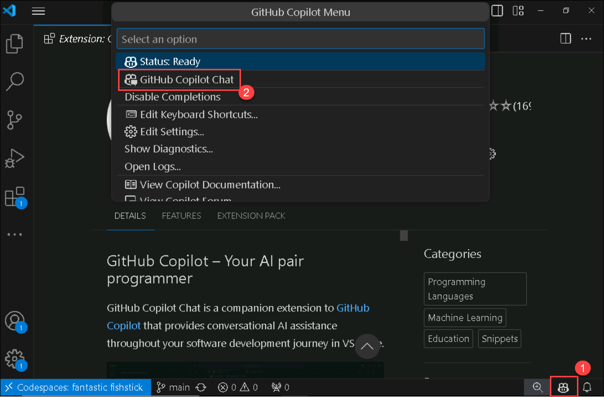

# Exercise 11: GitHub Copilot + Accessibility Insights for Web

Duration: 90 minutes

**GitHub Copilot Chat** is an AI-powered code completion tool that helps developers by suggesting code snippets and solutions based on context. This tool can significantly speed up the development process by providing relevant code suggestions and automating repetitive tasks.

**Accessibility Insights for Web** is a powerful, user-friendly tool that helps make web content accessible to all users, including those with disabilities. By integrating this tool into the development and testing process, web developers can ensure their websites meet accessibility standards, enhancing usability and inclusivity.

Accessible University (AU) is a fictional university home page designed to demonstrate a variety of common web design problems that result in visitors with disabilities being unable to access content or features.

Use the AU site to:

1. Demonstrate common web accessibility principles at trainings, presentations, and workshops on accessible web design.
   
1. Learn common web accessibility problems and solutions in an easy-to-understand way.

In this exercise, you will use Accessibility Insights for Web to identify accessibility issues on a sample website and then employ GitHub Copilot Chat to generate and implement code fixes for these issues. The target website, Accessible University (AU), is a fictional homepage designed to showcase common web design problems that hinder accessibility. By the end of this exercise, you will have enhanced the accessibility of the AU site, making it more user-friendly for individuals with disabilities.

## Task 1: Set Up Accessibility Insights for Web extension in Microsoft Edge

1. Navigate to the **Accessibility Insights for Web** page using the provided URL below:
   
     ```
    https://accessibilityinsights.io/docs/web/overview/
     ```
     
1. From the Accessibility Insights for Web page, click on the **Download for Web** option.

   

1. Click the **+ Add to Microsoft Edge** button from the Download Accessibility Insights page.

   

1. Select the **Get** option.
   
   

1. A pop-up appears. Select the **Add extension** option from there. It will start downloading an extension in your web browser.

   

1.  Click on the **Extensions** **(1)** icon in the browser toolbar. From Accessibility Insights for Web, select the **(...)** **(2)** option and click on **Manage extension** **(3)**.
   
    

1. In the **Manage Extension** page, scroll down and click on the **Allow access to file URLs** checkbox.

   

## Task 2: Verify the GitHub Copilot Chat extension and Clone Accessible University GitHub Repo in VS Code

1. Start **Visual Studio Code** from the desktop.

    

1. To verify the **GitHub Copilot Chat extension**, the following steps are to be performed within Visual Studio Code:
    - Click on the **Extensions (1)** icon in the activity bar present on the left side of the Visual Studio Code Window.
    - In the **"Search Extensions in Marketplace"** search box, type and search for the **GitHub Copilot Chat (2)** extension.
    - Select **GitHub Copilot Chat (3)** from the list of results that show up, and verify that **GitHub Copilot Chat** has been installed.
    - If not, click on the **Install (4)** button.

   

1. Once the installation is complete, in the left navigation pane, you will be able to see the icon for GitHub Copilot Chat, as shown below.

   

1. Skip to step 8. If you have already signed in to a GitHub Account in VS Code. If not, then follow steps 5 to 7.

1. Select the **Account** icon from bottom and click on **Sign in with GitHub**.

    

1. Sign in with GitHub Credentials, and on the **Authorize GitHub for VS Code** page, click on the **Authorize Visual-Studio-Code.**

    

1. If you get the pop-up, the site is trying to open the Visual Studio Code, then click on **Open**. It will navigate back to the **Visual Studio**.

    

1. In the **Visual Studio Code terminal,** click on **(...)** **(1)** to select the **Terminal** **(2)** menu, followed by selecting **New Terminal** **(3)**. The terminal window usually opens in the lower half of your screen.

    
    
1. Run the following command given below to clone the Accessible University GitHub repo.

    ```
   git clone https://github.com/CloudLabsAI-Azure/AU.git
    ```

    

1. Switch to the **Explorer** in the upper left corner, select **Open Folder**, and select the folder you have cloned.
   
   

1. Select **Yes, I trust the authors**.

   

1. Once the folder is opened, select the `before.html` file.

1. Navigate to **File Explorer** and open the folder you have cloned. From there, double-click on the `before.html` file. It will open in your web browser, where you have already added **Accessibility Insights for Web** extension.

   

   

1. Now click on the **Extensions** button from the browser toolbar, select **Accessibility Insights for Web**, and then click on **FastPass**. It will open in a new window pop-up.

   - **FastPass**: [FastPass](https://accessibilityinsights.io/docs/web/getstarted/fastpass/) is a lightweight, two-step process that helps developers identify common, high-impact accessibility issues in less than five minutes.

   

   

1. In the new window for **Accessibility Insights for Web**, you will see the following three-step checklist for FastPass.

   - **Automated checks**: The tool automatically checks for compliance with dozens of accessibility requirements. 

   - **Tab stops**: The tool provides clear instructions, partial automation, and a visual helper that makes it easy to identify critical accessibility issues related to keyboard access, such as missing tab stops, keyboard traps, and incorrect tab order.

   - **Needs review**: The tool provides instances that need to be reviewed by a human to determine whether they pass or fail.

1. Expand the color contrast issue to check failure details.

   

1. Copy the **how to fix** part and navigate back to your VS Code.

   

1. Click on the **GitHub Copilot Chat** window, paste your issues by adding the below prompt, and click on **Enter**.

   ```
   Fix the color contrast issue for the nth-child by considering html and css files
   ```

   

1. Review the suggestion from GitHub Copilot, which was generated based on the context provided, and ensure that it meets your requirements.

   

   >**Note**: It should be noted that the code suggestions offered by GitHub Copilot might not exactly match the screenshots shown within the lab guide. GitHub Copilot is an AI-powered tool that generates code based on context and patterns, and its suggestions can be influenced by various factors.

   >**Note:** If the suggestions do not appear, consider restarting Visual Studio Code and redoing the process.

1. Now open the **before-menu.css** file, replace the **color** with the suggested code given by the GitHub Copilot over line number 30, and **save** the file by pressing **Ctrl + S**.

   ```
   color: #5e6572;
   ```

   

1. Now refresh your **Accessible University** page. Click on the **Start over** button from the **Accessibility Insights for Web** page. You will now see a reduction in the error message.

   

   

   >**Note**: Perform step 14 if the data wasn't reloaded.

1. Click on **html-has-lang** to view the error.

    

1. Copy the **how to fix** part and navigate back to your VS Code.

1. Click on the **GitHub Copilot Chat** window, paste your issues, and click on **Enter**. 

1. Review the suggestion from GitHub Copilot, which was generated based on the context provided, and ensure it meets your requirements.

   

1. Change your `before.html` file according to the suggestions provided by GitHub Copilot. **Save** the file by pressing **Ctrl + S**.

   

1. Now refresh your **Accessible University** page. Click on the **Start over** button from  **Accessibility Insights for Web** page. You will now see a reduction in the error message.

1. Now, expand the **image-alt** to view the error message.

1. Copy the **how to fix** part, with the given **snippet** for both error and navigate back to your VS Code.

1. Click on the GitHub Copilot Chat window, paste your **how to fix** and **snippet** part by adding a given prompt below, and click on enter.

   ```
   fix the image-alt issue for
   ```

   

   >**Note**: Here you added the **snippet** for both error with the given prompt.

1. Review the suggestion from GitHub Copilot, which was generated based on the context provided, and ensure it meets your requirements.

   

1. Update your `before.html` file according to the provided suggestion by GitHub Copilot.

1. Code updating for **carousel**. Refer to the provided screenshots for **before** and **after** updating the code. 

   

   

1. Code updating for **captcha**. Refer to the provided screenshots for **before** and **after** updating the code. 

   

   

1. **Save** the file by **Ctrl + S**.

1. Refresh your **Accessible University** page. Click on the **Start over** button from  **Accessibility Insights for Web** page. You will now see a reduction in the error message.

1. Expand the **label** issue to check failure details.

   

1. Copy the **how to fix** part, with the given **snippet** for all error and navigate back to your VS Code.

1. Click on the **GitHub Copilot Chat** window, provide the given prompt, and click on **Enter**.

   ```
   fix the label issue for
   ```

   

   >**Note**: Here you added the **snippet** for all error with the given prompt.

1. It will generate a bunch of code that helps to resolve all **label** issues. 

   

1. Refer to the provided screenshots for **before** updating the code.

   
   
   

1. Refer to the provided screenshots for **after** updating the code.

   
   
   

1. **Save** the file by **Ctrl + S**.

1. Refresh your **Accessible University** page. Click on the **Start over** button from the **Accessibility Insights for Web** page. You will now see a reduction in the error message.

1. Expand the **link-in-text-block** to view the error details.

   

1. Copy the **how to fix** part, with the given **snippet**, and navigate back to your vs code.

1. Click on the **GitHub Copilot Chat** window, paste your **how to fix** and **snippet** parts by adding the given prompt below, and click on **Enter**.

   ```
   fix the link-in-text-block issue for 
   ```

   
   
   >**Note**: Here, you have added the **snippet** for all three errors with the given prompt.

1. Review the suggestion from GitHub Copilot, which was generated based on the context provided, and ensure that it meets your requirements.

   

1. Change your **`before.html`** file according to the suggestions provided by GitHub Copilot.

   

1. **Save** the file by pressing **Ctrl + S**.

1. Refresh your **Accessible University** page. Click on the **Start over** button from the **Accessibility Insights for Web** page. You will notice that there is no issue left.

   

### Summary

In this exercise, you successfully integrated Accessibility Insights for Web into Microsoft Edge and used it to identify accessibility issues on the AU homepage. By leveraging GitHub Copilot Chat in Visual Studio Code, you generated and implemented code solutions to fix these issues. This process ensured the website met accessibility standards, enhancing usability and inclusivity for all users, including those with disabilities. Refer to the link for more information about [Accessible University](https://www.washington.edu/accesscomputing/AU/).
