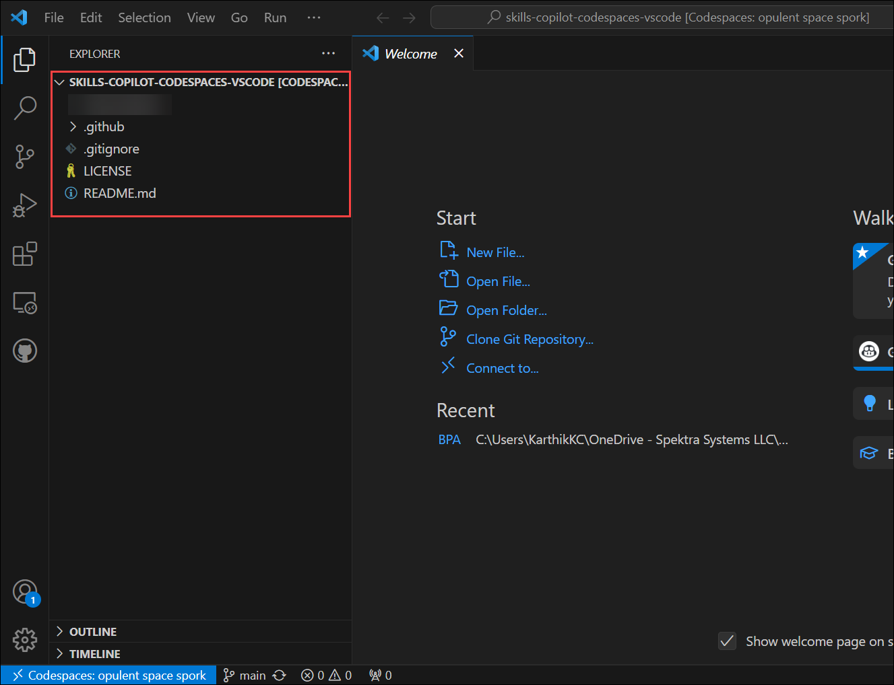
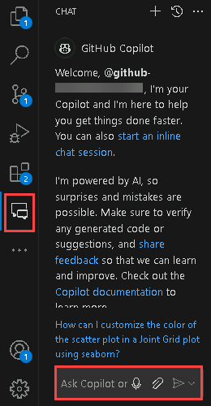
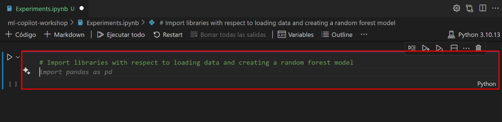
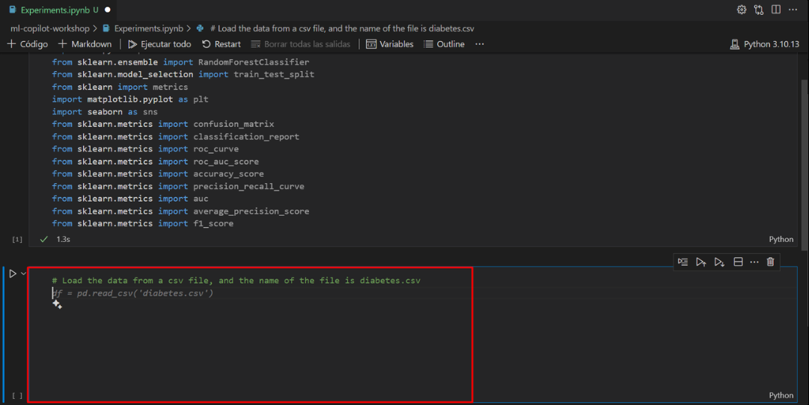

# Lab 10: Machine Learning & Data Transformation using Copilot
Duration: 90 minutes

Working with Copilot for machine learning involves leveraging GitHub Copilot, an AI-powered code completion tool developed by GitHub in collaboration with OpenAI. Here's a quick summary of the key steps and considerations:

Installation: Ensure you have GitHub Copilot installed as an extension in your integrated development environment (IDE), such as Visual Studio Code.

GitHub Integration: Link your IDE to your GitHub account to enable seamless integration. This allows Copilot to access your code repositories and provide context-aware suggestions.

Machine Learning Frameworks: Copilot supports various Machine Learning libraries and frameworks like TensorFlow, PyTorch, scikit-learn, and more. It can assist with code generation for tasks like data preprocessing, model building, and evaluation.

In this exercise, you will be cloning the Git repository with the required dataset into your environment. Here, you will be working with Copilot for Machine Learning, which involves leveraging GitHub Copilot.

>**Disclaimer**: GitHub Copilot will automatically suggest an entire function body or code in gray text. Examples of what you'll most likely see in this exercise, but the exact suggestion may vary.

>**Note**: Before proceeding with the exercise, make sure you have installed Python and pip packages.

## Lab objectives

In this lab, you will complete the following tasks:

* [Task 1: Prerequisites and Injecting the Required Dataset into Your Environment](#Task-1-Prerequisites-and-Injecting-the-Required-Dataset-into-Your-Environment)
* [Task 2: Auto_Completion of Code with Different Experiments](#Task-2-Auto_Completion-of-Code-with-Different-Experiments)
* [Task 3: Mathematical and Machine Learning with Different Examples](#Task-3-Mathematical-and-Machine-Learning-with-Different-Examples)
* [Task 4: Data Visualization and Data Transformation](#Task-4-Data-Visualization-and-Data-Transformation)
* [Task 5: Training the sample model](#Task-5-Training-the-sample-model)

### Task 1: Prerequisites and Injecting the Required Dataset into Your Environment

1. In the LABVM desktop search for **Microsoft Edge** **(1)**, click on **Microsoft Edge** **(2)** browser.

   

1. Navigate to GitHub login page using the provided URL below:
   ```
   https://github.com/login
   ```
   
1. On the **Sign in to GitHub** tab, you will see the login screen. In that screen, enter the  **email** **(1)** and **password** **(2)**. Then click on **Sign in** **(3)**. 
   
   

    >**Note:** To view the GitHub credentials, access the lab named **GitHub Copilot Lab: GitHub Credentials**, which is present within the First learning path of this course.

      

   >**Note:** Once the lab has been deployed successfully, navigate to the **Environment** tab to view the key-value pairs of the **GitHub UserEmail**, and **GitHub Password**. You can use the copy buttons under the actions column to have the values copied instantly. Alternatively, it is suggested to have the values copied over onto a notepad for easy accessibility. 

     

   >**Note:** If you're unable to copy the username and password, please type them manually to proceed further.
          
1. Navigate to Outlook login page using the provided URL below:
   ```
   https://outlook.office365.com/mail/
   ```
1. Next, to get the authentication code, sign in to Outlook with the git credentials within the Environment tab from the previous step. Once you have logged into Outlook, find the recent email containing the verification code. Enter the verification code, and click on **Verify**.

   >**Note:** The email containing the verification code can sometimes creep into the archive/spam folders within your Outlook.

   

1. Now,right click on your profile icon in the top right and click on **Your Repositories**.
    
   

1. Click on the repository named **skills-copilot-codespaces-vscode**.

1. Navigate back to the home page of your repository by clicking the **Code** **(1)** tab located at the top left of the screen. Click the **Code** **(2)** button located in the middle of the page.

   

1. Click the **Codespaces (1)** tab on the box that pops up and then click the **+ (2)** button.

   

   >**Note**: If in case pop-up prompt doesn't appear in the browser to open Visual Studio code, manually launch Visual Studio code from the desktop and close it. Next, return to the browser, refresh the page and launch the codespace that was previously created.

1. You will encounter a pop-up prompt. Click **Open** to proceed. Subsequently, another pop-up window will appear within Visual Studio Code (VS Code), where you should once again select **Install and Open** to continue.

   

   

1. At the bottom right corner, you will get a prompt to sign in to GitHub.

   

   >**Note:** If you do not get the sign-in prompt within Visual Studio Code, click on **Allow** in the pop-up that appears which will open a window in the browser, refresh the screen and click on **Open** in the pop-up that appears.

1. Next, once you get the popup, click on **Allow**

   

   >**Note**: Wait about 2 minutes for the codespace to spin itself up.

1. Verify your codespace is running. Make sure the VS code looks as shown below:

   

1. Click on **Extensions** **(1)** from the left menu, and the **GitHub Copilot** **(2)** extension should show up in the VS Code extension list. Click the Copilot extension and verify its installation as shown below:

   

   >**Note**: If the GitHub Copilot extension is not installed, click on Install.

1. In the "Search Extensions in Marketplace" search box, type and search for the **GitHub Copilot Chat** extension.
   
1. Select **GitHub Copilot Chat** from the list of results that show up, and verify that **GitHub Copilot Chat** has been installed.

1. If not, click on the **Install** button.

    

1. Once the installation is complete, in the left navigation pane you will able to see the icon for GitHub Copilot Chat as shown below.

    

1. Open VS Code Terminal by clicking on **Ellipsis (...)** **(1)**, selecting **Terminal** **(2)**, and clicking on **New Terminal** **(3)**.

   

1. Clone the below git repository in your environment.

   ```
   git clone https://github.com/CloudLabsAI-Azure/ml-copilot-workshop.git
   ```

1. Change the directory in the terminal by running the below command:

   ```
   cd ml-copilot-workshop
   ```

1. To install all the required Python dependencies in your environment before working with Copilot run the below command in your terminal:

   ```
   pip install -r requirements.txt
   ```

### Task 2: Auto_Completion of Code with Different Experiments

>**Disclaimer**: As you run the notebooks below, you might come across errors as the exact suggestion may vary. If so, utilize the **GitHub Copilot** chat as indicated below. Paste the comment and it will offer a solution to resolve or address the issue. Use the solution provided in the notebook to proceed.

   

1. From the VS Code explorer window, right-click on the folder named **ml-copilot-workshop** **(1)** and click on **New File**. Name the file `Experiments.ipynb` **(2)** and verify that your new file looks as shown below:

   

1. Type the below comments to import all the libraries where the Copilot automatically prompts all the libraries; press "enter" to get into the next line and review the suggestion, press "tab" and click on **Run** button to execute the cell.

   ```
   # Import libraries with respect to loading data and creating a random forest model
   ```

   

1. Accept all the suggestions for importing libraries as shown in the below screenshot **(1)** and click the **Run** **(2)** button to execute the cell. Hover your mouse over the cell and click on `+Code` **(3)** to add the new cell.

   

   >**Note**: While running the cell, you may need to install the required packages and select the kernel.

1. Type the below comments to load the data using the Copilot prompt. Press "enter" to get into the next line and review the suggestion, and press "tab" to accept the suggestion and click on **Run** button to execute the cell.

   ```
   # Load the data from a csv file, and the name of the file is diabetes.csv
   ```

    

1. Now click on **+Code** and move on to the next task.

   
### Task 3: Mathematical and Machine Learning with Different Examples

### Task 3.1: Mathematical Operations

1. Type the below comments to perform the first mathematical experiment would be to generate the birth year from the age column present in the dataset, press "tab", then press "enter" and click on **Run** button to execute the cell.

   ```
   # Mathematical operations on the dataset, like generating the birth year from Age
   ```

   

   >**Note**: Continue clicking on **+Code** after each comment till the last task of this exercise.

1. Type the below comment, press "tab", then press "enter" to get the output similar to the below image and click on **Run** button to execute the cell. 

   ```
   # Show the new column
   ```

   

   >**Note:** The representation may vary from the image.

1. Type the below comments to convert the BMI column up to two decimal values, press "tab", then press "enter" and click on **Run** button to execute the cell. 

   ```
   # convert the BMI column to two decimal values
   ```

   

1. In the same code cell, type the below comment, press "tab", then press "enter" and click on **Run** button to execute the cell to get the output similar to the below image.

   ```
   # Show the new column only
   ```

   


### Task 3.2: Machine Learning

1. Type the below comments to perform the data analysis and summary statistics on dataset, press "tab", then press "enter" and click on **Run** button to execute the cell to get the output.

   ```
   # Perform count, min, max, std, mean, 25%, 50%, and 75% on the dataset
   ```

   

1. Once the cell run is completed, you will get an output similar to the below image.

   

1. Before building the model, the main frame is to split the data into train tests and splits and this would be done by Copilot itself. Type the below comments, press "tab" and click on **Run** button to execute the cell.

   ```
   # Split the data into training and testing data and the column name Diabetic is the target column
   ```

   

   


### Task 4: Data Visualization and Data Transformation

### Task 4.1: Data Visualization

1. Click on **+Code** to open the new cell, and type the below comments to perform the basic operations on dataset, press "tab", then press "enter" and click on **Run** button to execute the cell. 

   ```
   # Perform univariate analysis on the dataset and plot the graphs
   ```

   

1. Once the cell run is completed, you will be getting a graphical representation output similar to the below image.

   

1. Now, type the below comments for specifying certain commonly used plots for visualization, press the "tab", then press "enter" and click on **Run** button to execute the cell to get the output as shown in the below-given image.

   ```
   # Perform scatter plot on the dataset and plot the graphs
   ```

   

1. Type the below comments for performing Joint Plot or Grid (rarely used plots) for visualization, press "tab", then press "enter" and click on **Run** button to execute the cell to get the output as shown in the below-given image.

   ```
   # Perform Joint Grid plot on the dataset and plot the graphs
   ```

   

   

1. Type the below comments for performing visualization on all features of the dataset, press "tab", then press "enter" and click on **Run** button to execute the cell to get the output as shown in the below-given image.

   ```
   # Perform comparison on all features of the dataset and plot the graphs in a single plot using heatmap
   ```

   

   


### Task 4.2: Data Transformations


1. Click **+Code** to add a new cell, and type the below comments for Standardization which is the process of scaling and centering numeric features to have a mean of 0 and a standard deviation of 1, making them comparable and suitable for certain algorithms, press "tab", then press "enter" and click on **Run** button to execute the cell.

   ```
   # Perform standardization on the data
   ```

   

   

1. You will get the output as shown in the below-given image once the code cell finishes running.

   


### Task 5: Training the sample model

Training a sample model using Random Forest.

>**Note**: The model training is a continuation of the train test split step to train the model; run the train test split step first and then continue with the model building.

1. Click **+ Code** to add a new cell, and type the below comments for creating the random forest model, press "tab", then press "enter" and click on **Run** button to execute the cell.

   ```
   # Create a random forest model with 100 trees, and the criterion is entropy
   ```

   

   

   

1. In a new cell, type the below comments for calculating the accuracy of the model, press "tab", then press "enter" and click on **Run** button to execute the cell.

   ```
   # Calculate the accuracy of the model
   ```

   

    <validation step="a09b45c1-f43a-482f-810e-70c634f54db0" />

   **Congratulations** on completing the task! Now, it's time to validate it. Here are the steps:
   - Navigate to the Lab Validation page, from the upper right corner in the lab guide section.
   - Hit the Validate button for the corresponding task. If you receive a success message, you can proceed to the next task. 
   - If not, carefully read the error message and retry the step, following the instructions in the lab guide.
   - If you need any assistance, please contact us at labs-support@spektrasystems.com. We are available 24/7 to help
   
  
### Review

In this lab, you have successfully leveraged the GitHub Copilot for Machine Learning.

## You have successfully completed the lab
