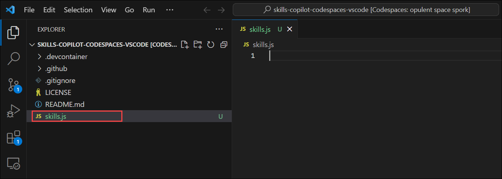

# Lab 3: Code Suggestions with GitHub Copilot in Codespaces using VS Code

Duration: 30 minutes

While GitHub Copilot offers recommendations for many languages and frameworks, it excels in particular when it comes to Python, JavaScript, TypeScript, Ruby, Go, C#, and C++. The samples below are in JavaScript, but they should also work in other languages.

In this lab, you will have the opportunity to experiment with and apply JavaScript with the assistance of GitHub Copilot and GitHub Copilot Chat.

>**Disclaimer**: A whole function body will be automatically suggested by GitHub Copilot in gray text. Here's an example of what you are likely to see; however, the precise recommendation could vary.

## Task 1: Add a JavaScript file and start writing code.

1. In the LABVM desktop, select Visual Studio Code.
 
1. From the VS Code Explorer window, create a New File.

   

1. Name the file `skills.js` and verify your new file looks as shown below:

   

1. In the `skills.js` file, type the following function header:

   ```
   function toCelsius(fahrenheit)
   ```
   
   > **Note**: A whole function body will be automatically suggested by GitHub Copilot in gray text. Here's an example of what you are likely to see; however, the precise recommendation could vary.

   

1. Press `Tab` to accept the suggestion and then press `Ctrl + S` to save the file.

   

## Task 2: Push code to your repository from the codespace

In this task, you will use the VS Code terminal to add the `skills.js` file to the GitHub repository.


### Summary

In this lab, you have successfully generated JavaScript code and other best practices using GitHub Copilot and GitHub Copilot Chat.
