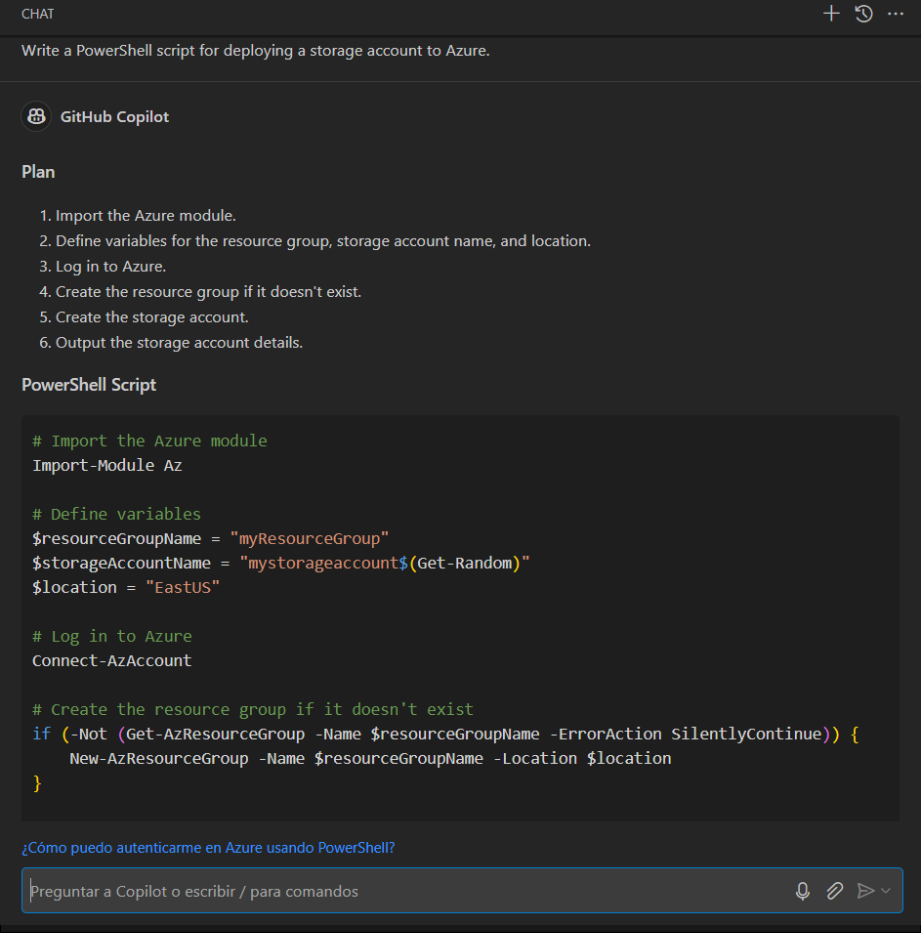

# Lab 4: Using GitHub Copilot to generate ARM Templates & Terraform Artifacts

### About GitHub Copilot Chat and Visual Studio Code

GitHub Copilot Chat allows you to ask coding questions and receive answers directly within the supported IDE. Copilot Chat can help you with a variety of coding-related tasks, like offering you code suggestions, providing natural language descriptions of a piece of code's functionality and purpose, generating unit tests for your code, and proposing fixes for bugs in your code. For more information, see "[About GitHub Copilot Chat](https://docs.github.com/en/copilot/github-copilot-chat/about-github-copilot-chat)."

### Use cases for GitHub Copilot Chat

There are several situations in which GitHub Copilot Chat can help with coding.

 - Generating unit test cases
 - Explaining code
 - Proposing code fixes
 - Answering coding questions

In this lab, you will utilize Copilot to generate code in ARM, Terraform, and PowerShell.

> **Disclaimer**: GitHub Copilot will automatically suggest an entire function body or code in gray text. Examples of what you'll most likely see in this exercise, but the exact suggestion may vary.

### Task 1: Generate code by chat that uses ARM to deploy resources to Azure

1. In the LABVM desktop search for **Microsoft Edge** **(1)**, click on **Microsoft Edge** **(2)** browser.

   

1. Navigate to GitHub login page using the provided URL below:
   ```
   https://github.com/login
   ```
   
1. On the **Sign in to GitHub** tab, you will see the login screen. In that screen, enter the  **email** **(1)** and **password** **(2)**. Then click on **Sign in** **(3)**. 

   

    >**Note:** To view the GitHub credentials, access the lab named **GitHub Copilot Lab: GitHub Credentials**, which is present within the First learning path of this course.

      

   >**Note:** Once the lab has been deployed successfully, navigate to the **Environment** tab to view the key-value pairs of the **GitHub UserEmail**, and **GitHub Password**. You can use the copy buttons under the actions column to have the values copied instantly. Alternatively, it is suggested to have the values copied over onto a notepad for easy accessibility. 

        

    >**Note:** If you're unable to copy the username and password, please type them manually to proceed further.
     
1. Navigate to Outlook login page using the provided URL below:
   ```
   https://outlook.office365.com/mail/
   ```
1. Next, to get the authentication code, sign in to Outlook with the git credentials within the Environment tab from the previous step. Once you have logged into Outlook, find the recent email containing the verification code. Enter the verification code, and click on **Verify**.

   >**Note:** The email containing the verification code can somtimes creep into the archive/spam folders within your Outlook.

   

1. Now, right-click on your profile icon in the top right and click on **Your Repositories**.
    
   

1. Click on the repository named **skills-copilot-codespaces-vscode**.

1. Copy the path of the repository and store it in a notepad.

   

1. Search for Windows Powershell ISE in the Windows Start button and run it as an Administrator.

     

1. Run the following command to clone it to your local system and paste the path of the repository which we copied earlier in the notepad.

    ```
    git clone https://github.com/<your github user name>/skills-copilot-codespaces-vscode
    ```   
1. Open Visual Studio Code from the desktop.

1. Click on File (1) and select Open Folder (2).

   

1. Navigate to `C:\Users\azureuser` and select skills-copilot-codespaces-vscode.

## Task 2: Example: Set the stage with a high-level goal

   >**Note**: If the GitHub Copilot extension is not installed, click on Install.

1. In the Visual Studio Code activity bar, click the GitHub Copilot Chat icon to open the GitHub Copilot Chat window.

1. At the bottom of the GitHub Copilot Chat window, in the **Ask Copilot a question or type / for topics** text box, type a coding-related question, then press Enter. For example, type "Write an ARM code for deploying a storage account to Azure with the code explanation."

    

1. GitHub Copilot Chat will process your question and provide an answer, with code suggestions when appropriate, in the chat window. 

    

       

    > **Note:** Here's an example of what you are likely to see; however, the precise recommendation could vary.

    > **Note**: Optionally, if GitHub Copilot Chat suggests a follow-up question above the **Ask Copilot a question or type / for topics** text box, click the follow-up question to ask it.

    > **Note**:  If your question is outside the scope of GitHub Copilot Chat, it will tell you and may suggest an alternative question to ask.
   
1. You can view the response from GitHub Copilot in the chat. To insert code into a new file, click on **Ellipsis (...)** **(1)** and select **Insert Into New File** **(2)**.

   

1. Press `CTRL + S` to save the file. Name the file `arm.json` and click on **OK**

   

1.  After saving the file, navigate to `portal.azure.com`.

1. Search for **deploy(1)** and select **Deploy a custom template(2)**.

     

1. Click on **Select a template(1)** and click on **Build your own template in the editor(2)**.

      

1. **Paste(1)** the code you had earlier saved in VS code in the **Edit template** section and click on **Save(2)**.

      

1. In the project details section, add the following details:

   - Subscription - **Select the default subscription (1)**
   - Resource Group - **Select JumpVM-RG-<inject key="Deployment ID" enableCopy="false"/> (2)**
   - Region - **Select the default region. (3)**
   - Storage Account Name - **Select storage<inject key="Deployment ID" enableCopy="false"/> (4)**
   - Location - **Select the same as the region (5)**
   - Sku - **Select the default sku (6)**
   - Click on **Review + Create (7)**

     

        > **Note:** In case, the storage account name is already fetched, use the default.
      
1. Click on **Go to Resource**.

     

1. Verify the **storage account** is created.

     

### Task 3: Generate code by chat that uses Terraform to deploy resources to Azure

1. In the Visual Studio Code activity bar, click the GitHub Copilot Chat icon to open the GitHub Copilot Chat window.

1. At the bottom of the GitHub Copilot Chat window, in the **Ask Copilot a question or type / for topics** text box, type a coding-related question, then press Enter. For instance, type "Write a Terraform code for deploying a storage account to Azure with the code explanation".

   

1. GitHub Copilot Chat will process your question and provide an answer, with code suggestions when appropriate, in the chat window.

    

    > **Note:** Here's an example of what you are likely to see; however, the precise recommendation could vary.
    
    > **Note**: Optionally, if GitHub Copilot Chat suggests a follow-up question above the **Ask Copilot a question or type / for topics** text box, click the follow-up question to ask it.

    > **Note**:  If your question is outside the scope of GitHub Copilot Chat, it will tell you and may suggest an alternative question to ask.
   
1. You can view the response from GitHub Copilot in the chat. To insert code into a new file, click on **Ellipsis (...)** **(1)** and select **Insert Into New File** **(2)**.

   

1. Fill the below details for the appropriate field:

   - Resource Group Name - **JumpVM-RG-<inject key="Deployment ID" enableCopy="false"/>** **(1)**
   - Region - **East US** **(2)**
   - Storage Account Name - **storage<inject key="Deployment ID" enableCopy="false"/>** **(3)**

       
     
1. Press `CTRL + S` to save the file. Name the file `terraform.tf` and click on **OK**
   
      

1. Click on the **Ellipsis (...) (1)** on the top , select **Terminal (2)** and click on **New Terminal (3).**

1. Run the below command to initialize a working directory and download the necessary provider plugins and modules.

    ```
    terraform init
    ```   

1. Run the below command to login to Azure

    ```
    az login
    ```
   * Username: <inject key="AzureAdUserEmail"></inject>

   * Password: <inject key="AzureAdUserPassword"></inject>
       
1. Run the below command to create an execution plan, which lets you preview the changes that Terraform plans to make to your infrastructure.

    ```
    terraform plan
    ```   

1. Run the below command to import the existing resource group

    ```
    terraform import azurerm_resource_group.example /subscriptions/<subscription_id>/resourceGroups/JumpVM-RG-<Deployment ID">
    ```   

     > **Note:** To fetch subscription id - Navigate to `portal.azure.com` , search for subscriptions and copy the id.

     > **Note:** To fetch the deployment id, navigate to the **Environmental Details** tab in the vm and copy the DID.

1.  Run the below command to execute planned actions, creating ot updating infrastructure resources.

    ```
    terraform apply
    ```   

     > **Note:** Provide **yes** when prompted.

1. Once the **terraform apply** command has run successfully, navigate to `portal,azure.com`.

1. Search for **storage (1)** and select **Storage Accounts (2)**.

    
  
1. Verify **storage<inject key="Deployment ID" enableCopy="false"/>** is created.

    
   
### Task 4: Generate code by chat that uses PowerShell to deploy resources to Azure

1. In the Visual Studio Code activity bar, click the GitHub Copilot Chat icon to open the GitHub Copilot Chat window.

1. At the bottom of the GitHub Copilot Chat window, in the **Ask Copilot a question or type / for topics** text box, type a coding-related question, then press Enter. For example, type "Write a PowerShell script for deploying a storage account to Azure."

   

1. GitHub Copilot Chat will process your question and provide an answer, with code suggestions when appropriate, in the chat window. 

    

    > **Note:** Here's an example of what you are likely to see; however, the precise recommendation could vary.

    > **Note**: Optionally, if GitHub Copilot Chat suggests a follow-up question above the **Ask Copilot a question or type / for topics** text box, click the follow-up question to ask it.

    > **Note**:  If your question is outside the scope of GitHub Copilot Chat, it will tell you and may suggest an alternative question to ask.
   
1. You can view the response from GitHub Copilot in the chat. To insert code into a new file, click on **Ellipsis (...)** **(1)** and select **Insert Into New File** **(2)**.

   

1. Press `CTRL + S` to save the file. Name the file `powershell.ps1` and click on **OK**.

   

### Task 5: Push code to your repository from the codespace

1. Use the VS Code terminal to add files to the repository. Open VS Code Terminal if it's not opened yet.

1. Run the below command to add the `arm.json` , `terraform.tf` and `powershell.ps1` files to the repository:

   ```
   git add arm.json terraform.tf powershell.ps1
   ```

1. Run the below command to sign in with GitHub

   - Email
    ```
    git config --global user.email "github user email"
    ```
    -  Username
    ```
    git config --global user.name "github username"
    ```

1. Click on **Sign in with your browser** when the following pop-up arises.

    

1. Verify if the authentication has succeeded.

    

1. Next, from the VS Code terminal stage, commit the changes to the repository:

   ```
   git commit -m "Copilot third commit"
   ```

1. Finally, from the VS Code terminal, push to code to the repository:

   ```
   git push
   ```

   >**Note**: Wait about 60 seconds, then refresh your repository landing page for the next step.

1. You can verify the `arm.json`, `powershell.ps1`, and `terraform.tf` files available in your GitHub repository.

   

    
   <validation step="41cb7abc-f8a9-4af0-a8c9-3df487cfda04" />

   **Congratulations** on completing the task! Now, it's time to validate it. Here are the steps:
   - Navigate to the Lab Validation page, from the upper right corner in the lab guide section.
   - Hit the Validate button for the corresponding task. If you receive a success message, you can proceed to the next task. 
   - If not, carefully read the error message and retry the step, following the instructions in the lab guide.
   - If you need any assistance, please contact us at labs-support@spektrasystems.com. We are available 24/7 to help
  
### Summary

In this lab, you have employed Copilot to automatically generate code in both ARM, Terraform, and PowerShell programming languages.
