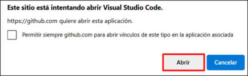
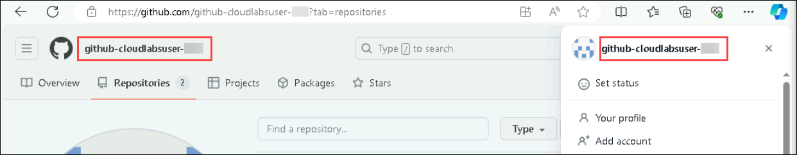

# Exercise 8: Creating a Mini Game with GitHub Copilot

Duration : 30 minutes

In this exercise, you will utilize the capabilities of GitHub Copilot to construct a classic rock, paper, scissors minigame. Through this practical engagement, you'll not only refine your programming expertise but also bolster your proficiency in crafting console applications using Python.

### Task 1: Setting up your environment

1. Navigate to [Mini-game-with-copilot](https://github.com/MicrosoftDocs/mslearn-challenge-project-create-mini-game-with-copilot) and click on **Fork**.

   

1. Click on **Create Fork**.

   

1. Once the repository is forked, select the **Code (1)** button and, in the **Codespaces** tab, select **Create codespace on main (2)**.

   

      >**Note**: In case you encounter a pop-up prompt. Click **Open** to proceed.

      

1. Click on **Open** when prompted to allow Github Codespaces Extension.

   
   
1. View the repository.

   

> **Congratulations** on completing the task! Now, it's time to validate it. Here are the steps:
 
- Navigate to the Lab Validation Page, from the upper right corner in the lab guide section.
- Hit the Validate button for the corresponding task. If you receive a success message, you can proceed to the next task.

   >**Note**: Upon clicking the validate button for this exercise, you'll receive a prompt to input your GitHub username. To find your GitHub username, simply click on your profile image within your GitHub account. After entering your username, proceed by selecting **Submit**.

   

   

- If not, carefully read the error message and retry the step, following the instructions in the lab guide.
- If you need any assistance, please contact us at labs-support@spektrasystems.com. We are available 24/7 to help you out.

### Task 2: Testing your GitHub Codespace

1. Open the **app.py** file.

   

1. Provide some context for the code we're about to write, paste the following:

   ```
   # Write a rock, paper, scissors game
   ```

   

1. On the next line we're going to prompt GitHub Copilot to suggest code. Paste the following:

   ```
   # import random module
   ```

1. Press `Enter` after typing the previous comment, GitHub Copilot will suggest some code for you.

1. Press `Tab` to accept the suggestion and then press `Enter`.

1. Paste the following to prompt GitHub Copilot to suggest code.

     ```
     # define main function that handles all the logic
     ```

1. Press `Enter` after typing the previous comment, GitHub Copilot will suggest some code for you.

1. Press `Tab` to accept the suggestion and then press `Enter`.

1. To open a new tab with multiple synthesized solutions, press `Ctrl + Enter`. GitHub Copilot will synthesize around 10 different code suggestions in a new tab. You can view the solutions, and to accept a suggestion, you need to click on **Accept Suggestion** below the desired suggestion and then **save** the file.

      >**Note**:  Incase of this error **CTRL + ENTER**: command '**github.copilot.generate**' not found , Please follow the below steps
   - In the file Explorer Go to the path **%USERPROFILE%/AppData/Roaming/Code/CachedExtensionVSIXs (1)**

      
  
   - **Delete all copilot files (2)** present in this path.
  
      
  
   - Reopen vsCode **reload the github copilot extenstion (3)** in vscode

      
  
   - Then try **CTRL + ENTER**

      

        >**Note:** However, it should be noted that the suggestions from GitHub Copilot may vary and occasionally be irrelevant, necessitating a clear understanding of the Python code and its usage.

1. Paste the following to prompt GitHub Copilot to call the function.

   ```
   # call main function
   ```

1. Click on **Save**.

1. Click on **Terminal (1)** and select **New Terminal (2)**.

   

1. Run the application with the **python app.py** command in the terminal.

   
   
### Summary

In this exercise, you have successfully created a minigame using Python and Github Copilot.
