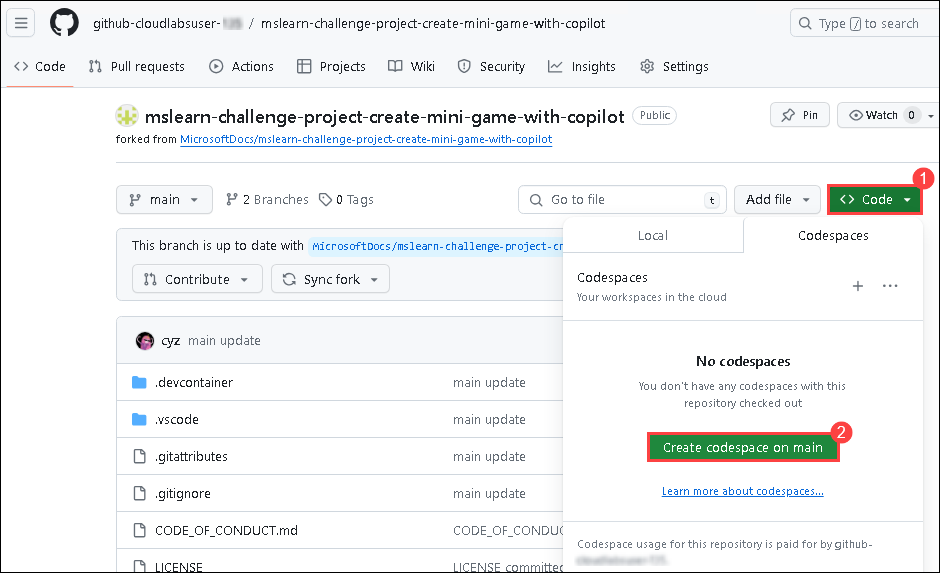
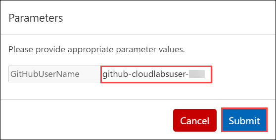

# Exercise 8: Creating a Mini Game with GitHub Copilot

Duration : 30 minutes

In this exercise, you will utilize the capabilities of GitHub Copilot to construct a classic rock, paper, scissors minigame. Through this practical engagement, you'll not only refine your programming expertise but also bolster your proficiency in crafting console applications using Python.

### Task 1: Setting up your environment

1. In the LABVM desktop search for **Microsoft Edge** **(1)**, click on **Microsoft Edge** **(2)** browser.

   

1. Navigate to GitHub login page using the provided URL below:
   ```
   https://github.com/login
   ```
   
1. On the **Sign in to GitHub** tab, you will see the login screen. In that screen, enter the  **email** **(1)** and **password** **(2)**. Then click on **Sign in** **(3)**. 

   

    >**Note:** To view the GitHub credentials, access the lab named **GitHub Copilot Lab: GitHub Credentials**, which is present within the First learning path of this course.

      

   >**Note:** Once the lab has been deployed successfully, navigate to the **Environment** tab to view the key-value pairs of the **GitHub UserEmail**, and **GitHub Password**. You can use the copy buttons under the actions column to have the values copied instantly. Alternatively, it is suggested to have the values copied over onto a notepad for easy accessibility. 

     
   
   >**Note:** If you're unable to copy the username and password, please type them manually to proceed further.
          
1. Navigate to Outlook login page using the provided URL below:
   ```
   https://outlook.office365.com/mail/
   ```
1. Next, to get the authentication code, sign in to Outlook with the git credentials within the Environment tab from the previous step. Once you have logged into Outlook, find the recent email containing the verification code. Enter the verification code, and click on **Verify**.

   >**Note:** The email containing the verification code can sometimes creep into the archive/spam folders within your Outlook.

   

1. Now,right click on your profile icon in the top right and click on **Your Repositories**.
    
   


1. Navigate to [Mini-game-with-copilot](https://github.com/MicrosoftDocs/mslearn-challenge-project-create-mini-game-with-copilot) and click on **Fork**.

   

1. Click on **Create Fork**.

   

1. Once the repository is forked, select the **Code (1)** button and, in the **Codespaces** tab, select **Create codespace on main (2)**.

   

      >**Note**: In case you encounter a pop-up prompt. Click **Open** to proceed.

      

1. Click on **Open** when prompted to allow Github Codespaces Extension.

   
   
1. View the repository.

   

> **Congratulations** on completing the task! Now, it's time to validate it. Here are the steps:
 
- Navigate to the Lab Validation Page, from the upper right corner in the lab guide section.
- Hit the Validate button for the corresponding task. If you receive a success message, you can proceed to the next task.

   >**Note**: Upon clicking the validate button for this exercise, you'll receive a prompt to input your GitHub username. To find your GitHub username, simply click on your profile image within your GitHub account. After entering your username, proceed by selecting **Submit**.

   

   

- If not, carefully read the error message and retry the step, following the instructions in the lab guide.
- If you need any assistance, please contact us at labs-support@spektrasystems.com. We are available 24/7 to help you out.

### Task 2: Testing your GitHub Codespace

1. Open the **app.py** file.

   

1. Provide some context for the code we're about to write, paste the following:

   ```
   # Write a rock, paper, scissors game
   ```

1. On the next line we're going to prompt GitHub Copilot to suggest code. Paste the following:

   ```
   # import random module
   ```
   

1. Press `Enter` after typing the previous comment, GitHub Copilot will suggest some code for you.

1. Press `Tab` to accept the suggestion and then press `Enter`.

1. Paste the following to prompt GitHub Copilot to suggest code.

     ```
     # define main function that handles all the logic
     ```

1. Press `Enter` after typing the previous comment, GitHub Copilot will suggest some code for you.

1. Press `Tab` to accept the suggestion and then press `Enter`.

1. To open a new tab with multiple synthesized solutions, press `Ctrl + Enter`. GitHub Copilot will synthesize around 10 different code suggestions in a new tab. You can view the solutions, and to accept a suggestion, you need to click on **Accept Suggestion** below the desired suggestion.

    >**Note:** However, it should be noted that the suggestions from GitHub Copilot may vary and occasionally be irrelevant, necessitating a clear understanding of the Python code and its usage.

   
   
1. Paste the following to prompt GitHub Copilot to call the function.

   ```
   # call main function
   ```
   

1. Click on **Save**.

1. Click on **Terminal (1)** and select **New Terminal (2)**.

   

1. Run the application with the **python app.py** command in the terminal.

   
   
### Summary

In this exercise, you have successfully created a minigame using Python and Github Copilot.
