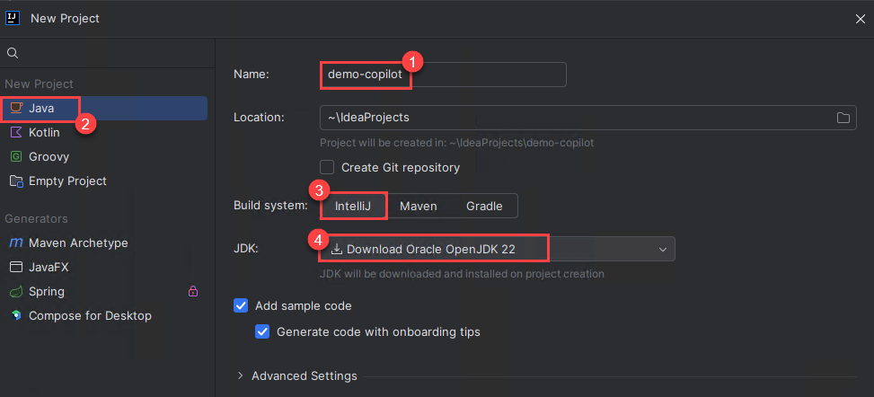

# Lab 8: GitHub Copilot with JetBrains
Duration: 30 minutes

GitHub Copilot, an innovative code generation tool, can be integrated with JetBrains IntelliJ, a widely used IDE for Java development. This integration enhances the Java coding experience by providing intelligent code suggestions and auto-completion within IntelliJ, boosting productivity and code quality.

In this exercise, you will use the JetBrains IntelliJ Idea IDE for Java. You will install the GitHub Copilot plugin and create a new project.

>**Disclaimer**: GitHub Copilot will automatically suggest an entire function body or code in gray text. Examples of what you'll most likely see in this exercise, but the exact suggestion may vary.

## Lab objectives

In this lab, you will complete the following tasks:

* [Task 1: Install the GitHub Copilot plugin and create a new project in the IntelliJ Idea IDE](#Task-1-Install-the-GitHub-Copilot-plugin-and-create-a-new-project-in-the-IntelliJ-Idea-IDE)
* [Task 2:Create a basic Java project](#Task-2-Create-a-basic-Java-project)
* [Task 3: Getting more suggestions](#Task-3-Getting-more-suggestions)
 
## Task 1: Install the GitHub Copilot plugin and create a new project in the IntelliJ Idea IDE

1. Navigate to the desktop and open the **IntelliJ IDEA Community** IDE.

   

1. In the IntelliJ IDEA Agreement, check **I confirm that I have read and accept the terms of this User Agreement (1)** and click on **Continue (2)**.

   

   >**Note:** When the data sharing box appears, click on **Don't Send**.

   

1. From the left menu, click on **Plugins** **(1)** and select **Marketplace** **(2)**. Search **GitHub Copilot** **(3)**, and once you find **GitHub Copilot** plugin, click on **Install** **(4)**.

   

   >**Note** : In the Third-Party Plugins notice, click **Accept**.

1. Verify the GitHub Copilot plugin is installed. Next, you need to restart the IDE by clicking on **Restart IDE**. Click on **Restart** in the pop-up once again to restart the IDE.

   .png)

1. Once the **IntelliJ Idea Community** IDE is restarted, select **Projects** **(1)** from the left menu and click on **New Project** **(2)**.

   

1. In the new project pane, enter the project name as demo-copilot (1). Select language as Java (2) and build system as IntelliJ (3). For JDK, select the default Download Oracle OpenJDK 22 (4) and click on Create.
   
   

1. Review the created **demo-copilot** project as shown below:

   

## Task 2: Create a basic Java project

1. Click the **icon** as shown in the below image. 

   

1. Click on **Tools (1)**. Click GitHub Copilot, then click **Login to GitHub (2)**.

   

1. In the "Sign in to GitHub" dialog box, to copy the device code in a notepad file and open the device activation window, click **Copy and Open**.

   

1. On the **Sign in to GitHub** tab, you will see the login screen. In that screen, enter the  **email** **(1)** and **password** **(2)**. Then click on **Sign in** **(3)**. 

   >**Note**: To get GitHub credentials navigate to the **Environment Details** tab and click on the **GitHub Credentials** option to view the key-value pairs of the **GitHub UserEmail**, and **GitHub Password**. You can use the copy buttons under the actions column to have the values copied instantly. Alternatively, it is suggested to have the values copied over onto a notepad for easy accessibility. 
   
   

   >**Note:** If you're unable to copy the username and password, please type them manually to proceed further.
          
1. Navigate to Outlook login page using the provided URL below:
   ```
   https://outlook.office365.com/mail/
   ```
1. Next, to get the authentication code, sign in to Outlook with the git credentials within the Environment tab from the previous step. Once you have logged into Outlook, find the recent email containing the verification code. Enter the verification code, and click on **Verify**.

   >**Note:** The email containing the verification code can sometimes creep into the archive/spam folders within your Outlook.

   

1. A device activation window will open in your browser. Paste the device **code (1)** which you have copied in the step number **3** in **Task 2**, then click **Continue (2)**.

   

1. GitHub will request the necessary permissions for GitHub Copilot. To approve these permissions, click **Authorize GitHub Copilot Plugin**.

1. After the permissions have been approved, your JetBrains IDE will show a confirmation. To begin using GitHub Copilot, click **OK**.

1. In your JetBrains IDE, right-click on the **src (1)**, select **New (2)** and click on **File (3)** to create a new Java (*.java) file named **Test.java** and hit enter.

   

1. Create a class by typing **class Test**. Copilot will suggest a class body, and you can press **tab** to accept the suggestion.

   

1. Below the bracket of the main function, type the following function header:

   ```
   int calculateDaysBetweenDates(
   ```

1. GitHub Copilot will automatically suggest an entire function body in gray text, as shown below. The exact suggestion may vary.

   

1. Press **Tab** to accept the suggestion.


## Task 3: Getting more suggestions

Sometimes, you may not want to use any of the initial suggestions. You can ask GitHub Copilot to return more.

1. Remove the function you entered and type the following again:

   ```
   int calculateDaysBetweenDates(
   ```

1. Open GitHub Copilot.

   -On macOS, press `Option + Enter`.

   -On Windows or Linux, press `Alt + Enter`.
   
      >**Note**: If the 'Alt + Enter' isn't working, please select Github Co-pilot from the right pane as shown in the below image.

      
   
1. Select "Open Copilot". GitHub Copilot will open a new tab and suggest multiple options, as shown below.

   

1. Pick a suggestion that you want to use, then click "Accept solution".

1. If you don't like any of the returned suggestions, just close the suggestions tab.


## Task 4: Getting code from a comment

GitHub Copilot can understand significantly more context than most code assistants and can generate entire functions from something as simple as a comment.

1. Remove the function you entered and type the following comment:
   
   ```
   // Identify all the images without alternate text
   // and add a red border to them
   void process() {

   ```

1. GitHub Copilot will automatically suggest an implementation.
  
   

  
  <validation step="554ef91e-3530-4e62-ae6d-e1cfec7b4bf7" />
 
   **Congratulations** on completing the task! Now, it's time to validate it. Here are the steps:
   - Navigate to the Lab Validation page, from the upper right corner in the lab guide section.
   - Hit the Validate button for the corresponding task. If you receive a success message, you can proceed to the next task. 
   - If not, carefully read the error message and retry the step, following the instructions in the lab guide.
   - If you need any assistance, please contact us at labs-support@spektrasystems.com. We are available 24/7 to help
     
## Review

In this lab, you have successfully configured the JetBrains IntelliJ Idea IDE for Java, installed the GitHub Copilot plugin, and explored the basic Java code that produced the suggestions using Copilot.

## You have successfully completed the lab
