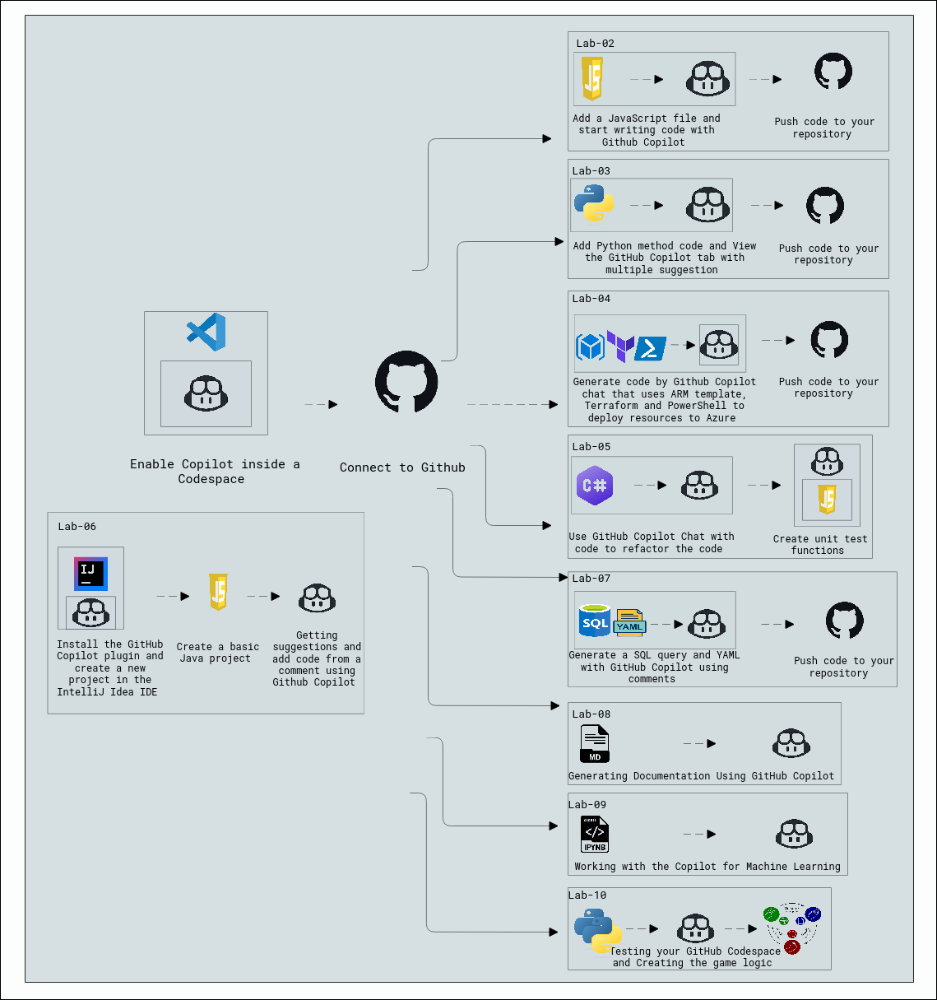

# Lab Scenario Preview: Github-Copilot

## Lab Overview

GitHub Copilot is an AI pair programmer speeding up coding with instant suggestions from comments and code context. Powered by OpenAI Codex, it excels in Python, JavaScript, TypeScript, Ruby, Go, C#, and C++. Copilot Chat offers coding assistance directly in supported IDEs, including code suggestions, descriptions, unit test generation, bug fixes, and refactoring. Integrated with JetBrains IntelliJ, it enhances Java coding with intelligent suggestions. Copilot assists in generating T-SQL and YAML code, streamlining documentation with auto-generated comments, Markdown, templates, grammar consistency, and cross-referencing. It also aids in crafting console applications using different programming languages, leveraging AI-powered completion.

## Lab Objectives

In this lab, you will perform:

## Estimated Timing: 8 hours

## Solution Architecture

Once you understand the lab's content, you can start the hands-on lab by clicking the **Launch** button located in the top right corner. 
This will lead you to the lab environment and guide. You can also preview the full lab guide [here](https://experience.cloudlabs.ai/#/labguidepreview/cb411b13-5340-498e-a4c4-01d029a436eb)
if you want to go through a detailed guide prior to launching the lab environment. 
