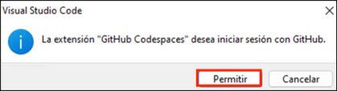

# Exercício 1: Usando Codespaces com VS Code para Copilot

### Duração estimada: 15 minutos

O GitHub Copilot é como um programador a pares de IA concebido para tornar a escrita de código mais fácil e rápida. Extrai contexto de comentários e código para sugerir linhas individuais de código e funções completas. O GitHub Copilot é baseado em Codex, um modelo de linguagem generativa pré-treinado criado pela OpenAI.

**O Copilot é compatível com uma grande variedade de editores de código, como o Neovim, JetBrains IDE, Visual Studio e VS Code.**

Além disso, o GitHub Copilot está treinado em todas as linguagens que podem ser encontradas nos repositórios públicos. A quantidade e variedade de dados de treino para cada linguagens de programação podem ter impacto na qualidade das recomendações obtidas.

**GitHub Codespace** é um ambiente de desenvolvimento alojado na nuvem. Pode personalizar o seu projeto para GitHub Codespaces enviando ficheiros de configuração para o seu repositório (geralmente conhecido como Configuração como Código), que cria uma configuração de codespace repetível para todos os utilizadores do seu projeto.

A utilização do Copilot num Codespace demonstra sem esforço a simplicidade de começar com as ferramentas abrangentes de [Escrita de Código Colaborativa](https://github.com/features#features-collaboration).

Neste exercício, terá a tarefa de criar um container. Especificará determinadas extensões ou configurações a utilizar ou instalar no seu Codespace. Como parte deste processo, certifique-se de que inclui o Copilot na sua lista de extensões.

## Objetivos do laboratório

Irá completar as seguintes tarefas:

- Tarefa 1: Activar o Copilot dentro de um Codespace

## Tarefa 1: Ativar o Copilot dentro de um codespace

1. Navegue de volta para a página inicial do seu repositório, clique no separador **Code** **(1)** do seu repositório, clique no botão pendente **Add file** **(2)** e selecione `+ Create new file` **(3)**.

   

1. Digite ou cole o seguinte no campo de texto vazio para nomear o seu ficheiro **(1)**.

    ```
    .devcontainer/devcontainer.json
    ```

1. No corpo do novo ficheiro **.devcontainer/devcontainer.json**, adicione o seguinte conteúdo **(2)** e clique em **Commit changes** **(3)**:

   ```
   {
       // Name this configuration
       "name": "Codespace for Skills!",
       "customizations": {
           "vscode": {
               "extensions": [
                   "GitHub.copilot",
                   "hashicorp.terraform"
               ]
           }
       },
       "features": {
          "ghcr.io/devcontainers/features/terraform:1": {},
          "ghcr.io/devcontainers/features/azure-cli:1": {}
      }
   }
   ```

   

1. Selecione a opção **Commit directly to the `main` branch** e clique no botão **Commit changes**.

   

1. Navegue de volta para a página inicial do seu repositório clicando no separador **Code** **(1)** localizado no canto superior esquerdo do ecrã. Clique no botão **Code** **(2)** localizado no meio da página.

   

1. Clique no separador **Codespaces (1)** na caixa que aparece e, em seguida, clique no botão **Create codespace on main (2)**.

   

   >**Nota**: Se o pedido de pop-up não aparecer no browser para abrir o código do Visual Studio, inicie manualmente o código do Visual Studio na área de trabalho e feche-o. De seguida, volte ao browser, atualize a página e inicie o codespace que foi criado anteriormente.

1. Encontrará um prompt pop-up. Clique em **Abrir** para continuar. Posteriormente, surgirá outra janela pop-up dentro do Visual Studio Code (VS Code), onde deverá selecionar **Install Extension and Open URI** para continuar.

   

   

   >**Nota**: Clique em **Allow** se a extensão **Github Codepsaces** pretender iniciar sessão utilizando o Github.

   

1. Clique em **Continue** para autorizar o Visual Studio Code.

   

1. Clique em **Authorize Visual-Studio-Code**

   

1. Clique em **Open** para abrir o Visual Studio Code

   

1. Verifique se o seu codespace está em execução. Certifique-se de que o código VS está como mostrado abaixo:

    

1. Clique em **Extensions** **(1)** no menu esquerdo, e a extensão **GitHub Copilot** **(2)** deverá aparecer na lista de extensões do VS Code. Clique na extensão Copilot e verifique a sua instalação como se mostra abaixo:

    

    >**Nota**: Se a extensão GitHub Copilot não estiver instalada, clique em Instalar.

1. Na parte superior ao lado da barra de pesquisa, clique no ícone mostrado para entrar no GitHub.

   

8. Na janela pop-up que aparece, na página **Sign in to Use Copilot for Free**, clique em **Sign in**

   

   > **Nota**: Se encontrar o erro: **No access to GitHub Copilot found**, entre em contato vir o email `cloudlabs-support@spektrasystems.com` para suporte.

   

1. Em seguida, quando for mostrado o seguinte popup, clique em **Allow**.

   

1. Clique em **Continue** para autorizar o Visual Studio Code.

   

1. Clique em **Authorize Visual-Studio-Code**


1. Em seguida, clique em **Open** para abrir o Visual Studio Code.

   


   > **Parabéns** por completar a tarefa! Agora, é hora de validar. Aqui estão os passos:
   > - Clique no botão Validar. Se você receber uma mensagem de sucesso, poderá prosseguir para a próxima tarefa.
   > - Caso contrário, leia atentamente a mensagem de erro e repita os passos, seguindo as instruções no guia do laboratório.
   > - Se precisar de ajuda, entre em contato conosco pelo cloudlabs-support@spektrasystems.com. Estamos disponíveis 24 horas por dia, 7 dias por semana, para ajudá-lo.

   <validation step="2c3e393f-eade-43e1-a96a-f8ea659b3047" />

### Resumo

Neste exercício, criou um desenvolvimento container e adicionou o Copilot à lista de extensões.

### Concluiu o laboratório com sucesso. Clique em **Próximo >>** para prosseguir com o próximo exercício.
