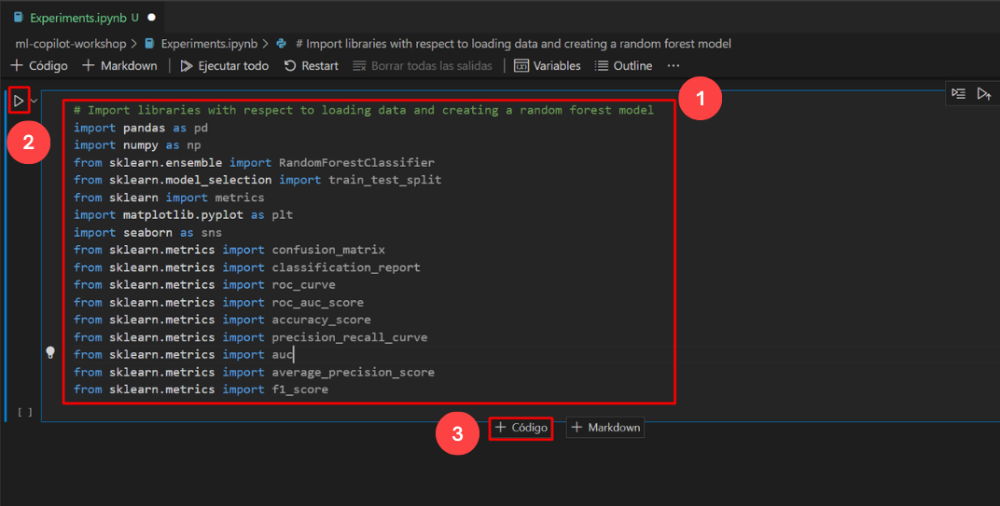

# Exercício 10: Trabalhar com o Copiloto para Aprendizagem Automática [Opcional]

### Duração estimada: 30 minutos

Trabalhar com o GitHub Copilot para Machine Learning implica aproveitar o GitHub Copilot, uma ferramenta de conclusão de código com tecnologia de IA desenvolvida pelo GitHub em colaboração com a OpenAI. Aqui está um rápido resumo das principais etapas e considerações:

Instalação: certifique-se de que tem o GitHub Copilot instalado como uma extensão no seu ambiente de desenvolvimento integrado (IDE), como o Visual Studio Code.

Integração com o GitHub: ligue o seu IDE à sua conta GitHub para permitir uma integração perfeita. Isto permite que o Copilot aceder aos seus repositórios de código e forneça sugestões baseadas no contexto.

Estruturas de aprendizagem automática: o Copilot suporta várias bibliotecas e estruturas de aprendizagem automática, como TensorFlow, PyTorch, scikit-learn e muito mais. Pode ajudar na geração de código para tarefas como o pré-processamento de dados, a construção de modelos e a avaliação.

Neste exercício, irá clonar um repositório Git com um conjunto de dados necessário para este laboratório. Aqui, irá trabalhar com o Copilot for Machine Learning, que envolve o aproveitamento do GitHub Copilot.

>**Nota**: O GitHub Copilot irá sugerir automaticamente um corpo de função completo ou código em texto cinzento. Exemplos do que provavelmente verá neste exercício, mas a sugestão exata pode variar.

>**Nota**: Antes de prosseguir com o exercício, certifique-se de que instalou os pacotes Python e pip.

>**Nota**: Se não conseguir ver nenhuma sugestão do GitHub Copilot no VS Code, reinicie o VS Code uma vez e tente novamente.

## Objetivos do laboratório

Poderá completar as seguintes tarefas:

- Tarefa 1: Pré-requisitos e injeção do conjunto de dados necessário no seu ambiente
- Tarefa 2: Auto_Completion de código com diferentes experiências
- Tarefa 3: Aprendizagem matemática e de máquina usando diferentes exemplos
- Tarefa 4: Visualização e Transformação de Dados
- Tarefa 5: Treinar o modelo de amostra

### Tarefa 1: Pré-requisitos e injeção do conjunto de dados necessário no seu ambiente

1. Abra o Terminal do VS Code clicando em **Reticências (...)** **(1)**, seleccionando **Terminal** **(2)** e clicando em **New Terminal** **(3)**.

   

1. Clone o repositório git abaixo no seu ambiente.

    ```
    git clone https://github.com/CloudLabsAI-Azure/ml-copilot-workshop.git
    ```

1. Altere o diretório no terminal executando o comando abaixo:

    ```
    cd ml-copilot-workshop
    ```

1. Para instalar todas as dependências Python necessárias no seu ambiente antes de trabalhar com o Copilot, execute o comando abaixo no seu terminal:

    ```
    pip install -r requirements.txt
    ```

### Tarefa 2: Auto_Completion de código com diferentes experiências

1. Na janela Explorer do Visual Studio Code, clique com o botão direito do rato na pasta denominada **ml-copilot-workshop** **(1)** e clique em **New File**. Nomeie o ficheiro `Experiments.ipynb` **(2)** e verifique se o seu novo ficheiro se parece com o que se mostra abaixo:

   

1. Digite os comentários abaixo para importar todas as bibliotecas onde o Copilot solicita automaticamente todas as bibliotecas; prima “enter” para passar para a linha seguinte e rever a sugestão, prima “tab” e clique no botão **Run** para executar a célula.

   ```
   # Import libraries with respect to loading data and creating a random forest model
   import pandas as pd
   ```

   

1. Aceite todas as sugestões para a importação de bibliotecas conforme imagem abaixo **(1)** e clique no botão **Run** **(2)** para executar a célula. Clique em `+Código` **(3)** para adicionar a nova célula.

   

   >**Nota**: Ao executar a célula, pode ser necessário instalar os pacotes necessários e selecionar o kernel.

1. Introduza os comentários abaixo para carregar os dados utilizando o prompt do Copilot. Prima “enter” para ir para a linha seguinte e rever a sugestão, e prima “tab” para aceitar a sugestão e clique no botão **Run** para executar a célula.

    ```
    # Load the data from a csv file, and the name of the file is diabetes.csv
    ```

   

1. Clique agora em **+Code** e passe para a tarefa seguinte.


### Tarefa 3: Aprendizagem matemática e de máquina usando diferentes exemplos

### Tarefa 3.1: Operações Matemáticas

1. Introduza os comentários abaixo para realizar a primeira experiência matemática que será gerar o ano de nascimento a partir da coluna da idade presente no conjunto de dados. Prima “enter” para ir para a linha seguinte e rever a sugestão, e prima “tab” para aceitar a sugestão e clique no botão **Run** para executar a célula.

    ```
    # Mathematical operations on the dataset, like generating the birth year from age
    ```

   

   >**Nota**: Continue a clicar em **+Code** após cada comentário até à última tarefa deste exercício.

1. Digite o comentário abaixo, prima "enter" para ir para a linha seguinte e rever a sugestão, e prima "tab" para obter uma saída semelhante à imagem abaixo e clique no botão **Run** para executar o celeu.

    ```
    # Show the new column
    ```

   

1. Introduza os comentários abaixo para converter a coluna do IMC até dois valores decimais, prima “tab”. Prima “enter” para ir para a linha seguinte e rever a sugestão, e prima “tab” para aceitar a sugestão e clique no botão **Run** para executar a célula.

    ```
    # Convert the BMI column to two decimal values
    ```

   

1. Na mesma célula de código, introduza o comentário abaixo. Prima “enter” para ir para a linha seguinte e rever a sugestão, e prima “tab” para aceitar a sugestão e clique no botão **Run** para executar a célula.

    ```
    # Show the new column only
    ```

   


### Tarefa 3.2: Aprendizagem Automática

1. Introduza os comentários abaixo para realizar a análise de dados e estatísticas resumidas no conjunto de dados. Prima “enter” para ir para a linha seguinte e rever a sugestão, e prima “tab” para aceitar a sugestão e clique no botão **Executar** para executar a célula.

    ```
    # Perform count, min, max, std, mean, 25%, 50%, and 75% on the dataset
    ```

   

1. Assim que a execução da célula estiver concluída, obterá uma saída semelhante à imagem abaixo.

   

1. Antes de construir o modelo, o quadro principal é dividir os dados em testes e divisões de comboios e isso seria feito pelo próprio Copilot. Introduza os comentários abaixo. Prima “enter” para ir para a linha seguinte e rever a sugestão, e prima “tab” para aceitar a sugestão e clique no botão **Run** para executar a célula.

    ```
    # Split the data into training and testing data and the column name Diabetic is the target column
    ```

   

   


### Tarefa 4: Visualização e transformação de dados

### Tarefa 4.1: Visualização de dados

1. Clique em **+Code** para abrir a nova célula e introduza os comentários abaixo para realizar as operações básicas no conjunto de dados. Prima “enter” para ir para a linha seguinte e rever a sugestão, e prima “tab” para aceitar a sugestão e clique no botão **Run** para executar a célula.

    ```
    # Perform univariate analysis on the dataset and plot the graphs
    ```

   

1. Assim que a execução da célula estiver concluída, obterá uma saída de representação gráfica semelhante à imagem abaixo.

   

1. Agora, digite os comentários abaixo para especificar determinados gráficos normalmente utilizados para visualização. Prima "enter" para ir para a linha seguinte e rever a sugestão, e prima "tab" para aceitar a sugestão e clique no botão **Run** para obter o resultado como mostra a imagem abaixo.

    ```
    # Perform scatter plot on the dataset and plot the graphs
    ```

   

1. Introduza os comentários abaixo para realizar Gráfico Conjunto ou Grelha (gráficos raramente utilizados) para visualização. Prima "enter" para ir para a linha seguinte e rever a sugestão, e prima "tab" para aceitar a sugestão e clique no botão **Run** para obter o resultado como mostra a imagem abaixo.

    ```
    # Perform Joint Grid plot on the dataset and plot the graphs
    ```

   

   

1. Introduza os comentários abaixo para realizar a visualização de todas as funcionalidades do conjunto de dados. Prima "enter" para ir para a linha seguinte e rever a sugestão, e prima "tab" para aceitar a sugestão e clique no botão **Run** para obter o resultado como mostra a imagem abaixo.

    ```
    # Perform comparison on all features of the dataset and plot the graphs in a single plot using heatmap
    ```

   

   


### Tarefa 4.2: Transformações de dados


1. Clique em **+Code** para adicionar uma nova célula e introduza os comentários abaixo para Normalização, que é o processo de escalar e centrar os recursos numéricos para terem uma média de 0 e um desvio padrão de 1, tornando-os comparáveis. ​​​​e adequados para determinados algoritmos. Prima "enter" para ir para a linha seguinte e rever a sugestão, e prima "tab" para aceitar a sugestão e clique no botão **Run**

    ```
    # Perform standardization on the data
    ```

   

   

1. Obterá a saída como mostrado na imagem abaixo assim que a execução da célula de código terminar.

   

 >**Nota**: A saída pode variar e pode não ser a mesma mostrada na captura de tela

### Tarefa 5: Treinar o modelo de amostra

Treino de um modelo de amostra usando Random Forest.

>**Nota**: O treino do modelo é uma continuação da etapa dividida do teste de treino para treinar o modelo; execute primeiro a etapa de divisão do teste do comboio e depois continue com a construção do modelo.

1. Clique em **+ Code** para adicionar uma nova célula e digite os comentários abaixo para criar o modelo de floresta aleatório. Prima “enter” para ir para a linha seguinte e rever a sugestão e prima “tab” para aceitar as sugestõese clique no botão **Run**

    ```
    # Create a random forest model with 100 trees, and the criterion is entropy
    ```

   

   

   

1. Numa nova célula digite os comentários abaixo para calcular a precisão do modelo. Prima "enter" para ir para a linha seguinte e rever a sugestão, e prima "tab" para aceitar a sugestão e clique no botão **Run**

    ```
    # Calculate the accuracy of the model
    ```

   


### Resumo

Neste exercício, aproveitou com sucesso o GitHub Copilot for Machine Learning.

### Concluiu o laboratório com sucesso
