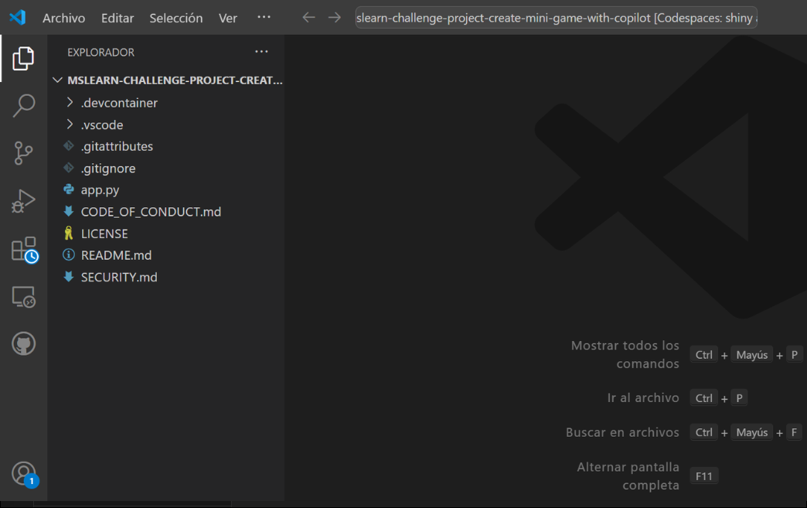

# Exercício 11: Criação de um minijogo com o GitHub Copilot [opcional]

### Duração estimada: 20 minutos

Neste exercício, irá utilizar as funcionalidades do GitHub Copilot para construir um minijogo clássico de pedra, papel e tesoura. Através deste envolvimento prático, não só irá refinar o seu conhecimento de programação, como também reforçará a sua proficiência na criação de aplicações de consola utilizando Python.

## Objetivos do laboratório

Poderá completar as seguintes tarefas:

- Tarefa 1: Configurar o seu ambiente
- Tarefa 2: Testar o seu Codespace GitHub
- Tarefa 3: Criação da lógica do jogo

### Tarefa 1: Configurar o seu ambiente

1. Navegue até [Mini-game-with-copilot](https://github.com/MicrosoftDocs/mslearn-challenge-project-create-mini-game-with-copilot) e clique em **Fork**.

   

1. Clique em **Create Fork**.

   

1. Depois de o repositório ser bifurcado, selecione o botão **Code (1)** e, no separador **Codespaces**, selecione **Create codespace on main (2)**.

   

   >**Nota**: Caso encontre um prompt pop-up. Clique em **Abrir** para continuar.

   

1. Clique em **Open** quando lhe for pedido para permitir a extensão Github Codespaces.

   

1. Visualize o repositório.

   

### Tarefa 2: Testar o seu Codespace GitHub

1. Abra o ficheiro **app.py**.

   

1. Cole o seguinte comentário e clique em **Enter** e verifique se o próximo comentário foi gerado pelo **Github Copilot**.

    ```
    # write 'hello world' to the console
    ```

   

   >**Nota:** Nos casos em que o código não é gerado pelo **Github Copilot**, clique em **Extensions**, pesquise por Github Copilot, seleccione-o e clique em **Install in Codespaces: zany train**.

   

1. Clique em **Save**.

1. Clique em **Terminal (1)** e seleccione **New Terminal (2)**.

   

1. Execute a aplicação com o comando **python app.py** no terminal e verifique se o resultado é semelhante à seguinte mensagem da consola:

   


### Tarefa 3: Criação da lógica do jogo

1. Apague o código gerado no passo anterior e utilize o atalho CTRL+I para solicitar ao GitHub Copilot que execute uma ação. Cole o seguinte **comentário (1)** para pesquisar o código e clique no botão Fazer pedido **(Enter) (2)** e clique em **Accept (3)** para utilizar o código.

    ```
    The player can choose rock, paper, or scissors, and invalid inputs are handled gracefully. After each round, display whether the player won, lost, or tied. Allow the player to play again after each round and display their score at the end of the game. Inputs are converted to lowercase for consistency.
    ```

   

   >**Nota:** No entanto, é de notar que as sugestões fornecidas pelo GitHub Copilot podem variar e, por vezes, podem ser irrelevantes e exigir uma compreensão clara do código python e da sua utilização.

1. **Salve** o arquivo pressionando **Ctrl + S**.

1. Execute a aplicação com o comando **python app.py** no terminal.

   

### Resumo

Neste exercício, criou com sucesso um minijogo utilizando o Python e o Github Copilot.

### Concluiu o laboratório com sucesso
