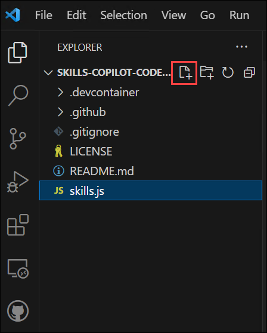

# Exercício 2: Explorar sugestões de código baseado em IA em JavaScript

### Duração estimada: 20 minutos

Embora o GitHub Copilot forneça recomendações em várias linguagens e frameworks, destaca-se particularmente com Python, JavaScript, TypeScript, Ruby, Go, C# e C++. Embora os exemplos seguintes estejam em JavaScript, também devem ser compatíveis com outras linguagens.

Neste exercício, terá a oportunidade de explorar e utilizar JavaScript, guiado pelo GitHub Copilot e do GitHub Copilot Chat.

>**Isenção de responsabilidade**: todo o corpo da função será sugerido automaticamente pelo GitHub Copilot em texto cinzento. No entanto, a recomendação precisa pode variar.

>**Nota**: Se não conseguir ver nenhuma sugestão do GitHub Copilot no VS Code, reinicie o VS Code uma vez e tente novamente.

## Objetivos do laboratório

Poderá completar as seguintes tarefas:

- Tarefa 1: Adicionar um ficheiro JavaScript e começar a escrever código
- Tarefa 2: Enviar código para o seu repositório a partir do codespace
- Tarefa 3: Boas práticas para utilizar o GitHub Copilot

## Tarefa 1: Adicionar um ficheiro JavaScript e começar a escrever código

1. Na janela do VS Code Explorer, crie um novo ficheiro.

   

2. Nomeie o ficheiro como `skills.js` e verifique se o novo ficheiro está como mostrado abaixo:

   

3. No ficheiro `skills.js`, digite o seguinte cabeçalho de função e prima Enter:

    ```
    function calculateNumbers(var1, var2)
    ```

   > **Nota**: O corpo da função será sugerido automaticamente pelo GitHub Copilot em texto cinzento. Aqui está um exemplo do que provavelmente verá; no entanto, a recomendação precisa pode variar.

   .png)

4. Prima `Tab` para aceitar a sugestão e prima `Ctrl + S` para guardar o ficheiro.

   .png)

## Tarefa 2: Enviar código para o seu repositório a partir do codespace

Nesta tarefa, irá utilizar o terminal VS Code para adicionar o ficheiro `skills.js` ao repositório GitHub.

1. Abra o Terminal do VS Code clicando em **Reticências (...)** **(1)**, seleccione **Terminal** **(2)** e clique em **New Terminal** **(3)**.

   

2. Execute o comando abaixo para adicionar o ficheiro `skills.js` ao repositório GitHub.

    ```
    git add skills.js
    ```

3. De seguida, na fase terminal do VS Code, envie as alterações para o repositório:

    ```
    git commit -m "Copilot first commit"
    ```

4. Por fim, no terminal VS Code, envie o código para o repositório:

    ```
    git push
    ```

   

 >**Nota**: Aguarde cerca de 60 segundos e atualize a página inicial do repositório GitHub para o passo seguinte.


## Tarefa 3: Boas práticas para utilizar o GitHub Copilot

### Verificar a extensão GitHub Copilot Chat no VS Code

1. Para verificar a extensão GitHub Copilot Chat, devem ser executados os seguintes passos no Visual Studio Code:

    - Clique no ícone **Extensions (1)** na barra de atividades presente no lado esquerdo da janela do Visual Studio Code.
    - Na caixa de pesquisa "Pesquisar extensões no Marketplace", digite e pesquise a extensão **GitHub Copilot Chat (2)**.
    - Selecione **GitHub Copilot Chat (3)** na lista de resultados apresentados e verifique se o **GitHub Copilot Chat** foi instalado.
    - Caso contrário, clique no botão **Install (4)**.

      

1. Assim que a instalação estiver concluída, no painel de navegação esquerdo poderá ver o ícone do GitHub Copilot Chat, conforme mostrado abaixo.

   

## Tarefa 3.1- Exemplo: Definir o cenário com um objetivo de alto nível

Isto é mais útil se tiver um ficheiro em branco ou uma base de código vazia. Por outras palavras, pode ser útil preparar o terreno para o GitHub Copilot ter ideia do que pretende construir ou alcançar. Ter uma descrição geral do que se pretende gerar (antes de entrar nos detalhes), ajuda o GitHub Copilot.

Quando fizer pedidos ao GitHub Copilot, pense no processo como uma conversa com alguém: como devo analisar o problema para que possamos resolvê-lo em conjunto? Como abordaria a programação a pares com essa pessoa?

1. Na janela do VS Code Explorer, crie um novo ficheiro.

   

2. Nomeie o ficheiro como `index.js` e verifique se o novo ficheiro está como mostrado abaixo:

   

3. Agora pressione Ctrl + I para abrir o GitHub Copilot Chat e cole o seguinte **comment (1)** para pesquisar o código e clique no botão Fazer pedido **(Enter) (2)** e clique em **Accept (3)** para utilizar o código.

   ```
   /*
   Create a basic markdown editor in Next.js with the following features:
   - Use react hooks
   - Create a state for markdown with the default text "type markdown here"
   - A text area where users can write markdown 
   - Show a live preview of the markdown text as I type
   - Support for basic markdown syntax like headers, bold, and italics 
   - Use React markdown npm package 
   - The markdown text and resulting HTML should be saved in the component's state and updated in real-time 
   */
   ```

   

## Tarefa 3.2- Exemplo: tentar receber um breve resultado do GitHub Copilot para uma questão simples e específica

Depois de explicar o seu objetivo principal ao GitHub Copilot, explique o raciocínio e os procedimentos necessários para atingir esse objetivo. Isto ajudará o GitHub Copilot a obter uma compreensão mais clara do resultado pretendido. Por exemplo, imagine que está a escrever uma receita. Em vez de escrever um parágrafo a descrever os alimentos que pretende preparar, dividiria o procedimento de confeção em partes distintas.
Assim, em vez de pedir ao GitHub Copilot para gerar uma grande quantidade de código de uma só vez, deixe-o gerar o código após cada passo.

1. No mesmo ficheiro index.js, introduza as instruções passo a passo abaixo para reverter uma frase.

    ```
    // take a sentence as input
    // reverse the input sentence
    // the start of the sentence must start with a capital
    // for javascript
    ```

2. O resultado gerado seria semelhante à imagem abaixo.

   

## Tarefa 3.3- Exemplo: dar um ou dois exemplos ao GitHub Copilot

Não só as pessoas podem beneficiar da aprendizagem com exemplos, mas também o GitHub Copilot. Por exemplo, para retirar os nomes da matriz de dados abaixo e colocá-los numa nova matriz:

   ```
          const data = [
        [
          { name: 'John', age: 25 },
          { name: 'Jane', age: 30 }
        ],
        [
          { name: 'Bob', age: 40 }
        ]
      ];    
   ```


1. Introduza o comentário abaixo no chat para gerar a saída sem mostrar um exemplo ao GitHub Copilot.

    ```
    // As an illustration, pull names out of the data array
    ```

2. Gerou um uso incorreto do mapa.

   

3. Por outro lado, digite os comentários abaixo para fornecer um exemplo de como gerar a saída desejada.

    ```
    // Map through an array of arrays of objects
    // Example: Extract names from the data array
    // Desired outcome: ['John', 'Jane', 'Bob']    
    ```

4. Agora recebemos o resultado desejado. Guarde o ficheiro `index.js` recém-criado utilizando as teclas de atalho `CTRL + S`.

   

5. Abra o **Novo Terminal** para enviar o código.

6. Execute o comando abaixo para obter as alterações mais recentes.

    ```
    git pull
    ```

1. Execute o comando abaixo para adicionar o ficheiro `index.js` ao repositório GitHub.

    ```
    git add index.js
    ```

8. De seguida, no terminal VS Code, envie as alterações para o repositório:

    ```
    git commit -m "Copilot commit"
    ```

9. Por fim, no terminal VS Code, envie o código para o repositório:

    ```
    git push
    ```

   >**Nota**: Aguarde cerca de 60 segundos e atualize a página inicial do repositório GitHub para o passo seguinte.

 <validation step="73a63481-3140-4473-9b94-36d265cdc8cb" />

10. Clique em **Próximo** abaixo para passar para a página seguinte.

### Resumo

Neste exercício, gerou com sucesso código JavaScript e outras práticas recomendadas utilizando o GitHub Copilot e o GitHub Copilot Chat.

### Concluiu o laboratório com sucesso. Clique em **Próximo >>** para prosseguir com o próximo exercício.
