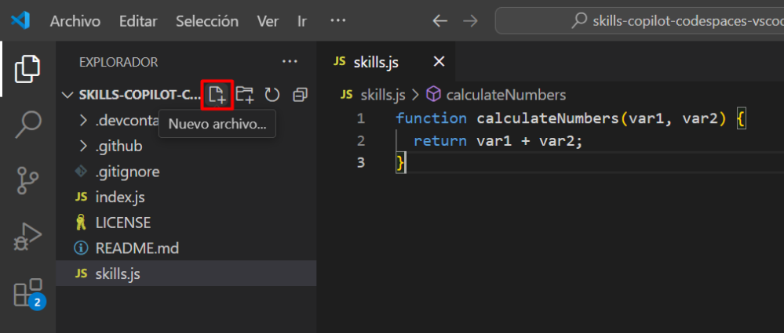
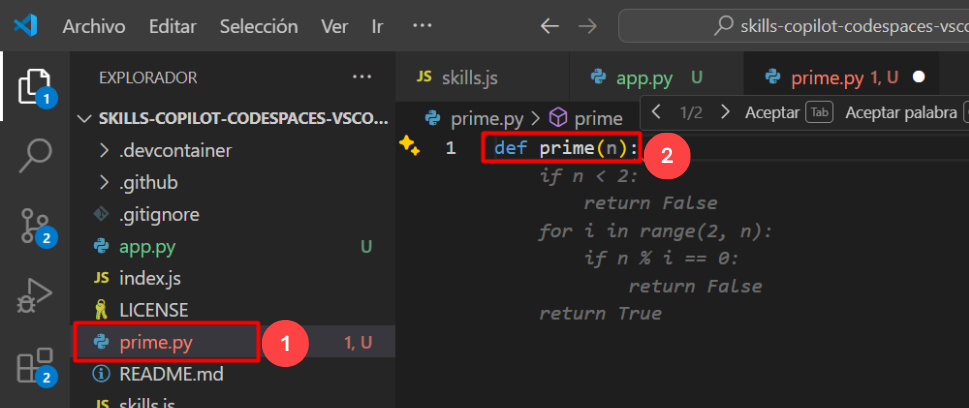
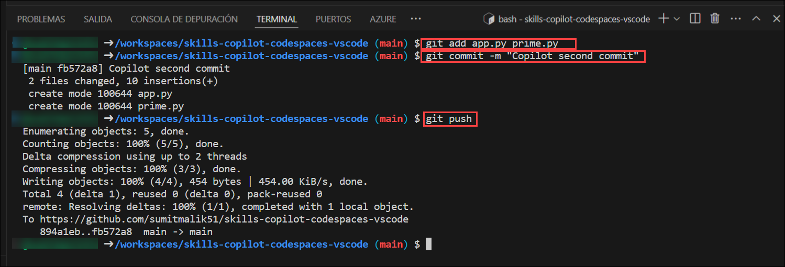

# Exercício 3: Explorar o Python com o GitHub Copilot: sugestões de código inteligente

### Duração estimada: 10 minutos

O GitHub Copilot fornece sugestões para uma infinidade de linguagens e frameworks, destacando-se particularmente com Python, JavaScript, TypeScript, Ruby, Go, C# e C++. Além disso, o Copilot oferece uma assistência valiosa na geração de consultas para bases de dados.

Neste exercício, terá a oportunidade de aprofundar os conhecimentos de Python e tirar partido das funcionalidades do Copilot, beneficiando de diversas sugestões.

>**Nota**: O GitHub Copilot irá sugerir automaticamente um corpo de função completa ou código em texto cinzento. A seguir, apresentamos alguns exemplos do que provavelmente verá neste exercício, mas a sugestão exata pode variar.

>**Nota**: Se não conseguir ver nenhuma sugestão do GitHub Copilot no VS Code, reinicie o VS Code uma vez e tente novamente.

## Objetivos do laboratório

Poderá completar as seguintes tarefas:

- Tarefa 1: Adicionar código a um método de Python
- Tarefa 2: Visualize o separador GitHub Copilot com várias sugestões
- Tarefa 3: Enviar código através de comandos push para o repositório usando GitHub Codespaces

## Tarefa 1: Adicionar código a um método de Python

### Instalação da extensão Python no VS Code

1. Para instalar a extensão Python, devem ser executados os seguintes passos no Visual Studio Code:

    - Clique no ícone **Extensions** **(1)** na barra de atividades presente no lado esquerdo da janela de código do Visual Studio.
    - Na caixa de pesquisa "Pesquisar extensões no Marketplace", digite e pesquise a extensão **Python** **(2)**.
    - Selecione **Python** **(3)** na lista de resultados que aparecem.
    - Clique no botão **Install** **(4)**.

      

1. A partir do codespace na janela do VS Code Explorer, crie um novo ficheiro.

   

1. Nomeie o ficheiro como `app.py`. Introduza o seguinte código neste ficheiro recém-criado e utilize a tecla Enter para passar para a linha seguinte.

    ```
    def hello():
    ```

1. O GitHub Copilot irá sugerir automaticamente um código inteiro em texto cinzento. Prima o separador para aceitar a sugestão e guarde o ficheiro.

   

 > **Nota**: Eis um exemplo do que provavelmente verá; no entanto, a recomendação precisa pode variar.

### Tarefa 2: Visualize o separador GitHub Copilot com várias sugestões

Nesta tarefa, continuará a utilizar o GitHub Copilot e poderá precisar de algumas das sugestões que oferece. O GitHub Copilot irá gerar cerca de 10 sugestões de código diferentes num novo separador.

1. A partir do codespace na janela do VS Code Explorer, crie um novo ficheiro chamado `prime.py` **(1)** e digite o seguinte código **(2)**.

    ```
    def prime(n):
    ```

   

   > **Nota**: Eis um exemplo do que provavelmente verá; no entanto, a recomendação precisa pode variar.

1. Para abrir um novo separador com múltiplas soluções sintetizadas, prima `Ctrl + Enter`. O GitHub Copilot irá gerar cerca de 10 sugestões de código diferentes num novo separador. Pode visualizar as soluções e, para aceitar uma sugestão, é necessário clicar em **Accept Suggestion** abaixo da sugestão pretendida e guardar o ficheiro.

   

 > **Nota**: Nos casos em que as sugestões do Github Copilot não apareçam, feche e volte a abrir o Visual Studio Code.

### Tarefa 3: Enviar código através de comandos push para o repositório usando GitHub Codespaces

1. Navegue de volta para o terminal do VS Code e adicione ficheiros ao repositório.

2. Execute o comando abaixo para adicionar os ficheiros `app.py` e `prime.py` ao repositório:

    ```
    git add app.py prime.py
    ```

3. De seguida, a partir da fase terminal do VS Code e confirme as alterações no repositório:

    ```
    git commit -m "Copilot second commit"
    ```

4. Por fim, a partir do terminal do VS Code, envie o código para o repositório:

    ```
    git push
    ```

   

   >**Nota**: Aguarde cerca de 60 segundos e atualize a página inicial do repositório para a próxima etapa.

   >**Nota**: Se você estiver enfrentando algum erro que diz `Rejeitado`, execute o comando fornecido abaixo e execute novamente o comando `git push` novamente. Isso irá buscar as alterações na ramificação remota e mesclá-las na ramificação atual sem rebase.
   
      ```
      git pull --no-rebase
      ```

   >**Nota**: Uma mensagem aparece no terminal informando que você precisa fechar o arquivo recém-aberto, além dos dois arquivos que já estão abertos. Feche o arquivo recém-aberto.

5. Pode verificar os ficheiros `app.py` e `prime.py` disponíveis no seu repositório GitHub.

   

 <validation step="95754ad8-7b5c-486d-8e7c-d034df03ff1b" />

6. Clique em **Próximo** abaixo para passar para a página seguinte.

### Resumo

Neste exercício, concluiu com sucesso a tarefa de utilizar Python em conjunto com o GitHub Copilot e fê-lo com o benefício de receber várias sugestões.

### Concluiu o laboratório com sucesso
