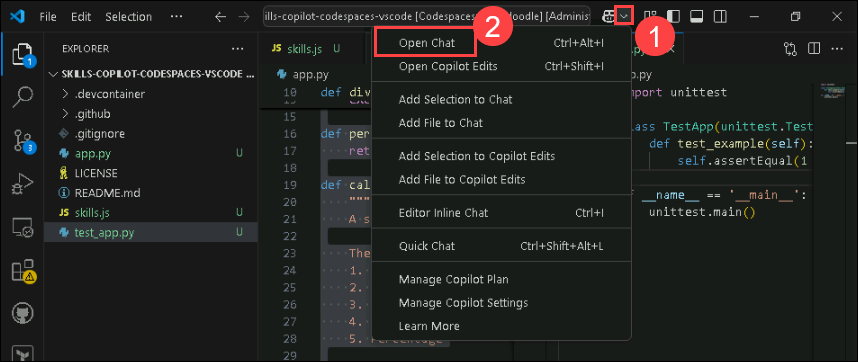
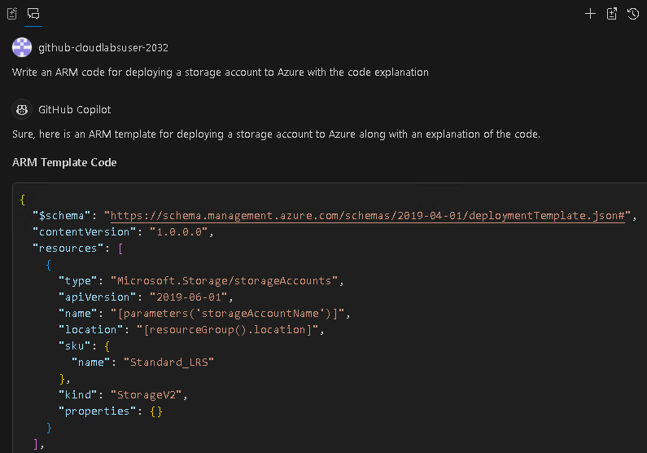
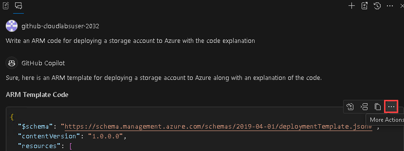
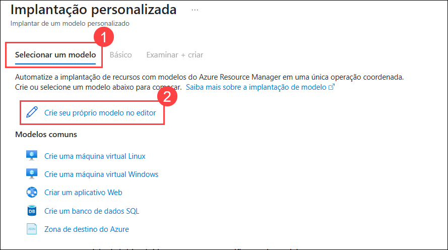
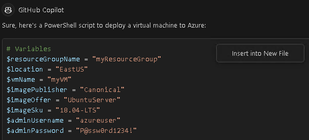

# Exercício 4: Utilização do GitHub Copilot Chat para gerar código ARM e Terraform com o Copilot

### Duração estimada: 60 minutos

## Sobre o GitHub Copilot Chat e o Visual Studio Code

O GitHub Copilot Chat permite-lhe fazer perguntas sobre código e receber respostas diretamente no IDE. O Copilot Chat pode ajudá-lo com uma variedade de tarefas relacionadas com a ecrita de código, como oferecer sugestões, fornecer descrições em linguagem natural da funcionalidade e finalidade de um trecho de código, gerar testes unitários para o seu código e propor correções para bugs. Para mais informações, consulte "[Sobre o GitHub Copilot Chat](https://docs.github.com/en/copilot/github-copilot-chat/about-github-copilot-chat)."

### Casos de utilização do GitHub Copilot Chat

Existem várias situações em que o GitHub Copilot Chat pode ajudar na codificação.

 - Geração de casos de testes unitários
 - Explicar o código
 - Propor correções de código
 - Respondendo a questões sobre código

Neste lab, irá utilizar o Copilot para gerar código em ARM, Terraform e PowerShell.

> **Nota**: O GitHub Copilot irá sugerir automaticamente um corpo de função completa ou código em texto cinzento. A seguir, apresentamos alguns exemplos do que provavelmente verá neste exercício, mas a sugestão exata pode variar.

## Objetivos do laboratório

Poderá completar as seguintes tarefas:

- Tarefa 1: Gerar código por chat que utilize ARM para implementar recursos no Azure
- Tarefa 2: Gerar código por chat que utiliza o Terraform para implementar recursos no Azure
- Tarefa 3: Gerar código por chat que utiliza o PowerShell para implementar recursos no Azure

### Tarefa 1: Gerar código por chat que utiliza ARM para implementar recursos no Azure

>**Nota**: Se a extensão GitHub Copilot não estiver instalada, clique em Instalar.

1. Na barra de atividades do Visual Studio Code, clique no ícone **GitHub Copilot Chat (1)**. Clique em **Open Chat (2)** para abrir a janela GitHub Copilot Chat.

    

1. Na parte inferior da janela GitHub Copilot Chat, na caixa de texto **Ask Copilot or type / for commands**, digite uma pergunta relacionada com programação e prima Enter. Por exemplo, digite `Write ARM code to deploy a storage account in Azure with code explanation"`.

   

1. O GitHub Copilot Chat processará a sua pergunta e fornecerá uma resposta, com sugestões de código quando apropriado, na janela de chat.

   

    > **Nota:** Eis um exemplo do que provavelmente verá; no entanto, a recomendação precisa pode variar.

    > **Nota**: Opcionalmente, se o GitHub Copilot Chat sugerir uma pergunta de seguimento acima da caixa de texto **Ask Copilot or type / for commands**, clique na pergunta de seguimento para a fazer.

    > **Nota**: Se a sua questão estiver fora do âmbito do GitHub Copilot Chat, este irá informá-lo e poderá sugerir uma questão alternativa a ser colocada.

1. Pode visualizar a resposta do GitHub Copilot no chat. Para inserir código num novo ficheiro, clique em **Reticências (...)** **(1)** e seleccione **Insert Into New File** **(2)**.

   

   

1. Prima `CTRL + S` para guardar o ficheiro. Nomeie o ficheiro como `arm.json` e clique em **OK**

      

1. Após salvar o arquivo, abra o ícone do Azure Portal na área de trabalho.

         

1. Se a janela abrir dentro da sessão existente, clique no ícone de **Profile** no canto superior direito e selecione **Sign in with a different account**.

       

1. Clique em **Use Another Account**.

       

1. Na guia **Sign in to Microsoft Azure tab**, você verá uma tela de login. Insira o seguinte e-mail/nome de usuário e clique em **Next**.

   - **Email/Username:** <inject key="AzureAdUserEmail"></inject>

1. Agora, insira a seguinte senha e clique em **Sign in**.

   - **Password:** <inject key="AzureAdUserPassword"></inject>

1. Se você vir o pop-up **Stay Signed in?**, clique em **No**.

1. Selecione **Cancel** na página **Welcome to Azure**.

     

1. Pesquise por **deploy(1)** e selecione **Deploy a custom template(2)**.

     

1. Clique em **Select a template(1)** e clique em **Build your own template in the editor(2)**.

      

1. Copie e **cole(1)** o código que você salvou anteriormente no VS Code na seção **Edit template** e clique em **Save(2)**.

      

1. Na seção de detalhes do projeto, adicione as seguintes informações:

   - Subscription - **Select the default subscription (1)**
   - Resource Group - **Select JumpVM-RG-<inject key="Deployment-id" enableCopy="false"/> (2)**
   - Region - **Select the default region. (3)**
   - Storage Account Name - **storage<inject key="Deployment-id" enableCopy="false"/> (4)**
   - Clique em **Review + Create (5)**

     

        > **Note:** In case, the storage account name is already fetched, use the default.

1. Clique em **Create**        
      
1. Clique em **Go to Resource**.

     

1. Verifique que a **storage account** foi criada.

     

### Tarefa 2: Gerar código por chat que utiliza o Terraform para implementar recursos no Azure

1. Na barra de atividades do Visual Studio Code, clique no ícone GitHub Copilot Chat para abrir a janela GitHub Copilot Chat.

1. Na parte inferior da janela GitHub Copilot Chat, na caixa de texto **Ask Copilot or type / for commands**, digite uma pergunta relacionada com programação e prima Enter. Por exemplo, digite `Write a Terraform code for deploying a storage account to Azure with the code explanation`.

1. O GitHub Copilot Chat processará a sua pergunta e fornecerá uma resposta, com sugestões de código quando apropriado, na janela de chat.

    

    > **Nota:** Eis um exemplo do que provavelmente verá; no entanto, a recomendação precisa pode variar.

    > **Nota**: Opcionalmente, se o GitHub Copilot Chat sugerir uma pergunta de acompanhamento acima da caixa de texto **Ask Copilot a question or type / for topics**, clique na pergunta de acompanhamento para a fazer.

    > **Nota**: Se a sua questão estiver fora do âmbito do GitHub Copilot Chat, este irá informá-lo e poderá sugerir uma questão alternativa a ser colocada.

1. Pode visualizar a resposta do GitHub Copilot no chat. Para inserir código num novo ficheiro, clique em **Reticências (...)** **(1)** e seleccione **Insert Into New File** **(2)**.

   

1. Prima `CTRL + S` para guardar o ficheiro. Nomeie o ficheiro como `terraform.tf` e clique em **OK**

   

### Tarefa 3: Gerar código por chat que utiliza o PowerShell para implementar recursos no Azure

1. Na barra de atividades do Visual Studio Code, clique no ícone GitHub Copilot Chat para abrir a janela GitHub Copilot Chat.

1. Na parte inferior da janela GitHub Copilot Chat, na caixa de texto **Ask Copilot or type / for commands**, digite uma pergunta relacionada com programação e prima Enter. Por exemplo, escreva `Write a PowerShell script for deploying a storage account to Azure`.

1. O GitHub Copilot Chat processará a sua pergunta e fornecerá uma resposta, com sugestões de código quando apropriado, na janela de chat.

      

    > **Nota:** Eis um exemplo do que provavelmente verá; no entanto, a recomendação precisa pode variar.

    > **Nota**: Opcionalmente, se o GitHub Copilot Chat sugerir uma pergunta de acompanhamento acima da caixa de texto **Ask Copilot a question or type / for topics**, clique na pergunta de acompanhamento para a fazer.

    > **Nota**: Se a sua questão estiver fora do âmbito do GitHub Copilot Chat, este irá informá-lo e poderá sugerir uma questão alternativa a ser colocada.

1. Pode visualizar a resposta do GitHub Copilot no chat. Para inserir código num novo ficheiro, clique em **Reticências (...)** **(1)** e seleccione **Insert Into New File** **(2)**.

      

1. Pressione `CTRL + S` para guardar o ficheiro e verá uma recomendação para instalar a extensão `PowerShell`. Clique em Instalar. Nomeie o ficheiro como `powershell.ps1` e clique em **OK**.

   

### Resumo

Neste exercício, foi utilizado o Copilot para gerar código automaticamente em ARM, Terraform e PowerShell.

### Concluiu o laboratório com sucesso. Clique em **Próximo >>** para prosseguir com o próximo exercício.