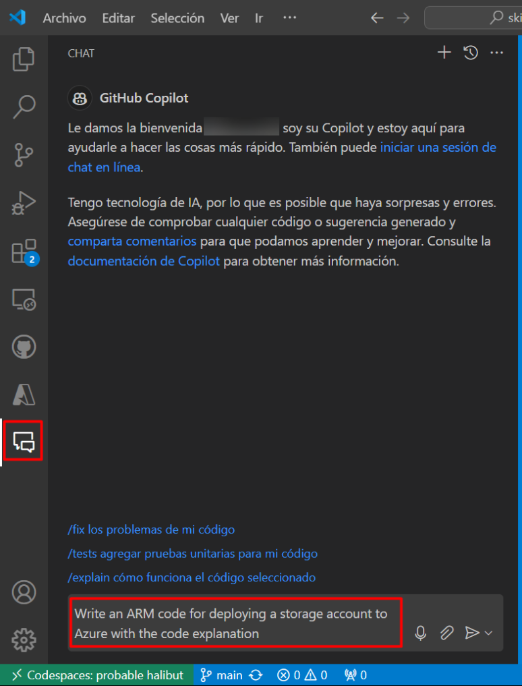
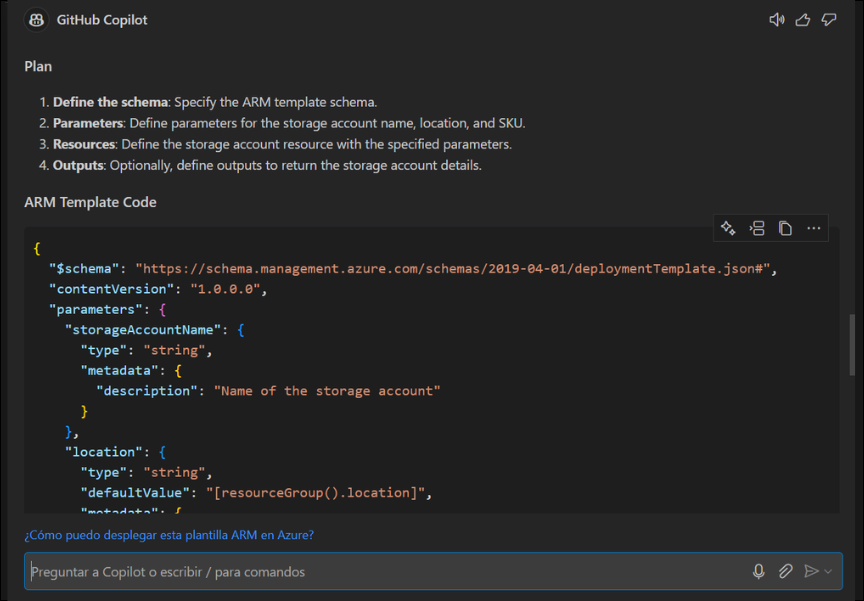
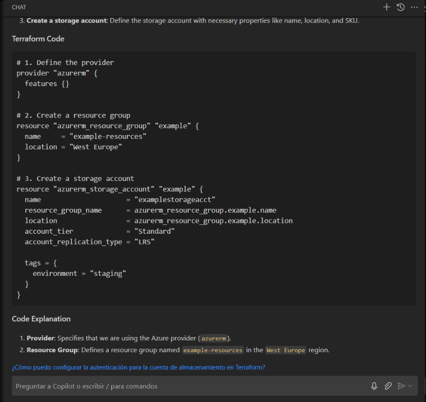
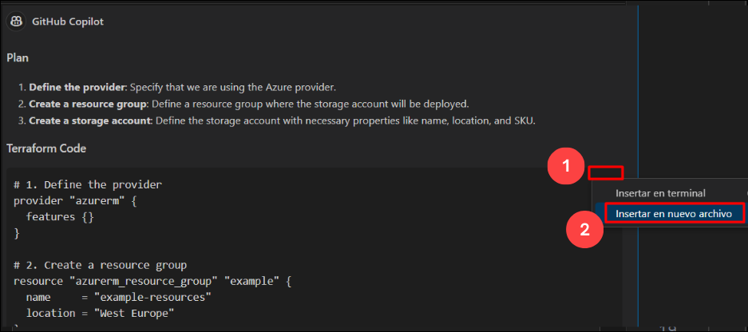
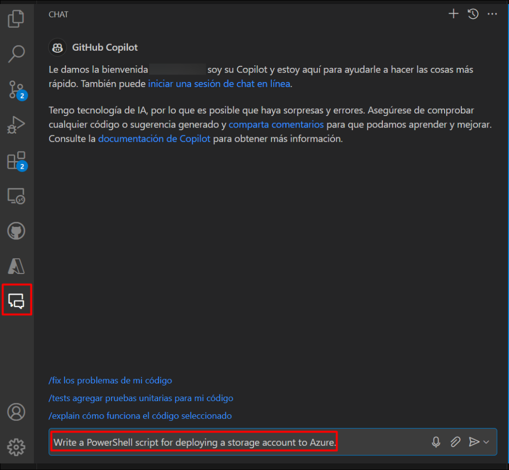

# Exercício 4: Utilização do GitHub Copilot Chat para gerar código ARM e Terraform com o Copilot

### Duração estimada: 25 minutos

## Sobre o GitHub Copilot Chat e o Visual Studio Code

O GitHub Copilot Chat permite-lhe fazer perguntas sobre codificação e receber respostas diretamente no IDE compatível. O Copilot Chat pode ajudá-lo com uma variedade de tarefas relacionadas com a codificação, como oferecer sugestões de código, fornecer descrições em linguagem natural da funcionalidade e finalidade de um trecho de código, gerar testes unitários para o seu código e propor correções para bugs em o seu código. Para mais informações, consulte "[Sobre o GitHub Copilot Chat](https://docs.github.com/en/copilot/github-copilot-chat/about-github-copilot-chat)."

## Casos de utilização do GitHub Copilot Chat

Existem várias situações em que o GitHub Copilot Chat pode ajudar na codificação.

 - Geração de casos de testes unitários
 - Explicando o código
 - Propor correções de código
 - Respondendo a questões de codificação

Neste exercício, irá utilizar o Copilot para gerar código em ARM, Terraform e PowerShell.

> **Isenção de responsabilidade**: O GitHub Copilot irá sugerir automaticamente um corpo de função inteiro ou código em texto cinzento. Exemplos do que provavelmente verá neste exercício, mas a sugestão exata pode variar.

>**Nota**: Se não conseguir ver nenhuma sugestão do GitHub Copilot no VS Code, reinicie o VS Code uma vez e tente novamente.

## Objetivos do laboratório

Poderá completar as seguintes tarefas:

- Tarefa 1: Gerar código por chat que utilize ARM para implementar recursos no Azure
- Tarefa 2: gerar código por chat que utiliza o Terraform para implementar recursos no Azure
- Tarefa 3: Gerar código por chat que utiliza o PowerShell para implementar recursos no Azure
- Tarefa 4: enviar código para o seu repositório a partir do codespace

### Tarefa 1: gerar código por chat que utiliza ARM para implementar recursos no Azure

1. Na barra de atividades do Visual Studio Code, clique no ícone GitHub Copilot Chat para abrir a janela GitHub Copilot Chat.

1. Na parte inferior da janela GitHub Copilot Chat, na caixa de texto **Pergunte ao Copilot ou digite / para comandos**, digite uma pergunta relacionada com a codificação e prima Enter. Por exemplo, digite "Escreva um código ARM para implementar uma conta de armazenamento no Azure com a explicação do código".

   

1. O GitHub Copilot Chat processará a sua pergunta e fornecerá uma resposta, com sugestões de código quando apropriado, na janela de chat.

   

   

    > **Nota:** Eis um exemplo do que provavelmente verá; no entanto, a recomendação precisa pode variar.

    > **Nota**: Opcionalmente, se o GitHub Copilot Chat sugerir uma pergunta de seguimento acima da caixa de texto **Perguntar ao Copilot ou digitar / para comandos**, clique na pergunta de seguimento para a fazer.

    > **Nota**: Se a sua questão estiver fora do âmbito do GitHub Copilot Chat, este irá informá-lo e poderá sugerir uma questão alternativa a ser colocada.

1. Pode visualizar a resposta do GitHub Copilot no chat. Para inserir código num novo ficheiro, clique em **Reticências (...)** **(1)** e seleccione **Inserir em novo ficheiro** **(2)**.

   

1. Prima `CTRL + S` para guardar o ficheiro. Nomeie o ficheiro como `arm.json` e clique em **OK**

   

### Tarefa 2: gerar código por chat que utiliza o Terraform para implementar recursos no Azure

1.Na barra de atividades do Visual Studio Code, clique no ícone GitHub Copilot Chat para abrir a janela GitHub Copilot Chat.

1. Na parte inferior da janela GitHub Copilot Chat, na caixa de texto **Pergunte ao Copilot ou digite / para comandos**, digite uma pergunta relacionada com a codificação e prima Enter. Por exemplo, digite "Escreva um código Terraform para implementar uma conta de armazenamento no Azure com a explicação do código".

   

1. O GitHub Copilot Chat processará a sua pergunta e fornecerá uma resposta, com sugestões de código quando apropriado, na janela de chat.

   

    > **Nota:** Eis um exemplo do que provavelmente verá; no entanto, a recomendação precisa pode variar.

    > **Nota**: Opcionalmente, se o GitHub Copilot Chat sugerir uma pergunta de acompanhamento acima da caixa de texto **Faça uma pergunta ao Copilot ou digite / para tópicos**, clique na pergunta de acompanhamento para a fazer.

    > **Nota**: Se a sua questão estiver fora do âmbito do GitHub Copilot Chat, este irá informá-lo e poderá sugerir uma questão alternativa a ser colocada.

1. Pode visualizar a resposta do GitHub Copilot no chat. Para inserir código num novo ficheiro, clique em **Reticências (...)** **(1)** e seleccione **Inserir em novo ficheiro** **(2)**.

   

1. Prima `CTRL + S` para guardar o ficheiro. Nomeie o ficheiro como `terraform.tf` e clique em **OK**

   

### Tarefa 3: Gerar código por chat que utiliza o PowerShell para implementar recursos no Azure

1.Na barra de atividades do Visual Studio Code, clique no ícone GitHub Copilot Chat para abrir a janela GitHub Copilot Chat.

1. Na parte inferior da janela GitHub Copilot Chat, na caixa de texto **Faça uma pergunta ao Copilot ou digite / para tópicos**, digite uma codificação pergunta relacionada e prima Enter. Por exemplo, escreva "Escrever um script PowerShell para implementar uma conta de armazenamento no Azure".

   

1. O GitHub Copilot Chat processará a sua pergunta e fornecerá uma resposta, com sugestões de código quando apropriado, na janela de chat.

   

    > **Nota:** Eis um exemplo do que provavelmente verá; no entanto, a recomendação precisa pode variar.

    > **Nota**: Opcionalmente, se o GitHub Copilot Chat sugerir uma pergunta de acompanhamento acima da caixa de texto **Faça uma pergunta ao Copilot ou digite / para tópicos**, clique na pergunta de acompanhamento para a fazer.

    > **Nota**: Se a sua questão estiver fora do âmbito do GitHub Copilot Chat, este irá informá-lo e poderá sugerir uma questão alternativa a ser colocada.

1. Pode visualizar a resposta do GitHub Copilot no chat. Para inserir código num novo ficheiro, clique em **Reticências (...)** **(1)** e seleccione **Inserir em novo ficheiro** **(2)**.

   

1. Pressione `CTRL + S` para guardar o ficheiro e verá uma recomendação para instalar a extensão `PowerShell`. Clique em Instalar. Nomeie o ficheiro como `powershell.ps1` e clique em **OK**.

   

### Tarefa 4: enviar código push para o seu repositório a partir do codespace

1. Utilize o terminal VS Code para adicionar ficheiros ao repositório. Abra o VS Code Terminal se ainda não estiver aberto.

1. Execute o comando abaixo para adicionar os ficheiros `arm.json` , `terraform.tf` e `powershell.ps1` ao repositório:

    ```
    git add arm.json terraform.tf powershell.ps1
    ```

1. De seguida, na fase terminal do VS Code, envie as alterações para o repositório:

    ```
    git commit -m "Copilot third commit"
    ```

1. Por fim, a partir do terminal VS Code, envie o código para o repositório:

    ```
    git push
    ```

   

   >**Nota**: Aguarde cerca de 60 segundos e atualize a página inicial do repositório para o passo seguinte.

1. Pode verificar os ficheiros `arm.json`, `powershell.ps1` e `terraform.tf` disponíveis no seu repositório GitHub.

   

1. Clique em **Seguinte** abaixo para passar para a página seguinte.

### Resumo

Neste exercício, foi utilizado o Copilot para gerar código automaticamente em ARM, Terraform e PowerShell.

### Concluiu o laboratório com sucesso
