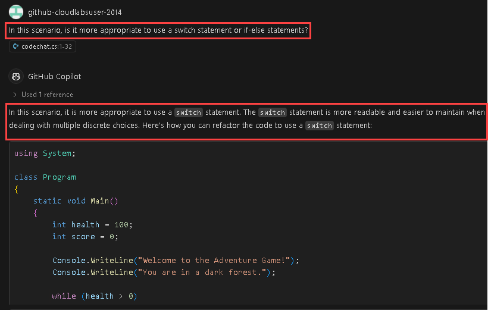
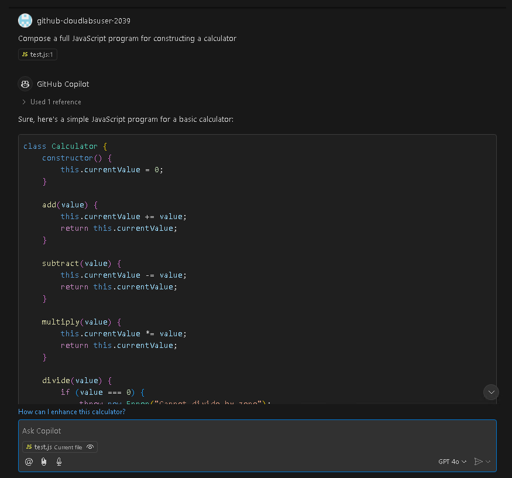

# Exercício 5: Utilização do GitHub Copilot para refatoração de código

### Duração estimada: 30 minutos

A refatoração de código refere-se ao processo de reestruturação e melhoria da qualidade do código sem alterar o seu comportamento externo. A refatoração de código visa melhorar a legibilidade, a capacidade de manutenção e o desempenho, ao mesmo tempo que reduz o dívida técnica e possíveis bugs.

Neste exercício, irá participar numa aprendizagem ou atividade prática com o objetivo principal de usar o GitHub Copilot para a refatoração de código C#. Além disso, irá criar funções de testes unitáros através do GitHub Copilot Chat.

> **Nota**: O GitHub Copilot irá sugerir automaticamente um corpo de função completa ou código em texto cinzento. A seguir, apresentamos alguns exemplos do que provavelmente verá neste exercício, mas a sugestão exata pode variar.

>**Nota**: Se não conseguir ver nenhuma sugestão do GitHub Copilot no VS Code, reinicie o VS Code uma vez e tente novamente.

## Objetivos do laboratório

Poderá completar as seguintes tarefas:

- Tarefa 1: Compreender o código já disponível para si
- Tarefa 2: Utilizar o GitHub Copilot para refatorar o código
- Tarefa 3: Rever o código refatorado e Compreender como funciona
- Tarefa 4: Utilizar o GitHub Copilot Chat com código para refatorar o código
- Tarefa 5: Criar funções de teste unitário

## Tarefa 1: Compreender o código já disponível para si

### Instalação da extensão CSharp (C#) no VS Code

1. Para instalar a extensão C Sharp (C#), devem ser executados os seguintes passos no Visual Studio Code:

    - Clique no ícone **Extensions** **(1)** na barra de atividades presente no lado esquerdo da janela de código do Visual Studio.
    - Na caixa de pesquisa "Search Extensions in Marketplace", digite e pesquise a extensão **C#** **(2)**.
    - Selecione **C#** **(3)** na lista de resultados que aparecem.
    - Clique no botão **Install** **(4)**, se estiver disponível, caso contrário, por favor, ignore.

      

       >**Nota:** Garanta que instala a extensão também no Codespace.   

                

1. No Codespace, na janela do Explorer do VS Code, crie um novo arquivo e nomeie-o como **codechat.cs**.

    

     > **Nota**: Se você perceber alguma recomendação para instalar a extensão C#, clique em Instalar.

1. Para demonstrar o refatorador de código do GitHub, vamos usar um exemplo de código mal escrito e analisá-lo. O código abaixo foi escrito utilizando a linguagem de programação C#. Cole o código abaixo no arquivo.

   ```
   using System;

   class Program
   {
       const int MAX = 100;

        static int Sum(int[] arr, int n)
        {
            int result = 0;
            for (int i = 0; i < n; i++)
            {
                result += arr[i];
            }
            return result;
        }

        static void Main()
        {
            int n;
            Console.Write("Enter the number of elements (1-100): ");
            if (!int.TryParse(Console.ReadLine(), out n) || n < 1 || n > MAX)
            {
                Console.WriteLine("Invalid input. Please provide a digit ranging from 1 to 100.");
                Environment.Exit(1);
            }

            int[] arr = new int[n];

            Console.WriteLine("Enter " + n + " integers:");
            for (int i = 0; i < n; i++)
            {
                if (!int.TryParse(Console.ReadLine(), out arr[i]))
                {
                    Console.WriteLine("Invalid input. Please enter valid integers.");
                    Environment.Exit(1);
                }
            }

            int total = Sum(arr, n);

            Console.WriteLine("Sum of the numbers: " + total);

            // No need to free memory in C#, as it's managed by the runtime.
        }
    }      
   ```

1. Este código é um exemplo mal escrito de um programa que solicita ao utilizador o número de elementos a somar e toma esses números inteiros como entrada. Emprega alocação dinâmica de memória para a matriz de inteiros e trata as falhas de alocação com uma mensagem de erro. Aqui estão alguns problemas relacionados com o código:

    - O código começa com a inclusão do namespace System para as operações essenciais de entrada e saída.
    - Define uma constante MAX com o valor 100 para representar o número máximo de elementos permitidos.
    - O método Sum calcula a soma dos elementos de um array.
    - No método Principal:
        - Solicita ao utilizador que introduza o número de elementos (entre 1 e 100) e valida a introdução.
        - Aloca um array 'arr' para guardar os inteiros inseridos.
        - Solicita ao utilizador que introduza o número especificado de números inteiros e valida cada entrada.
        - Calcula a soma dos números inteiros introduzidos através do método Sum.
        - Envia a soma para a consola.
        - Não há necessidade de libertar memória manualmente em C# porque gere a memória automaticamente.

## Tarefa 2: Utilizar o GitHub Copilot para refatorar o código

1. Agora, vamos utilizar a funcionalidade **GitHub Copilot Chat** para refatorar o código acima.

1. Clique no ícone **Chat** no canto superior direito. Isso abre a janela GitHub Copilot Chat na qual o código acima deve ser **colado**.

1. Introduza o prompt após o código colado `#selection How can we refactor this code to adhere to coding best practices?` e prima **enter**. O GitHub Copilot Chat fornecerá a resposta conforme mostrado abaixo.

   

1. Cole o código refatorado no arquivo.

   

## Tarefa 3: Reveja o código refatorado e perceber como funciona

1. O código recém-gerado terá o aspeto apresentado abaixo:

     ```
     using System;

     class Program
     {
        const int MAX = 100;

        static int Sum(int[] arr)
        {
            int result = 0;
            foreach (int num in arr)
            {
                result += num;
            }
            return result;
        }

        static void Main()
        {
            int n;
            Console.Write("Enter the number of elements (1-100): ");
            if (!int.TryParse(Console.ReadLine(), out n) || n < 1 || n > MAX)
            {
                Console.WriteLine("Invalid input. Please enter a number between 1 and 100.");
                Environment.Exit(1);
            }

            int[] arr = new int[n];

            Console.WriteLine("Enter " + n + " integers:");
            for (int i = 0; i < n; i++)
            {
                if (!int.TryParse(Console.ReadLine(), out arr[i]))
                {
                    Console.WriteLine("Invalid input. Please enter valid integers.");
                    Environment.Exit(1);
                }
            }

            int total = Sum(arr);

            Console.WriteLine("Sum of the numbers: " + total);
        }
    }
    ```

1. Vamos agora analisar as alterações feitas ao código pelo GitHub Copilot Chat
    - Alterado o nome do método Sum para CalculateSum para descrever melhor sua funcionalidade.
    - Criado um novo método GetNumberOfElements para lidar com a lógica de obter o número de elementos do usuário. Este método garante que a entrada esteja dentro da faixa válida (1-100) e fornece mensagens de erro apropriadas.
    - Criado outro método ReadIntegers para lidar com a lógica de leitura de inteiros do usuário. Este método garante que cada entrada seja um número inteiro válido e fornece mensagens de erro para entradas inválidas.
    - Em GetNumberOfElements, foi utilizado um loop while para solicitar repetidamente ao usuário até que um número válido seja inserido.
    - Em ReadIntegers, foi utilizado um loop while dentro do loop for para solicitar repetidamente ao usuário até que um número inteiro válido fosse inserido para cada elemento.
    - A lógica para calcular a soma dos elementos do array foi movida para o método CalculateSum.
    - A lógica para obter o número de elementos e ler os inteiros foi movida para seus respectivos métodos.

1. Note que agora o código é mais modular, legível e mais fácil de compreender.

 >**Nota**: É essencial rever cuidadosamente as sugestões do copiloto antes de as aplicar.

## Tarefa 4: utilizar o GitHub Copilot Chat com código para refatorar o código

Nesta tarefa, demonstrará a funcionalidade de chat com código do GitHub Copilot. Com esta funcionalidade, os programadores podem participar em conversas em tempo real com o Copilot diretamente através de comentários de código, fazendo com que pareça que estão a colaborar com outro programador.

1. Copie e cole o código abaixo no ficheiro `codechat.cs`.

    ```
    using System;

    class Program
    {
        static void Main()
        {
            int health = 100;
            int score = 0;

            Console.WriteLine("Welcome to the Adventure Game!");
            Console.WriteLine("You are in a dark forest.");

            while (health > 0)
            {
                Console.WriteLine("\nOptions:");
                Console.WriteLine("1. Go deeper into the forest.");
                Console.WriteLine("2. Rest by the campfire.");
                Console.WriteLine("3. Quit the game.");

                int choice;
                Console.Write("Enter your choice: ");
                if (int.TryParse(Console.ReadLine(), out choice))
                {
                    if (choice == 1)
                    {
                        Console.WriteLine("You go farther into the forest and discover a treasure chest!");
                        score += 10;
                    }
                    else if (choice == 2)
                    {
                        Console.WriteLine("You rest by the campfire and regain 20 health.");
                        health += 20;
                    }
                    else if (choice == 3)
                    {
                        Console.WriteLine($"Thanks for playing! Your score: {score}");
                        return;
                    }
                    else
                    {
                        Console.WriteLine("Invalid choice. Try again.");
                    }

                    health -= 10;
                    if (health <= 0)
                    {
                        Console.WriteLine($"Game over. Your score: {score}");
                    }
                }
                else
                {
                    Console.WriteLine("Invalid input. Please enter a valid number.");
                }
            }
        }
    }
    ```

1. Vamos perguntar ao Copilot a seguinte questão para entender qual declaração condicional é a melhor escolha neste caso. *Cole o mesmo código no chat do Copilot e, abaixo do código, cole o seguinte prompt.*
   
    ```
    In this scenario, is it more appropriate to use a switch statement or if-else statements?
    ```

   

1. Como a declaração switch é mais legível e fácil de manter ao lidar com várias opções discretas, vamos copiar e colar o código no arquivo e clicar em `Ctrl+S`.

   

## Tarefa 5: Criar funções de teste unitário

1. No codespace na janela do VS Code Explorer, crie um novo ficheiro.

   

1. Nomeie o ficheiro `test.js` como se mostra abaixo:

   

1. Agora, navegue até ao GitHub Copilot Chat e forneça o prompt **Compose a full JavaScript program for build a calculator**.

1. O GitHub Copilot Chat irá gerar o código como se mostra abaixo.

   

1. Copie e cole o código no ficheiro denominado **test.js** que acabou de criar.

1. Agora, para gerar casos de teste para cada função, selecione a função para a qual o caso de teste deve ser gerado e, de volta à janela GitHub Copilot Chat, digite **/tests** e prima Enter.

   

1. Irá gerar um caso de teste para a função add.

   


## Resumo

Neste exercício, empregou com sucesso o GitHub Copilot para realizar tarefas de refactoring de código e criar funções de teste unitário. A refatoração de código com a ajuda do Copilot tornará os seus projetos de codificação mais eficientes e colaborativos.

### Concluiu o laboratório com sucesso
