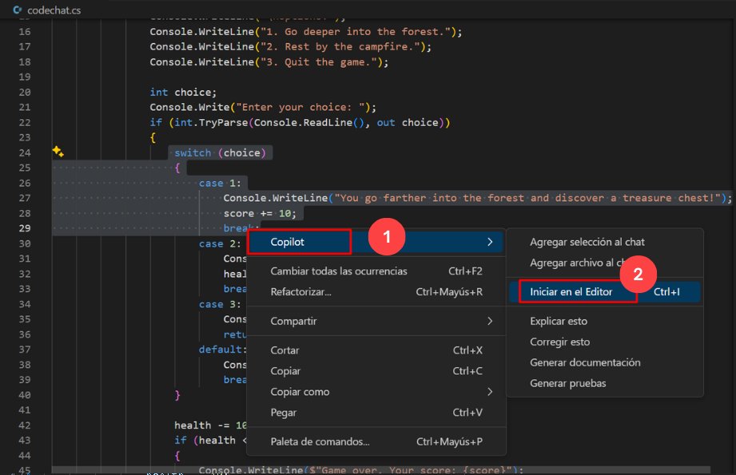
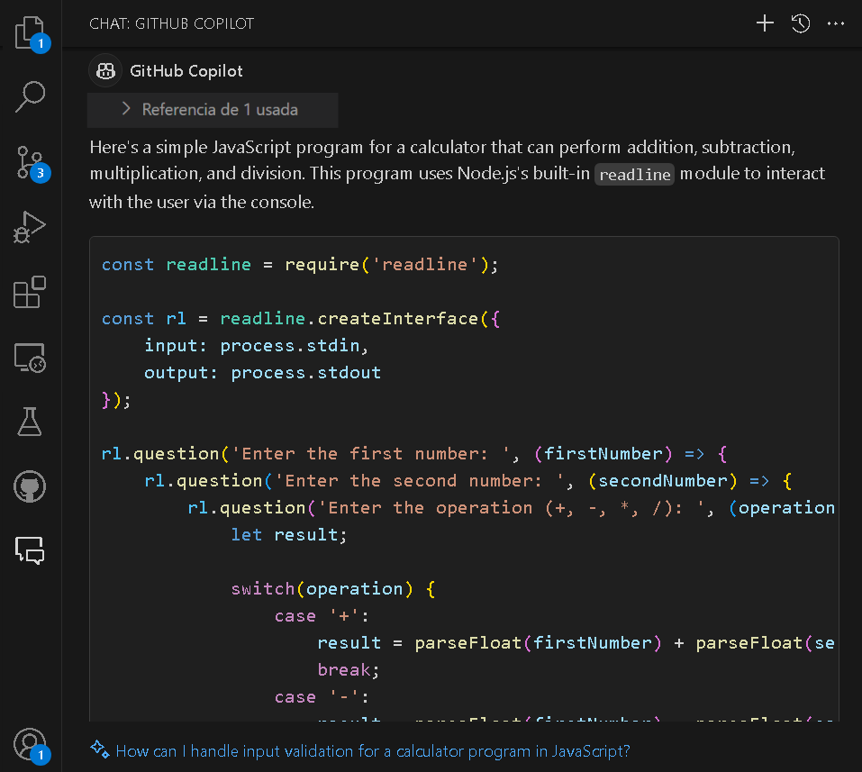
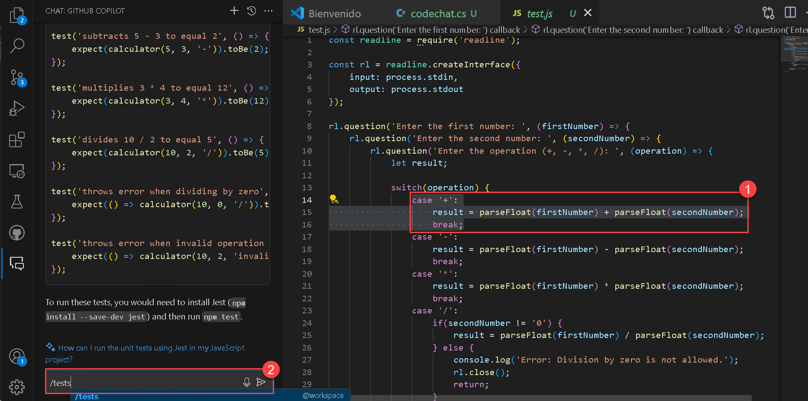
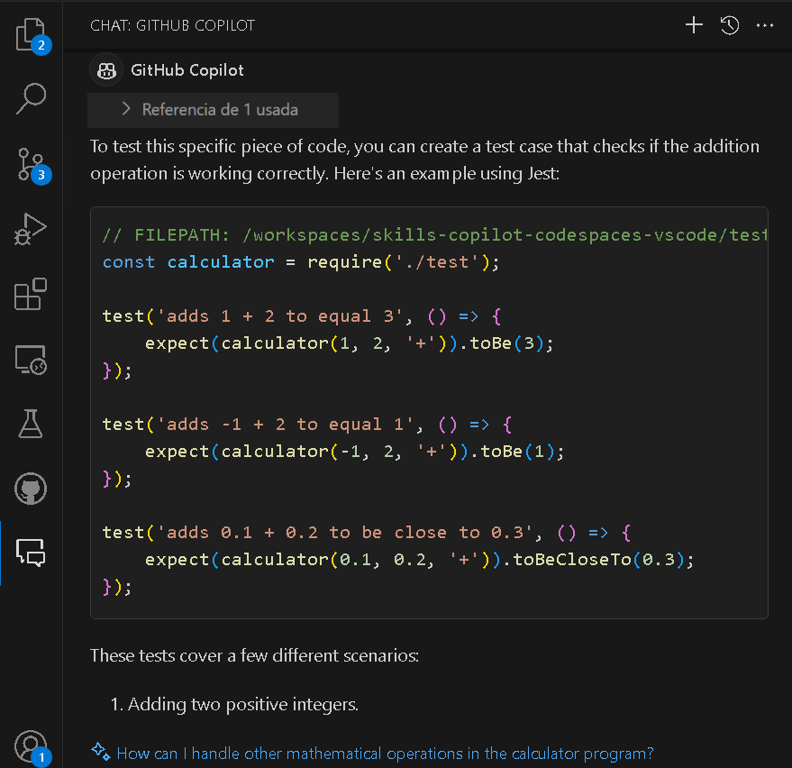
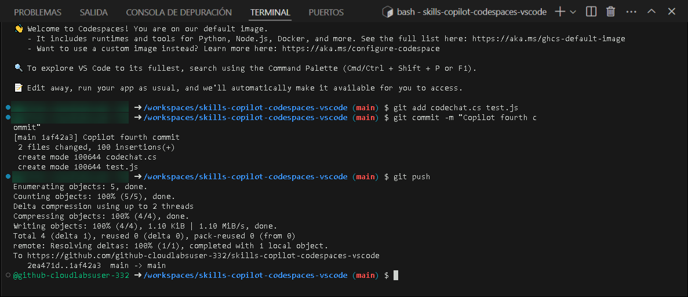

# Exercício 5: Utilização do GitHub Copilot para refatoração de código

### Duração estimada: 20 minutos

A refatoração de código GitHub refere-se ao processo de reestruturação e melhoria da qualidade do código num repositório GitHub sem alterar o seu comportamento externo. A refatoração de código visa melhorar a legibilidade, a capacidade de manutenção e o desempenho, ao mesmo tempo que reduz o débito técnico e possíveis bugs.

Neste exercício, irá participar numa aprendizagem ou atividade prática com o objetivo principal de empregar o GitHub Copilot para a refatoração de código em C#. Além disso, irá criar funções de teste de unidade através do GitHub Copilot Chat.

>**Isenção de responsabilidade**: O GitHub Copilot irá sugerir automaticamente um corpo de função inteiro ou código em texto cinzento. Exemplos do que provavelmente verá neste laboratório, mas a sugestão exata pode variar.

>**Nota**: Se não conseguir ver nenhuma sugestão do GitHub Copilot no VS Code, reinicie o VS Code uma vez e tente novamente.

## Objetivos do laboratório

Poderá completar as seguintes tarefas:

- Tarefa 1: Compreender o código já disponível para si
- Tarefa 2: utilizar o GitHub Copilot para refatorar o código
- Tarefa 3: Reveja o código refatorado e compreenda como funciona
- Tarefa 4: utilizar o GitHub Copilot Chat com código para refatorar o código
- Tarefa 5: Criar funções de teste unitário
- Tarefa 6: enviar código para o seu repositório a partir do codespace

## Tarefa 1: Compreender o código já disponível para si

### Instalação da extensão C Sharp (C#) no VS Code

1. Para instalar a extensão C Sharp (C#), devem ser executados os seguintes passos no Visual Studio Code:

    - Clique no ícone **Extensões** **(1)** na barra de atividades presente no lado esquerdo da janela de código do Visual Studio.
    - Na caixa de pesquisa "Pesquisar extensões no Marketplace", digite e pesquise a extensão **C#** **(2)**.
    - Selecione **C#** **(3)** na lista de resultados que aparecem.
    - Clique no botão **Instalar** **(4)**.

      

1. Para demonstrar o refatorador de código do GitHub, vamos pegar num exemplo de código mal escrito e analisá-lo. O código abaixo foi escrito utilizando a linguagem de programação C#.

   ```
   using System;

   class Program
   {
       const int MAX = 100;

        static int Sum(int[] arr, int n)
        {
            int result = 0;
            for (int i = 0; i < n; i++)
            {
                result += arr[i];
            }
            return result;
        }

        static void Main()
        {
            int n;
            Console.Write("Enter the number of elements (1-100): ");
            if (!int.TryParse(Console.ReadLine(), out n) || n < 1 || n > MAX)
            {
                Console.WriteLine("Invalid input. Please provide a digit ranging from 1 to 100.");
                Environment.Exit(1);
            }

            int[] arr = new int[n];

            Console.WriteLine("Enter " + n + " integers:");
            for (int i = 0; i < n; i++)
            {
                if (!int.TryParse(Console.ReadLine(), out arr[i]))
                {
                    Console.WriteLine("Invalid input. Please enter valid integers.");
                    Environment.Exit(1);
                }
            }

            int total = Sum(arr, n);

            Console.WriteLine("Sum of the numbers: " + total);

            // No need to free memory in C#, as it's managed by the runtime.
        }
    }      
   ```

1. Este código é um exemplo mal escrito de um programa que solicita ao utilizador o número de elementos a somar e toma esses números inteiros como entrada. Emprega alocação dinâmica de memória para a matriz de inteiros e trata as falhas de alocação com uma mensagem de erro. Aqui estão alguns problemas relacionados com o código:

    - O código começa com a inclusão do namespace System para as operações essenciais de entrada e saída.
    - Define uma constante MAX com o valor 100 para representar o número máximo de elementos permitidos.
    - O método Sum calcula a soma dos elementos de um array.
    - No método Principal:
    - Solicita ao utilizador que introduza o número de elementos (entre 1 e 100) e valida a introdução.
    - Aloca um array 'arr' para guardar os inteiros inseridos.
    - Solicita ao utilizador que introduza o número especificado de números inteiros e valida cada entrada.
    - Calcula a soma dos números inteiros introduzidos através do método Sum.
    - Envia a soma para a consola.
    - Não há necessidade de libertar memória manualmente em C# porque gere a memória automaticamente.

## Tarefa 2: Utilizar o GitHub Copilot para refatorar o código

1. Agora, vamos utilizar a funcionalidade **GitHub Copilot Chat** para refatorar o código acima.

1. Clique no ícone da extensão **Chat** na barra de atividades do painel de navegação esquerdo. Isto abre a janela GitHub Copilot Chat na qual o código acima deve ser **colado**.

1. Introduza o prompt `Refactor the code` no final do código e prima **enter**.

1. O GitHub Copilot Chat dará a resposta como se mostra abaixo.

   

## Tarefa 3: Reveja o código refatorado e perceber como funciona

1. O código recém-gerado terá o aspeto apresentado abaixo:

     ```
     using System;

     class Program
     {
        const int MAX = 100;

        static int Sum(int[] arr)
        {
            int result = 0;
            foreach (int num in arr)
            {
                result += num;
            }
            return result;
        }

        static void Main()
        {
            int n;
            Console.Write("Enter the number of elements (1-100): ");
            if (!int.TryParse(Console.ReadLine(), out n) || n < 1 || n > MAX)
            {
                Console.WriteLine("Invalid input. Please enter a number between 1 and 100.");
                Environment.Exit(1);
            }

            int[] arr = new int[n];

            Console.WriteLine("Enter " + n + " integers:");
            for (int i = 0; i < n; i++)
            {
                if (!int.TryParse(Console.ReadLine(), out arr[i]))
                {
                    Console.WriteLine("Invalid input. Please enter valid integers.");
                    Environment.Exit(1);
                }
            }

            int total = Sum(arr);

            Console.WriteLine("Sum of the numbers: " + total);
        }
    }
    ```

1. Vamos agora analisar as alterações feitas ao código pelo GitHub Copilot Chat
    - Isto inclui o namespace do sistema para as operações de entrada e saída **(1)**.
    - Define uma constante MAX com valor 100 para o número máximo de elementos permitidos num array **(2)**.
    - Aqui, o GitHub Copilot removeu o parâmetro `n` do método Sum, uma vez que não é necessário. Em vez disso, o Copilot utilizou um ciclo for-each para iterar no array. Como resultado, o código é mais fácil de compreender e mais conciso **(3)**.
    - O método Sum calcula a soma dos elementos de uma matriz de inteiros utilizando um ciclo for-each **(4)**.
    - No método Principal:
    - Cria uma matriz inteira para armazenar valores introduzidos pelo utilizador **(5)**.
    - Solicita ao utilizador que introduza o número de elementos e valide **(6)**.
    - Solicita ao utilizador que introduza números inteiros, valida a entrada e armazena-os no array **(7)**.
    - Lê uma linha de entrada, tenta convertê-la num número inteiro e armazena o resultado **(8)**.
    - Calcula a soma dos números inteiros através do método Sum **(9)**.
    - O código inclui a validação de entrada e fornece a soma dos números inteiros introduzidos pelo utilizador **(10)**.

      

1. Note que agora o código é mais modular, legível e mais fácil de compreender.

 >**Nota**: É essencial rever cuidadosamente as sugestões do copiloto antes de as aplicar.

## Tarefa 4: utilizar o GitHub Copilot Chat com código para refatorar o código

Nesta tarefa, demonstrará a funcionalidade de chat com código do GitHub Copilot. Com esta funcionalidade, os programadores podem participar em conversas em tempo real com o Copilot diretamente através de comentários de código, fazendo com que pareça que estão a colaborar com um parceiro de codificação.

1. No codespace na janela do VS Code Explorer, crie um novo ficheiro.

   

1. Nomeie o ficheiro `codechat.cs` e se vir uma recomendação para instalar a extensão `C#`. Clique em Instalar.

   

1. Copie e cole o código abaixo no ficheiro recém-criado, ou seja, `codechat.cs`.

    ```
    using System;

    class Program
    {
        static void Main()
        {
            int health = 100;
            int score = 0;

            Console.WriteLine("Welcome to the Adventure Game!");
            Console.WriteLine("You are in a dark forest.");

            while (health > 0)
            {
                Console.WriteLine("\nOptions:");
                Console.WriteLine("1. Go deeper into the forest.");
                Console.WriteLine("2. Rest by the campfire.");
                Console.WriteLine("3. Quit the game.");

                int choice;
                Console.Write("Enter your choice: ");
                if (int.TryParse(Console.ReadLine(), out choice))
                {
                    switch (choice)
                    {
                        case 1:
                            Console.WriteLine("You go farther into the forest and discover a treasure chest!");
                            score += 10;
                            break;
                        case 2:
                            Console.WriteLine("You rest by the campfire and regain 20 health.");
                            health += 20;
                            break;
                        case 3:
                            Console.WriteLine($"Thanks for playing! Your score: {score}");
                            return;
                        default:
                            Console.WriteLine("Invalid choice. Try again.");
                            break;
                    }

                    health -= 10;
                    if (health <= 0)
                    {
                        Console.WriteLine($"Game over. Your score: {score}");
                    }
                }
                else
                {
                    Console.WriteLine("Invalid input. Please enter a valid number.");
                }
            }
        }
    }
    ```

1. Vamos pedir ao Copilot para utilizar instruções if else em vez da instrução switch.

1. Identifique a secção do código onde a instrução switch está presente e selecione-a.

1. Clique com o botão direito do rato na janela de código e clique na opção **Copilot** **(1)**. Na lista de opções seguinte no Copilot, seleccione **Iniciar no Editor** **(2)**.

   

1. Agora digite o aviso "Utilizar instruções if-else em vez da instrução switch" **(1)** para tornar o código mais compreensível e clique em `>` ou prima `Enter` **(2)**. O Copilot dará uma resposta e poderá revê-la e clicar em **Aceitar** **(3)**. Além disso, pode **Descartar** a sugestão como mostra a imagem abaixo.

   

 >**Nota:** É essencial rever cuidadosamente as sugestões do copiloto antes de as aplicar.

## Tarefa 5: Criar funções de teste unitário

1. No codespace na janela do VS Code Explorer, crie um novo ficheiro.

   

1. Nomeie o ficheiro `test.js` como se mostra abaixo:

   

1. Agora, navegue até ao GitHub Copilot Chat e forneça o prompt **Compose a full JavaScript program for build a calculator**.

1. O GitHub Copilot Chat irá gerar o código como se mostra abaixo.

   

1. Copie e cole o código no ficheiro denominado **test.js** que acabou de criar.

1. Agora, para gerar casos de teste para cada função, selecione a função para a qual o caso de teste deve ser gerado e, de volta à janela GitHub Copilot Chat, digite **/tests** e prima Enter.

   

1. Irá gerar um caso de teste para a função add.

   

### Tarefa 6: enviar código para o seu repositório a partir do codespace

1. Utilize o terminal VS Code para adicionar ficheiros ao repositório. Abra o VS Code Terminal se ainda não estiver aberto.

1. Execute o comando abaixo para adicionar os ficheiros `codechat.cs` e `test.js` ao repositório:

    ```
    git add codechat.cs test.js
    ```

1. De seguida, na fase terminal do VS Code, envie as alterações para o repositório:

    ```
    git commit -m "Copilot commit"
    ```

1. Por fim, a partir do terminal VS Code, envie o código para o repositório:

    ```
    git push
    ```

    

    >**Nota**: Aguarde cerca de 60 segundos e atualize a página inicial do repositório para o passo seguinte.

1. Pode verificar os ficheiros `codechat.cs` e `test.js` disponíveis no seu repositório GitHub.

    

 <validation step="8357b601-4d37-4a08-b8c5-c03df620fdc4" />

## Resumo

Neste exercício, empregou com sucesso o GitHub Copilot para realizar tarefas de refactoring de código e criar funções de teste unitário. A refatoração de código com a ajuda do Copilot tornará os seus projetos de codificação mais eficientes e colaborativos.

### Concluiu o laboratório com sucesso
