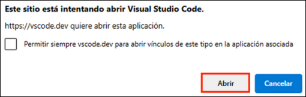
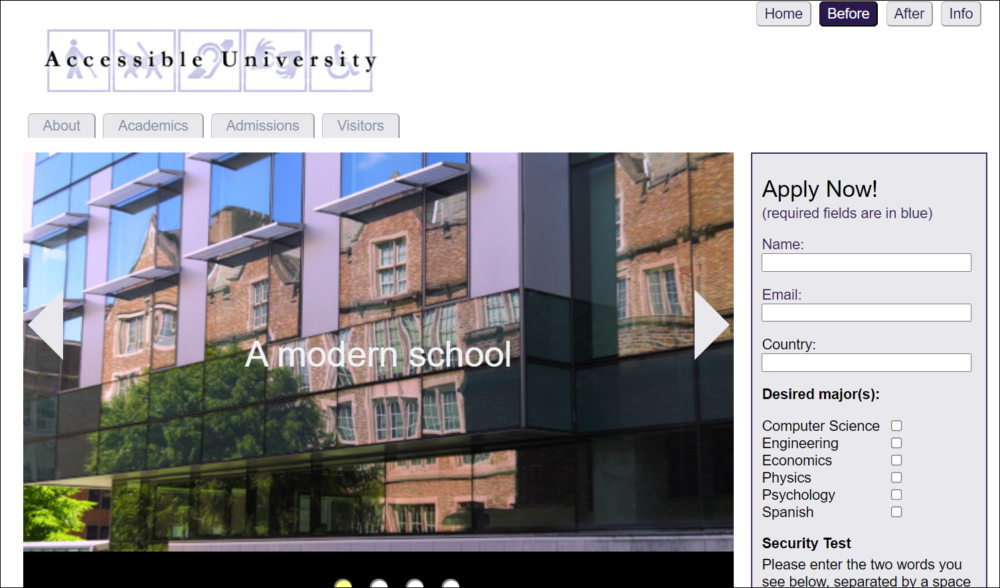
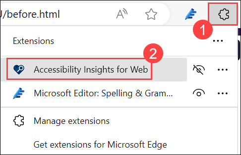
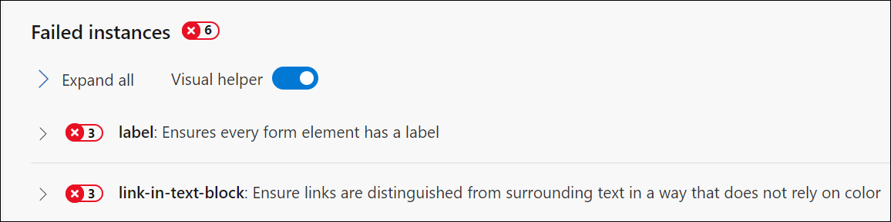
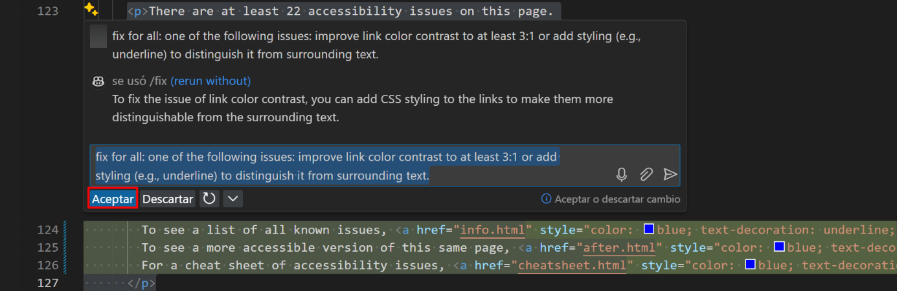

# Exercício 7: Melhorar a acessibilidade na Web com o GitHub Copilot Chat e o Accessibility Insights

### Duração estimada: 35 minutos

**GitHub Copilot Chat** é uma ferramenta de preenchimento de código com tecnologia de IA que ajuda os programadores sugerindo pedaços de código e soluções com base no contexto. Esta ferramenta pode acelerar significativamente o processo de desenvolvimento, fornecendo sugestões de código relevantes e automatizando tarefas repetitivas.

**Accessibility Insights for Web** é uma ferramenta poderosa e fácil de utilizar para garantir que o conteúdo Web é acessível a todos, incluindo aqueles com competências diversas. Ao integrar esta ferramenta no processo de desenvolvimento e teste, os web developers podem garantir que os seus sites cumprem os padrões de acessibilidade, melhorando a usabilidade e a inclusão.

Universidade Acessível (AU) é uma página inicial de uma universidade fictícia concebida para demonstrar uma variedade de problemas comuns de web design que fazem com que os visitantes com deficiência não consigam aceder a conteúdos ou recursos.

Utilize o site da UA para:

1. Demonstrar princípios comuns de acessibilidade na web em formações, apresentações e workshops sobre web design acessível.

1. Aprenda problemas e soluções comuns de acessibilidade na Web de uma forma fácil de compreender.

Neste exercício, irá utilizar o Accessibility Insights for Web para identificar problemas de acessibilidade num site de exemplo e, em seguida, utilizará o GitHub Copilot Chat para gerar e implementar correções de código para esses problemas. O site de destino, Accessible University (AU), é uma página inicial fictícia concebida para mostrar problemas comuns de web design que dificultam a acessibilidade. No final deste exercício, terá melhorado a acessibilidade do website da UA, tornando-o mais fácil de utilizar para pessoas com deficiência.

## Objetivos do laboratório

Poderá completar as seguintes tarefas:

- Tarefa 1: configurar insights de acessibilidade para a extensão Web no Microsoft Edge
- Tarefa 2: verificar a extensão GitHub Copilot Chat e clonar o repositório GitHub da Universidade Acessível no VS Code

## Tarefa 1: configurar insights de acessibilidade para a extensão Web no Microsoft Edge

1. Navegue até à página **Accessibility Insights for Web** utilizando o URL fornecido abaixo:

    ```
    https://accessibilityinsights.io/docs/web/overview/
    ```

1. Na página Accessibility Insights for Web, clique na opção **Download for Web**.

   

1. Clique no botão **+ Adicionar ao Microsoft Edge** na página Transferir Insights de Acessibilidade.

   

1. Selecione a opção **Obter**.

   

1. Um pop-up é apresentado. Selecione a partir daí a opção **Adicionar extensão**. Começará a descarregar uma extensão no seu navegador.

   

1. Clique no ícone **Extensões** **(1)** na barra de ferramentas do browser. No Accessibility Insights for Web, selecione a opção **(...)** **(2)** e clique em **Gerir extensão** **(3)**.

   

1. Na página **Gerir extensão**, desça e clique na caixa de selecção **Permitir acesso a URLs de ficheiros**.

   

## Tarefa 2: verificar a extensão GitHub Copilot Chat e clonar o repositório GitHub da Universidade Acessível no VS Code

1. Inicie o **Visual Studio Code** no ambiente de trabalho.

   

1. Para verificar a **extensão GitHub Copilot Chat**, devem ser executados os seguintes passos no Visual Studio Code:

    - Clique no ícone **Extensões (1)** na barra de atividades presente no lado esquerdo da janela do Visual Studio Code.
    - Na caixa de pesquisa **"Pesquisar extensões no Marketplace"**, digite e pesquise a extensão **GitHub Copilot Chat (2)**.
    - Selecione **GitHub Copilot Chat (3)** na lista de resultados apresentados e verifique se o **GitHub Copilot Chat** foi instalado.
    - Caso contrário, clique no botão **Instalar (4)**.

      

1. Assim que a instalação estiver concluída, no painel de navegação esquerdo, poderá ver o ícone do GitHub Copilot Chat, como se mostra abaixo.

   

1. Vá para o passo 8. Se já tiver iniciado sessão numa conta GitHub no VS Code. Caso contrário, siga os passos 5 a 7.

1. Selecione o ícone **Conta** na parte inferior e clique em **Sign in with GitHub**.

   

1. Faça login com as credenciais do GitHub e, na página **Autorizar GitHub para VS Code**, clique em **Autorizar Visual-Studio-Code.**

   

1. Se receber o pop-up, o site está a tentar abrir o Visual Studio Code, por isso clique em **Abrir**. Regressará ao **Visual Studio**.

   

1. No terminal **Visual Studio Code,** clique em **(...)** **(1)** para selecionar o menu **Terminal** **(2)**, seguido de seleção **Novo Terminal** **(3)**. A janela do terminal abre geralmente na metade inferior do ecrã.

   

1. Execute o seguinte comando fornecido abaixo para clonar o repositório GitHub da Accessible University.

    ```
    git clone https://github.com/CloudLabsAI-Azure/AU.git
    ```

   

1. Mude para o **Explorer** no canto superior esquerdo, selecione **Abrir pasta** e selecione a pasta que clonou.

   

1. Selecione **Sim, confio nos autores**.

   

1. Assim que a pasta for aberta, seleccione o ficheiro `before.html`.

1. Navegue até ao **Explorador de Ficheiros** e abra a pasta que clonou. A partir daí, clique duas vezes no ficheiro `before.html`. Será aberto no seu navegador Web, onde já adicionou a extensão **Accessibility Insights for Web**.

   

   

1. Clique agora no botão **Extensões** na barra de ferramentas do browser, selecione **Accessibility Insights for Web** e clique em **FastPass**. Será aberto em uma nova janela pop-up.

    - **FastPass**: [FastPass](https://accessibilityinsights.io/docs/web/getstarted/fastpass/) é um processo leve de duas etapas que ajuda os programadores a identificar problemas de acessibilidade comuns e de alto impacto em menos de cinco minutos.

      

      

1. Na nova janela **Accessibility Insights for Web**, verá a seguinte lista de verificação de três passos para o FastPass.

    - **Verificações automatizadas**: a ferramenta verifica automaticamente a conformidade com dezenas de requisitos de acessibilidade.

    - **Paragens de tabulação**: a ferramenta fornece instruções claras, automatização parcial e um auxiliar visual que facilita a identificação de problemas críticos de acessibilidade relacionados com o acesso ao teclado, tais como paragens de tabulação em falta, interrupções no teclado e ordem de tabulação incorreta .

    - **Revisão necessária**: a ferramenta fornece instâncias que precisam de ser revistas por um ser humano para determinar se foram aprovadas ou reprovadas.

1. Expanda o problema de contraste de cor para verificar os detalhes da avaria.

   

1. Navegue de volta para o Visual Studio Code, abra o ficheiro **before-menu.css (2)** que se encontra na pasta **styles (1)**.

   

1. No ficheiro **before-menu. css**, encontre a secção CSS que trata do contraste de cores. Selecione o trecho de código fornecido, prima **Ctrl + I** para abrir o chat do GitHub Copilot, introduza o aviso e prima Enter.

    ```
    Fix the colour contrast issue.
    ```

   

1. Reveja a sugestão do GitHub Copilot, que foi gerada com base no contexto fornecido, certifique-se de que cumpre os seus requisitos e clique na opção **Aceitar**.

   

    >**Nota**: É de notar que as sugestões de código oferecidas pelo GitHub Copilot podem não corresponder exatamente às capturas de ecrã apresentadas no guia do laboratório. O GitHub Copilot é uma ferramenta alimentada por IA que gera código com base no contexto e nos padrões, e as suas sugestões podem ser influenciadas por vários fatores.

    >**Nota:** Se as sugestões não aparecerem, considere reiniciar o Visual Studio Code e refazer o processo.

1. Aceitar isto modificará o código.

   

1. **Guarde** o ficheiro premindo **Ctrl + S**.

1. Agora atualize a sua página **Universidade Acessível**. Clique no botão **Recomeçar** na página **Insights de acessibilidade para a Web**. Agora verá uma redução na mensagem de erro.

   

   

   >**Nota**: Execute o passo 14 se os dados não tiverem sido recarregados.

1. Clique em **html-has-lang** para rever a mensagem de erro em detalhe.

   

1. Navegue de volta para o seu código VS, abra o ficheiro `before.html`.

1. Selecione o código `html`, prima **Ctrl + I** para aceder ao chat do GitHub Copilot, introduza o aviso fornecido e clique em **Enter**.

    ```
    Add the html lang attribute
    ```

   

1. Reveja a sugestão do GitHub Copilot, que foi gerada com base no contexto fornecido, e certifique-se de que cumpre os seus requisitos. Clique na opção **Aceitar**.

   

1. Aceitar isto modificará o código.

   

1. **Guarde** o ficheiro premindo **Ctrl + S**.

1. Agora atualize a sua página **Universidade Acessível**. Clique no botão **Recomeçar** na página **Insights de acessibilidade para a Web**. Agora verá uma redução na mensagem de erro.

   

1. Agora, expanda **image-alt** para visualizar a mensagem de erro.

1. Navegue de volta para o seu código VS, abra o ficheiro `before.html`.

1. No ficheiro **before.html**, selecione o código fornecido, prima **Ctrl + I** para abrir o chat do GitHub Copilot, introduza o prompt fornecido e prima Enter.

    ```
    Fix the accessibility issue
    ```

   

1. Reveja a sugestão do GitHub Copilot, que foi gerada com base no contexto fornecido, certifique-se de que cumpre os seus requisitos e clique na opção **Aceitar**.

   

1. Aceitar isto modificará o código.

   

1. **Guarde** o ficheiro premindo **Ctrl + S**.

1. Agora atualize o seu **Acpágina da Universidade** acessível. Clique no botão **Recomeçar** na página **Insights de acessibilidade para a Web**. Agora verá uma redução na mensagem de erro.

   

   

1. Agora, expanda o **label** para verificar detalhadamente a mensagem de erro.

1. Navegue de volta para o seu código VS, abra o ficheiro `before.html`.

1. No ficheiro **before.html**, selecione o código fornecido e prima **Ctrl + I** para aceder ao chat do GitHub Copilot. Forneça o aviso fornecido e prima Enter.

    ```
    Add a label to the selected code
    ```

   

1. Reveja a sugestão do GitHub Copilot, que foi gerada com base no contexto fornecido, certifique-se de que cumpre os seus requisitos e clique na opção **Aceitar**.

   

1. Aceitar isto modificará o código.

   

1. **Guarde** o ficheiro com **Ctrl + S**.

1. Atualize a sua página **Universidade Acessível**. Clique no botão **Recomeçar** na página **Insights de acessibilidade para a Web**. Agora verá uma redução na mensagem de erro.

1. Expanda **link-in-text-block** para visualizar os detalhes do erro.

   

1. Navegue de volta para o seu código VS.

1. No ficheiro **before.html**, selecione o código fornecido e prima **Ctrl + I** para aceder ao chat do GitHub Copilot. Forneça o aviso fornecido e prima Enter.

    ```
    Fix for all: one of the following issues: improve link color contrast to at least 3:1 or add styling (e.g., underline) to distinguish it from surrounding text.
    ```

   

1. Reveja a sugestão do GitHub Copilot, que foi gerada com base no contexto fornecido, e certifique-se de que cumpre os seus requisitos. clique em **Entrar**.

   

1. Aceitar isto modificará o código.

   

1. **Guarde** o ficheiro premindo **Ctrl + S**.

1. Atualize a sua página **Universidade Acessível**. Clique no botão **Recomeçar** na página **Insights de acessibilidade para a Web**. Irá notar que não há mais nenhum problema.

   

### Resumo

Neste exercício, integrou com êxito o Accessibility Insights for Web no Microsoft Edge e utilizou-o para identificar problemas de acessibilidade na página inicial do AU. Ao tirar partido do GitHub Copilot Chat no Visual Studio Code, gerou e implementou soluções de código para corrigir estes problemas. Este processo garantiu que o website cumprisse os padrões de acessibilidade, melhorando a usabilidade e a inclusão para todos os utilizadores, incluindo aqueles com deficiência. Consulte o link para mais informações sobre [Universidade Acessível](https://www.washington.edu/accesscomputing/AU/).

### Concluiu o laboratório com sucesso
