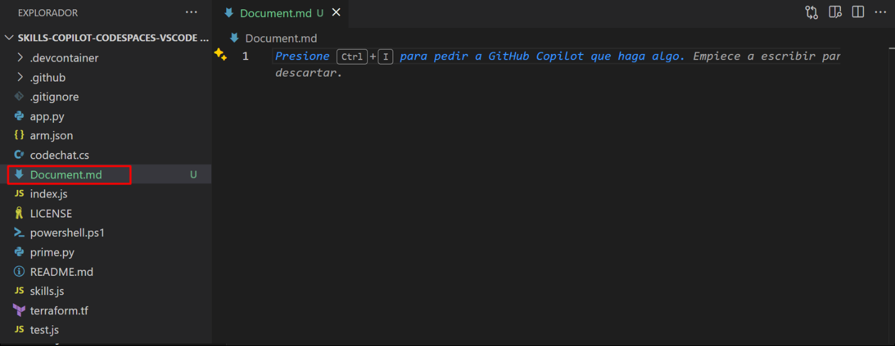

# Exercício 9: Gerar documentação utilizando o GitHub Copilot [opcional]

### Duração estimada: 10 minutos

O GitHub Copilot pode ajudar a agilizar o processo de geração de documentação para os seus projetos de software. Auxilia na geração automática de comentários de código, na criação de documentação Markdown, no fornecimento de modelos para secções comuns, na garantia de consistência gramatical e de estilo e na referência cruzada de código e documentação. Esta ferramenta pode poupar tempo e melhorar a qualidade da documentação do seu projeto, tornando-a mais acessível e fácil de utilizar.

Neste exercício, irá gerar documentação utilizando o GitHub Copilot.

>**Isenção de responsabilidade**: O GitHub Copilot irá sugerir automaticamente um corpo de função inteiro ou código em texto cinzento. Exemplos do que provavelmente verá neste exercício, mas a sugestão exata pode variar.

>**Nota**: Se não conseguir ver nenhuma sugestão do GitHub Copilot no VS Code, reinicie o VS Code uma vez e tente novamente.

1. A partir do codespace na janela do VS Code Explorer, crie um novo ficheiro.

   

1. Nomeie o ficheiro como `Document.md` e prima `CTRL + I` para pedir ao GitHub Copilot para fazer algo.

   

1. Digite a instrução `Create a markdown document to create a virtual network in Azure Portal` **(1)** e clique em `>` ou prima `Enter` **(2)**.

   

1. O Copilot dará uma resposta e poderá revê-la **(1)**, clicar em **Aceitar** **(2)** e premir `CTRL + S` para guardar o ficheiro. Além disso, pode descartar a sugestão como mostra a imagem abaixo.

   

## Resumo

Neste exercício, gerou com sucesso um documento utilizando o GitHub Copilot Chat.

### Concluiu o laboratório com sucesso
