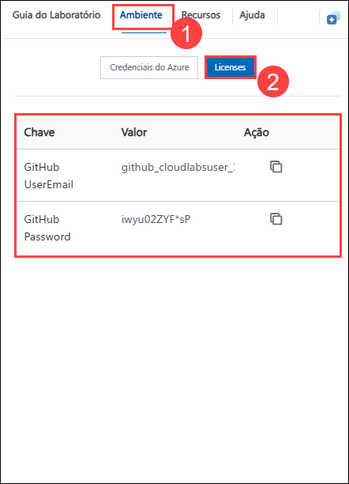
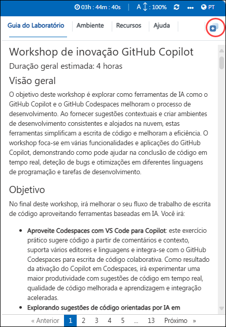
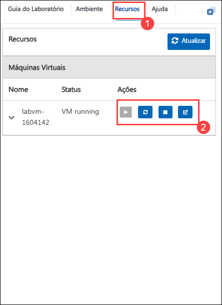
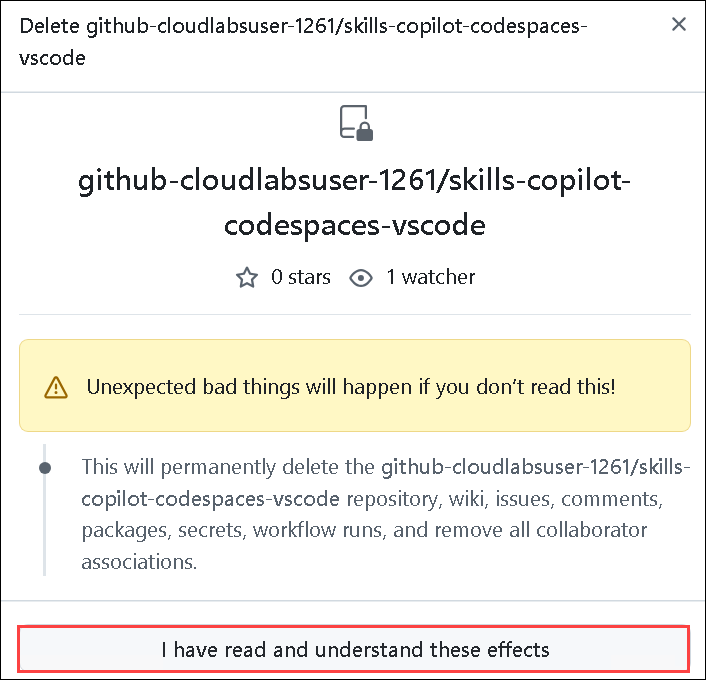

# Workshop de inovação GitHub Copilot

### Duração geral estimada: 4 horas

## Visão geral

O objetivo deste workshop é explorar como ferramentas de IA como o GitHub Copilot e o GitHub Codespaces melhoram o processo de desenvolvimento. Ao fornecer sugestões contextuais e criar ambientes de desenvolvimento consistentes e alojados na nuvem, estas ferramentas simplificam a escrita de código e melhoram a eficiência. O workshop foca-se em várias funcionalidades e aplicações do GitHub Copilot, demonstrando como pode ajudar na conclusão de código em tempo real, deteção de bugs e otimizações em diferentes linguagens de programação e tarefas de desenvolvimento.

## Objetivo

No final deste workshop, irá melhorar o seu fluxo de trabalho de escrita de código aproveitando ferramentas baseadas em IA. Você irá:

- **Aproveite Codespaces com VS Code para Copilot**: este exercício prático sugere código a partir de comentários e contexto, suporta vários editores e linguagens e integra-se com o GitHub Codespaces para escrita de código colaborativa. Como resultado da ativação do Copilot em Codespaces, irá experimentar uma maior produtividade com sugestões de código em tempo real, qualidade de código melhorada e aprendizagem e integração aceleradas.
- **Explorando sugestões de código orientadas por IA em JavaScript**: Este exercício prático tem como objetivo examinar como a IA melhora a escrita de código JavaScript com conclusões em tempo real, deteção de bugs, otimizações e melhorias de eficiência. Ao ativar o Copilot num Codespace, irá experimentar uma maior produtividade com sugestões de código em tempo real ao adicionar e escrever um ficheiro JavaScript, simplificando o processo de envio de código para o seu repositório e aderindo às melhores práticas, melhorando a qualidade geral do código e reduzindo os erros.
- **Exporar Python com GitHub Copilot**: Este exercício prático tem como objetivo oferecer excelentes sugestões para linguagens como Python, JavaScript, Ruby e muito mais e auxiliar em consultas de base de dados. Como resultado deste exercício, terá adicionado com sucesso código Python com sugestões em tempo real do GitHub Copilot, visualizado várias sugestões de código no separador Copilot e enviado o código refinado para o seu repositório a partir do VS Code Codespace.
- **Utilização do GitHub Copilot Chat para gerar código ARM e Terraform com o Copilot**: Este exercício prático tem como objetivo fornecer assistência de escrita de código diretamente nos IDEs suportados, oferecendo sugestões de código, explicações, testes unitários e correções de bugs. A ativação do Copilot em Codespaces resultará numa maior produtividade com sugestões de código em tempo real e qualidade de código melhorada, ao mesmo tempo que gera scripts ARM, Terraform e PowerShell para implementar recursos no Azure.
- **Utilização do GitHub Copilot para refactoring de código**: Este exercício prático visa melhorar a qualidade do código reestruturando a legibilidade, a capacidade de manutenção e o desempenho sem alterar o comportamento externo, reduzindo dívidas técnicas e bugs. Ao utilizar o GitHub Copilot para refatorar o código e empregar o Copilot Chat com o código, melhorou a qualidade e a produtividade do código. Este exercício também facilita uma melhor compreensão do código refatorado, acelera a criação de testes unitários e simplifica o envio de código para o seu repositório.
- **Utilização de IDEs como o JetBrains IntelliJ para Java**: Este exercício prático visa melhorar a escrita de código Java no IntelliJ, oferecendo sugestões inteligentes e preenchimento automático, elevando a produtividade e a qualidade do código. Instalar o plugin GitHub Copilot e criei um projeto Java básico no IntelliJ IDEA. Utilizar o Copilot para obter sugestões de código melhoradas e gerar código a partir de comentários.
- **Melhorando a acessibilidade da Web com o GitHub Copilot Chat e o Accessibility Insights**: Este exercício prático visa acelerar a escrita de código com sugestões baseadas em IA, enquanto o Accessibility Insights for Web garante conteúdos Web inclusivos e acessíveis. Ao concluir o exercício, configurou com sucesso a extensão Accessibility Insights for Web no Microsoft Edge, que permite avaliar e resolver eficazmente problemas de acessibilidade em projetos web.
- **Utilização do GitHub Copilot para código T-SQL e YAML [opcional]**: Este exercício prático pretende tirar partido do GitHub Copilot para gerar código em T-SQL e YAML, utilizando comentários para orientar as suas sugestões. Como resultado da conclusão do exercício, o utilizador gerou com êxito uma consulta SQL e uma configuração YAML utilizando o GitHub Copilot, aproveitando os comentários para orientar a assistência da IA.
- **Geração de documentação utilizando o GitHub Copilot [Opcional]**: Este exercício prático tem como objetivo agilizar a documentação gerando comentários automaticamente, Markdown e garantindo a consistência, melhorando a acessibilidade do projeto. Como resultado deste exercício, irá gerar documentação de forma eficaz utilizando o GitHub Copilot
- **Trabalhar com o Copilot para aprendizagem automática [opcional]**: Este exercício prático tem como objetivo utilizar o GitHub Copilot com estruturas de Machine Learning (ML) para tarefas como pré-processamento de dados, construção de modelos e avaliação. No final deste exercício, configurou um ambiente, experimentou o preenchimento automático de código, aplicou técnicas matemáticas e de aprendizagem automática, executou dados visuaisização e transformação, e treinou um modelo de amostra.
- **Criar um minijogo com GitHub Copilot [Opcional]**: Este exercício prático tem como objetivo construir um minijogo, refinando as habilidades em Python no desenvolvimento de aplicações de consola. Depois de concluir o exercício, terá configurado o seu ambiente com sucesso, testado o seu GitHub Codespace para garantir que está a funcionar corretamente e criado a lógica do jogo, fornecendo uma configuração totalmente operacional para o seu projeto.

## Pré-requisitos

Conhecimentos fundamentais de **Visual Studio Code** e de **linguagens de programação** populares, como Python, Javascript, C# etc.

## Arquitetura

O GitHub Copilot é uma ferramenta de conclusão de código com tecnologia de IA que auxilia os programadores sugerindo pedaços de código e completando código com base no contexto fornecido. O GitHub Copilot Chat complementa isto oferecendo uma interface de chat interativa onde os programadores podem fazer perguntas e receber sugestões de código e assistência para depuração. Integrado com os Codespaces do Visual Studio Code, o GitHub Copilot beneficia de ambientes de desenvolvimento alojados na nuvem, garantindo consistência e fiabilidade em qualquer lugar. Para melhorar o desenvolvimento web, o Accessibility Insights for Web ajuda a identificar e resolver problemas de acessibilidade, garantindo aplicações web inclusivas. O GitHub Copilot suporta várias linguagens de programação como Python, JavaScript e C#, o que o torna uma ferramenta versátil para uma grande variedade de tarefas de escrita de código.

## Diagrama de Arquitetura


## Explicação dos Componentes

1. **GitHub Copilot**: Ferramenta de conclusão de código com tecnologia de IA que ajuda os programadores sugerindo pedaços de código e completando o código com base no contexto fornecido.

1. **GitHub Copilot Chat**: Interface de chat interativa que permite aos programadores colocar questões e receber sugestões de código e assistência de debug do GitHub Copilot.

1. **Codespaces**: Codespaces fornecem ambientes de desenvolvimento alojados na nuvem que podem ser acedidos a partir de qualquer lugar, garantindo consistência e fiabilidade.

1. **Insights de acessibilidade para a Web**: Extensão para o browser que ajuda os programadores a encontrar e corrigir problemas de acessibilidade em aplicações Web.

1. **Linguagens de programação**: Ferramentas utilizadas para escrever instruções para os computadores executarem, como por exemplo, Python, Javascript, C# etc.

# Introdução ao laboratório

Bem-vindo ao workshop de inovação do GitHub Copilot! Preparamos um ambiente perfeito para você explorar e aprender GitHub Copilot Services. Vamos começar aproveitando ao máximo esta experiência:

## Acessando seu ambiente de laboratório
 
Quando você estiver pronto para começar, sua máquina virtual e o guia de laboratório estarão ao seu alcance no navegador da web.
   
   .png)

### Máquina Virtual e Guia de Laboratório
 
Sua máquina virtual é seu carro-chefe durante todo o workshop. O guia de laboratório é o seu roteiro para o sucesso.

## Explorando os recursos do seu laboratório
 
Para entender melhor os recursos e credenciais do seu laboratório, navegue até a guia **Ambiente**. Quando estiver na guia **Ambiente (1)**, clique na opção **Licenses (2)** para obter credenciais de usuário do GitHub. As credenciais também serão enviadas para o seu endereço de e-mail registrado.
 
   

## Utilizando o recurso de janela dividida
 
Por conveniência, você pode abrir o guia de laboratório em uma janela separada selecionando o botão **Dividir janela** no canto superior direito.
 

 
## Guia de laboratório Aumentar/diminuir zoom
 
Para ajustar o nível de zoom da página do ambiente, clique no ícone **A↕ : 100%** localizado próximo ao cronômetro no ambiente do laboratório.

   

## Gerenciando sua máquina virtual
 
Sinta-se à vontade para **iniciar**, **parar** ou **reiniciar** sua máquina virtual conforme necessário na guia **Recursos**. Sua experiência está em suas mãos!
 



## Iniciar sessão no GitHub

1. Na área de trabalho do LABVM, procure por **Microsoft Edge** **(1)**, clique no browser **Microsoft Edge** **(2)**.

   .png)

1. Navegue até à página de login do GitHub utilizando o URL fornecido abaixo:

    ```
    https://github.com/login
    ```

1. No separador **Sign in to GitHub**, verá o ecrã de login. Neste ecrã, insira o seguinte **Username or email address** **(1)** e **Password** **(2)**. De seguida, clique em **Sign in** **(3)**.

    >**Nota**: Para obter as credenciais do GitHub, navegue até ao separador **Ambiente** e clique na opção **GitHub Credentials** para visualizar os pares de valores-chave do **GitHub UserEmail** e **GitHub Password**. Pode utilizar os botões de cópia na coluna de ações para copiar os valores instantaneamente. Em alternativa, sugere-se que os valores sejam copiados para um bloco de notas para facilitar o acesso.

   

1. De seguida, para obter o código de autenticação, inicie sessão no Outlook (https://outlook.office365.com/mail/) com as credenciais git no separador Ambiente do passo anterior. Depois de iniciar sessão no Outlook, encontre o e-mail recente que contém o código de verificação. Introduza o código de verificação e clique em **Verify**.

    >**Nota:** O e-mail que contém o código de verificação pode, por vezes, infiltrar-se nas pastas de ficheiros/spam do seu Outlook.

   

1. Clique com o botão direito do rato em **Start course** fornecido abaixo, clique em **Copiar link** e navegue até ao link dentro do LabVM no navegador Edge onde fez login no GitHub nos passos anteriores.

   <!-- For start course, run in JavaScript:
   'https://github.com/new?' + new URLSearchParams({
     template_owner: 'skills',
     template_name: 'copilot-codespaces-vscode',
     owner: '@me',
     name: 'skills-copilot-codespaces-vscode',
     description: 'My clone repository',
     visibility: 'public',
   }).toString()
   -->

   [](https://github.com/new?template_owner=skills&template_name=copilot-codespaces-vscode&owner=%40me&name=skills-copilot-codespaces-vscode&description=My+clone+repository&visibility=public)

1. Na nova guia, a maioria dos avisos serão preenchidos automaticamente para si. Deixe o padrão para o proprietário, pois já fez login no GitHub para alojar o repositório **(1)**. Selecione **Public** **(2)** e clique no botão **Create repository** **(3)** na parte inferior do formulário.

   

1. Se o repositório já existir, apague o existente e execute novamente o passo acima. Para eliminar o repositório,
siga do passo 08 ao passo 12. Na ausência de um repositório existente, passe para o passo 13.

1. Navegue até ao repositório existente que deve ser eliminado

   

   

1. Clique em **Settings**.

   

1. Desça até ao painel **Danger Zone** e clique em **Delete this repository**.

   

1. Clique em **I want to delete this repository**.

   

1. Clique em **I have read and understand these effects**, para aceitar que leu e aceitou os efeitos.

   

1. Após a criação do seu novo repositório, aguarde cerca de 20 segundos e atualize a página.

1. Depois de o repositório estar criado, clique na fotografia do seu perfil e selecione **Your organizations**.

   

1. Na Sua organização, selecione **Codespaces** no painel de navegação esquerdo.

   

1. Desça e certifique-se de que está selecionado **Visual Studio Code**, em **Editor preference** .

   

1. Agora, clique em **Próximo** no canto inferior direito para passar para a página seguinte.

Este laboratório prático demonstra como o GitHub Copilot e o GitHub Codespaces melhoram o desenvolvimento através de sugestões de código em tempo real e ambientes de cloud consistentes.

## Contacto de suporte

1. A equipa de suporte da CloudLabs está disponível 24 horas por dia, 7 dias por semana, 365 dias por ano, através de e-mail e chat ao vivo para garantir a assistência contínua a qualquer momento. Oferecemos canais de apoio dedicados e adaptados especificamente para alunos e instrutores, garantindo que todas as suas necessidades são satisfeitas de forma rápida e eficiente.

   Contactos de apoio ao aluno:

    - Suporte por e-mail: cloudlabs-support@spektrasystems.com
    - Suporte por chat ao vivo: https://cloudlabs.ai/labs-support

1. Agora clique em Seguinte no canto inferior direito para passar para a página seguinte.

## Boa aprendizagem!!