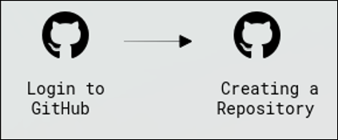
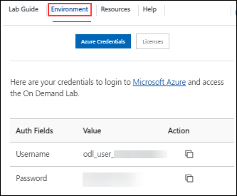

# Introduction to GitHub Copilot

### Overall Estimated Duration: 20 minutes

## Overview
 
GitHub Copilot is the world's first at-scale AI developer tool that can help you write code faster with less work. GitHub Copilot uses comments and code context to instantly suggest specific lines of code and the entire functions.

Research has found GitHub Copilot helps developers code faster, focus on solving bigger problems, stay in the flow longer, and feel more fulfilled with their work.

Powered by OpenAI Codex and GitHub Copilot's generative, pretrained language model was created by OpenAI. An extension is available for Visual Studio Code, Visual Studio, Neovim, and the JetBrains suite of integrated development environments (IDEs).

## Objective 

 - **Getting Started with Github Copilot** : Create and configure a GitHub repository, set Visual Studio Code as the preferred editor for seamless code editing and version control, and explore the advantages of using GitHub and GitHub Copilot for collaborative development and AI-driven code assistance.

## Prerequisites

 - Basic understanding of GitHub fundamentals
 - A GitHub Enterprise Cloud administrator account

## Architecture

The process involves logging into GitHub for authentication and creating a new repository to securely store and manage code. This setup allows users to efficiently store, manage, and version control their code on GitHub.

## Architecture Diagram

 

## Explanation of Components

The architecture for this lab involves the following key components:

- **Login into GitHub:** The authentication process where users securely access their GitHub account to manage repositories.

- **Create a GitHub Repo:** The process of initializing a new repository on GitHub, providing a dedicated space for managing code.

## **Accessing Your Lab Environment**
 
Once you're ready to dive in, your virtual machine and lab guide will be right at your fingertips within your web browser.
 
 

## **Virtual Machine & Lab Guide**
 
Your virtual machine is your workhorse throughout the workshop. The lab guide is your roadmap to success.
 
## **Exploring Your Lab Resources**
 
To get a better understanding of your lab resources and credentials, navigate to the **Environment** Details tab.
 
   
 
## **Utilizing the Split Window Feature**
 
For convenience, you can open the lab guide in a separate window by selecting the **Split Window** button from the Top right corner.

 

## Lab Guide Zoom In/Zoom Out
 
To adjust the zoom level for the environment page, click the **A↕ : 100%** icon located next to the timer in the lab environment.

  

## Managing Your Virtual Machine

Feel free to start, stop, or restart your virtual machine as needed from the **Resources** tab. Your experience is in your hands!

## Support Contact
 
The CloudLabs support team is available 24/7, 365 days a year, via email and live chat to ensure seamless assistance at any time. We offer dedicated support channels tailored specifically for both learners and instructors, ensuring that all your needs are promptly and efficiently addressed.

Learner Support Contacts:
- Email Support: cloudlabs-support@spektrasystems.com
- Live Chat Support: https://cloudlabs.ai/labs-support

Now, click on **Next** from the lower right corner to move on to the next page.

  

### Happy Learning!!

