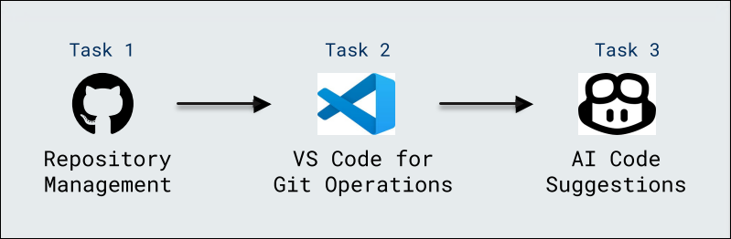

# Getting Started with GitHub Copilot

### Overall Estimated Duration: 30 minutes

## Overview
 
In this lab, a JavaScript file is created, and code is written with the assistance of GitHub Copilot's suggestions. The process includes pushing the code to a GitHub repository and following best practices for using Copilot. Additionally, GitHub Copilot Chat is explored to generate specific code snippets and refine prompts for more precise results.

## Objective 

- **Code Suggestions with GitHub Copilot in Codespaces using VS Code** : Explore GitHub Copilot's code suggestions to enhance your JavaScript development in VS Code, leveraging its AI-powered assistance for writing and improving code efficiently.

## Prerequisites

- **Basic Git and GitHub Knowledge** : Understanding Git operations (such as cloning, committing, and pushing code) along with familiarity with GitHub Codespaces is essential to effectively manage repositories and leverage AI-driven code suggestions.

## Architecture

This architecture streamlines coding by integrating repository management through a running codespace, enabling seamless Git operations via VS Code, and boosting productivity with AI-driven code suggestions from GitHub.

## Architecture Diagram

 

## Explanation of Components

The architecture for this lab involves the following key components:

- **Repository Management:** Ensure the codespace is running and properly configured for repository operations.
- **VS Code for Git Operations:** Use VS Code to perform Git actions, such as pushing .js code to GitHub directly from the codespace.
- **AI Code Suggestions:** Leverage GitHub's AI-powered code suggestions to enhance coding efficiency.

## **Accessing Your Lab Environment**
 
Once you're ready to dive in, your virtual machine and lab guide will be right at your fingertips within your web browser.
 
 

## **Virtual Machine & Lab Guide**
 
Your virtual machine is your workhorse throughout the workshop. The lab guide is your roadmap to success.
 
## **Exploring Your Lab Resources**
 
To get a better understanding of your lab resources and credentials, navigate to the **Environment** Details tab.
 
   
 
## **Utilizing the Split Window Feature**
 
For convenience, you can open the lab guide in a separate window by selecting the **Split Window** button from the Top right corner.

 

## Lab Guide Zoom In/Zoom Out
 
To adjust the zoom level for the environment page, click the **A↕ : 100%** icon located next to the timer in the lab environment.

  

## Managing Your Virtual Machine

Feel free to start, stop, or restart your virtual machine as needed from the **Resources** tab. Your experience is in your hands!

## Support Contact
 
The CloudLabs support team is available 24/7, 365 days a year, via email and live chat to ensure seamless assistance at any time. We offer dedicated support channels tailored specifically for both learners and instructors, ensuring that all your needs are promptly and efficiently addressed.

Learner Support Contacts:
- Email Support: cloudlabs-support@spektrasystems.com
- Live Chat Support: https://cloudlabs.ai/labs-support

Now, click on **Next** from the lower right corner to move on to the next page.

  

### Happy Learning!!
