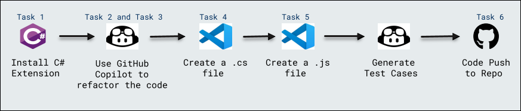

# Code Refactoring

### Overall Estimated Duration: 60 minutes

## Overview
 
This lab focuses on enhancing your skills with GitHub Copilot for C# and JavaScript development. You’ll gain experience with refactoring code, creating new programs, and utilizing GitHub for version control and collaboration.

## Objective 

- **Code Refactoring** : The objective is to enhance C# and JavaScript development workflows by leveraging GitHub Copilot for refactoring code and generating new code. You'll also learn to create test cases and manage code versions through GitHub.

## Prerequisites

- **Basic Knowledge of C# and JavaScript**: Familiarity with the syntax and structure of both C# and JavaScript will help in understanding the code modifications and new code generation.
- **Git and GitHub Basics**: Understanding Git commands and GitHub workflows, like committing and pushing code to a repository, is essential for managing code versions and collaborating on the project.

## Architecture

This architecture involves using GitHub Copilot and Visual Studio Code to improve the development workflow. The process starts with setting up a C# environment in VS Code, followed by using GitHub Copilot for code refactoring and generating new code. Additionally, it demonstrates how to generate test cases and push the final code changes to a GitHub repository for collaboration and version control.

## Architecture Diagram

## Explanation of Components

The architecture for this lab involves the following key components:

- **Install C# Extension**: Install the C# extension in VS Code to enable features like IntelliSense, debugging, and code navigation for C# development.
- **Use GitHub Copilot to Refactor the Code**: Utilize GitHub Copilot to improve and restructure poorly written C# code into more efficient and readable code.
- **Create a .cs File**: Use GitHub Copilot to rewrite a C# program, replacing a switch statement with if-else statements.
- **Create a .js File**: Use GitHub Copilot Chat to generate a full JavaScript program, such as a calculator, based on a prompt.
- **Generate Test Cases**: Write automated test cases for each function to ensure the code works correctly and meets the requirements.
- **Code Push to Repo**: Commit and push the code changes to a remote GitHub repository to ensure version control and collaboration.

## **Accessing Your Lab Environment**
 
Once you're ready to dive in, your virtual machine and lab guide will be right at your fingertips within your web browser.
 
 

## **Virtual Machine & Lab Guide**
 
Your virtual machine is your workhorse throughout the workshop. The lab guide is your roadmap to success.
 
## **Exploring Your Lab Resources**
 
To get a better understanding of your lab resources and credentials, navigate to the **Environment** Details tab.
 
   
 
## **Utilizing the Split Window Feature**
 
For convenience, you can open the lab guide in a separate window by selecting the **Split Window** button from the Top right corner.

 

## Lab Guide Zoom In/Zoom Out
 
To adjust the zoom level for the environment page, click the **A↕ : 100%** icon located next to the timer in the lab environment.

  

## Managing Your Virtual Machine

Feel free to start, stop, or restart your virtual machine as needed from the **Resources** tab. Your experience is in your hands!

## Support Contact
 
The CloudLabs support team is available 24/7, 365 days a year, via email and live chat to ensure seamless assistance at any time. We offer dedicated support channels tailored specifically for both learners and instructors, ensuring that all your needs are promptly and efficiently addressed.

Learner Support Contacts:
- Email Support: cloudlabs-support@spektrasystems.com
- Live Chat Support: https://cloudlabs.ai/labs-support

Now, click on **Next** from the lower right corner to move on to the next page.

  

### Happy Learning!!

 
