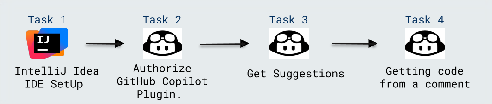

# Using IDEs such as JetBrains IntelliJ for Java

### Overall Estimated Duration: 20 minutes

## Overview
 
In this lab, you will learn how to integrate GitHub Copilot with IntelliJ IDEA to improve your Java coding experience. You'll get hands-on with creating Java projects, using code suggestions, and generating functions from simple comments.

## Objective 

- **Using IDEs such as JetBrains IntelliJ for Java**: This lab aims to set up and configure GitHub Copilot with IntelliJ IDEA for enhanced Java coding. The objective is to explore how GitHub Copilot can help you write Java code by providing suggestions and generating functions from comments.

## Prerequisites

- **Java**: Basic knowledge of Java and experience using IntelliJ IDEA for creating and managing projects.

## Architecture

This diagram outlines the process of setting up GitHub Copilot in IntelliJ IDEA to generate code suggestions. It demonstrates how GitHub Copilot can assist in coding by understanding comments and offering contextual suggestions.

## Architecture Diagram

 

## Explanation of Components

The architecture for this lab involves the following key components:
- **IntelliJ Idea IDE Setup:** Setting up a new Java project in the IntelliJ Idea IDE.
- **Authorize Github Copilot Plugin:** Integrating the GitHub Copilot plugin into your IDE for code assistance.
- **Get Suggestions:** Using GitHub Copilot to provide code suggestions based on context.
- **Getting Code from a Comment:** Leveraging GitHub Copilot to generate code from descriptive comments.

## **Accessing Your Lab Environment**
 
Once you're ready to dive in, your virtual machine and lab guide will be right at your fingertips within your web browser.
 
 

## **Virtual Machine & Lab Guide**
 
Your virtual machine is your workhorse throughout the workshop. The lab guide is your roadmap to success.
 
## **Exploring Your Lab Resources**
 
To get a better understanding of your lab resources and credentials, navigate to the **Environment** Details tab.
 
   
 
## **Utilizing the Split Window Feature**
 
For convenience, you can open the lab guide in a separate window by selecting the **Split Window** button from the Top right corner.

 

## Lab Guide Zoom In/Zoom Out
 
To adjust the zoom level for the environment page, click the **A↕ : 100%** icon located next to the timer in the lab environment.

  

## Managing Your Virtual Machine

Feel free to start, stop, or restart your virtual machine as needed from the **Resources** tab. Your experience is in your hands!

## Support Contact
 
The CloudLabs support team is available 24/7, 365 days a year, via email and live chat to ensure seamless assistance at any time. We offer dedicated support channels tailored specifically for both learners and instructors, ensuring that all your needs are promptly and efficiently addressed.

Learner Support Contacts:
- Email Support: cloudlabs-support@spektrasystems.com
- Live Chat Support: https://cloudlabs.ai/labs-support

Now, click on **Next** from the lower right corner to move on to the next page.

  

### Happy Learning!!
