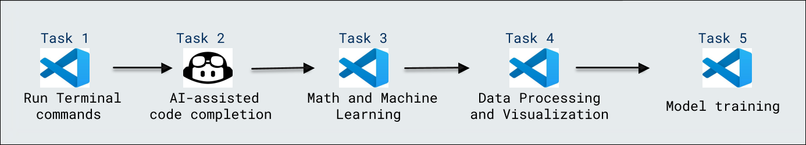

# Working with the Copilot for Machine Learning

### Overall Estimated Duration: 30 minutes

## Overview
 
This lab focuses on using GitHub Copilot to streamline machine learning workflows, including data preprocessing, mathematical operations, visualization, and model building. You'll learn how Copilot can assist with code generation, making the process faster and more efficient.

## Objective 

- **Working with the Copilot for Machine Learning** : The objective of this lab is to work with GitHub Copilot to assist in machine learning tasks, from dataset preparation to model training. You’ll use Copilot’s suggestions to build and train machine learning models.

## Prerequisites

- **Python**: Basic understanding of Python programming, machine learning concepts, and familiarity with libraries like pandas, scikit-learn, and Jupyter notebooks.

## Architecture

This architecture diagram represents the flow of tasks involved in the lab. It begins with setting up the environment, followed by code completion assistance, mathematical processing, and data visualization. Finally, the model is trained to make predictions based on the prepared data.

## Architecture Diagram

 

## Explanation of Components

The architecture for this lab involves the following key components:

- **Run Terminal Commands**: Executes essential setup and installation commands to prepare the environment for the lab.
- **AI-assisted Code Completion**: Utilizes GitHub Copilot to assist in auto-completing code for machine learning tasks and experiments.
- **Math and Machine Learning**: Involves performing mathematical operations and applying machine learning techniques to process and analyze data.
- **Data Processing and Visualization**: Transforms data and visualizes it through various charts and plots for better insights.
- **Model Training**: Trains a machine learning model, such as a random forest, on the processed data to make predictions.

## **Accessing Your Lab Environment**
 
Once you're ready to dive in, your virtual machine and lab guide will be right at your fingertips within your web browser.
 
 

## **Virtual Machine & Lab Guide**
 
Your virtual machine is your workhorse throughout the workshop. The lab guide is your roadmap to success.
 
## **Exploring Your Lab Resources**
 
To get a better understanding of your lab resources and credentials, navigate to the **Environment** Details tab.
 
   
 
## **Utilizing the Split Window Feature**
 
For convenience, you can open the lab guide in a separate window by selecting the **Split Window** button from the Top right corner.

 

## Lab Guide Zoom In/Zoom Out
 
To adjust the zoom level for the environment page, click the **A↕ : 100%** icon located next to the timer in the lab environment.

  

## Managing Your Virtual Machine

Feel free to start, stop, or restart your virtual machine as needed from the **Resources** tab. Your experience is in your hands!

## Support Contact
 
The CloudLabs support team is available 24/7, 365 days a year, via email and live chat to ensure seamless assistance at any time. We offer dedicated support channels tailored specifically for both learners and instructors, ensuring that all your needs are promptly and efficiently addressed.

Learner Support Contacts:
- Email Support: cloudlabs-support@spektrasystems.com
- Live Chat Support: https://cloudlabs.ai/labs-support

Now, click on **Next** from the lower right corner to move on to the next page.

  

### Happy Learning!!
