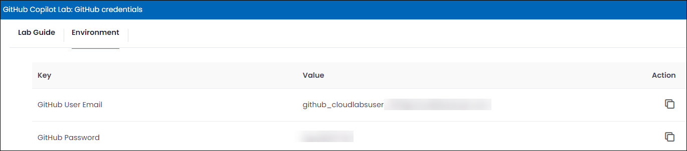
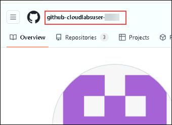

# Lab 1:  Getting Started with GitHub Copilot

## Lab Objective
 
The objective of this lab is to log in to GitHub, create a repository, configure its initial settings, and explore the platform's interface for efficient management of code repositories.

## Github Copilot for Individuals

GitHub Copilot is an AI-powered coding assistant developed by GitHub, designed to help individual developers by providing intelligent code suggestions, automating repetitive tasks, and enhancing productivity during software development. It leverages machine learning models trained on vast repositories of code to generate code snippets, complete functions, and offer contextual suggestions based on the developer's input and coding patterns. Copilot supports various programming languages and adapts to individual coding styles, making it a valuable tool for accelerating coding tasks, exploring new techniques, and improving code quality.

Ways in which the data in GitHub Copilot Individual can be used and shared :

- **Enhancing GitHub Copilot**: The data collected is utilized to improve GitHub Copilot by evaluating different strategies for processing and predicting suggestions that users may find valuable.
- **Developing related developer products and services**: The insights gained from the data help in the development and improvement of other developer tools and services offered by GitHub and Microsoft.
- **Detecting abuse and policy violations**: The data is examined to investigate and identify any potential misuse or violation of the Acceptable Use Policies associated with GitHub Copilot.

## GitHub Copilot for Business

GitHub Copilot is available through GitHub personal accounts with GitHub Copilot for Individuals or through organization or enterprise accounts with GitHub Copilot for Business.

With Copilot for Business, you can manage access to GitHub Copilot for organizations within your enterprise. Once you grant an organization access to GitHub Copilot, the organization's administrators can grant access to individuals and teams.

With GitHub Copilot for Business, GitHub Copilot is open to every developer, team, organization, and enterprise.

Focused on making organizations more productive, secure, and fulfilled, GitHub Copilot for Business allows developers to code faster and allows them to focus on more satisfying work.

Here are some features you can expect from Copilot for Business:

 - A robust AI model: New modeling algorithms improve the quality of code suggestions.
 - AI-based security vulnerability filtering: GitHub Copilot automatically blocks common insecure code suggestions by targeting issues such as hardcoded credentials, SQL injections, and path injections.
 - VPN proxy support: GitHub Copilot works with VPNs, including with self-signed certificates, so developers can use it in any working environment.
 - Simple sign-up: Regardless of whether a business does not use the GitHub service for its source code, it can easily buy Copilot for Business licenses online and assign seats.

## GitHub Copilot for Enterprise

GitHub Copilot is an AI-powered coding assistant that helps developers write code faster.

GitHub Copilot Enterprise is a Copilot plan available for enterprises that use GitHub Enterprise Cloud. It provides AI features to enhance your experience on GitHub.com, such as the ability to chat with Copilot in the browser and reference context for Copilot from across your project repositories. For more information, see "GitHub Copilot Enterprise feature set." For details of the differences between GitHub Copilot Enterprise and the other Copilot plans, see the comparison table below.

Enterprise owners can allow some or all organizations in the enterprise to access GitHub Copilot. If an organization has access to Copilot, owners of the organization can assign Copilot Enterprise seats to some or all members of the organization.

### GitHub Copilot Enterprise includes the following features, available to all users who are assigned a GitHub Copilot Enterprise seat:

- **GitHub Copilot in your IDE**: GitHub Copilot is an AI tool that offers autocomplete-style suggestions in your IDE.
- **GitHub Copilot Chat in your IDE**: GitHub Copilot Chat in your IDE is a chat interface that lets you ask and receive answers to coding-related questions within supported IDEs.
- **GitHub Copilot in the CLI**: GitHub Copilot in the CLI provides a chat-like interface in the terminal that allows you to ask questions about the command line. You can ask GitHub Copilot to provide either command suggestions or explanations of given commands.
- **GitHub Copilot Chat in GitHub.com**: GitHub Copilot Chat in GitHub.com is a chat interface that lets you ask and receive answers to coding-related questions within GitHub.com.
- **Copilot pull request summaries**: Copilot pull request summaries is an AI-powered feature that allows you to create a summary of the changes that were made in a pull request, which files they impact, and what a reviewer should focus on when they conduct their review.

### GitHub Copilot for Business vs. GitHub Copilot for Individuals

|                                                            | GitHub Copilot for Individuals |GitHub Copilot for Business | GitHub Copilot Enterprise |
| ---------------------------------------------------------- | --------------------------- | ------------------------------- | ------------- |
| Unlimited messages and interactions            |             ✓	             |      ✓                 |    ✓  |
| Context-aware coding support and explanations   |             ✓	             |      ✓                 |    ✓  |
| Debugging and security remediation assistance |             ✓	             |         ✓                 |    ✓  |
| Conversations tailored to your organization’s repositories  |     ✕	             |   ✕	 |    ✓  |
| Answers based on your organization’s knowledge base |             ✕	             |   ✕	 |    ✓  |
| Access to knowledge from top open source repositories |             ✕	             |    ✕	 |    ✓  |
| Pull request diff analysis         |             ✕	             |   ✕	 |    ✓  |
| Web search powered by Bing (beta)  |             ✕	             |   ✕	 |    ✓  |
| Real time code suggestions |             ✓	             |               ✓                 |    ✓  |
| Comments to code |             ✓	             |               ✓                 |    ✓  |
| Fine-tuned models (coming soon as add-on) |             ✕	             |   ✕	 |    ✓  |
| Inline chat and prompt suggestions |             ✓	             |               ✓                 |    ✓  |
| Slash commands and context variables |             ✓	             |               ✓                 |    ✓  |
| Commit message generation |             ✓	             |               ✓                 |    ✓  |
| Pull request description and summarization |             ✕	             |   ✕	 |    ✓  |
| IDE, CLI and GitHub Mobile |             ✓	             |               ✓                 |    ✓  |
| GitHub.com |             ✕	             |   ✕	 |    ✓  |
| Public code filter |             ✓	             |               ✓                 |    ✓  |
| User management |             ✕	             |  ✓                 |    ✓  |
| Data excluded from training by default |             ✕	             |  ✓                 |    ✓  |
| IP indemnity |             ✕	             |  ✓                 |    ✓  |
| Content exclusions |             ✕	             |  ✓                 |    ✓  |
| SAML SSO authentication¹ |             ✕	             |  ✓                 |    ✓  |
| Requires GitHub Enterprise Cloud |             ✕	             |   ✕	 |    ✓  |

### GitHub Copilot for Business Use Cases and Customer Stories

GitHub Copilot improves developer productivity and happiness, reduces disruptions, improves flow, and increases the amount of time a developer spends doing satisfying work.

 - Developers code faster.
 - Developers stay in the flow longer.

### How to get started with GitHub Copilot for Business?

Using GitHub Copilot for Business in your enterprise: You must first establish a policy for using GitHub Copilot for Business in your enterprise. Once GitHub Copilot for Business is enabled at the enterprise level, you can configure GitHub Copilot settings for each organization in your enterprise.
 
## Task 1: Login to GitHub

Sign in to GitHub and configure a GitHub repository and set Visual Studio Code as the editor preference for seamless code editing.

1. In the LABVM desktop search for **Microsoft Edge** **(1)**, click on **Microsoft Edge** **(2)** browser.

   

1. Navigate to GitHub login page using the provided URL below:
   
   ```
   https://github.com/login
   ```
   
1. On the **Sign in to GitHub** tab, you will see the login screen. In that screen, enter the  **email** **(1)** and **password** **(2)**. Then click on **Sign in** **(3)**. 

    
          
    >**Note:** To view the GitHub credentials, access the lab named **GitHub Copilot Lab: GitHub Credentials**, which is present within the First learning path of this course.

      

    >**Note:** Once the lab has been deployed successfully, navigate to the **Environment** tab to view the key-value pairs of the **GitHub UserEmail**, and **GitHub Password**. You can use the copy buttons under the actions column to have the values copied instantly. Alternatively, it is suggested to have the values copied over onto a notepad for easy accessibility. 

    

    >**Note:** If you're unable to copy the username and password, please type them manually to proceed further.
   
1. Navigate to Outlook login page using the provided URL below:

   ```
   https://outlook.office365.com/mail/
   ```
1. Next, to get the authentication code, sign in to Outlook with the git credentials within the Environment tab from the previous step. Once you have logged into Outlook, find the recent email containing the verification code. Enter the verification code, and click on **Verify**.

   >**Note:** The email containing the verification code can sometimes creep into the archive/spam folders within your Outlook.

   

1. In a new browser tab, copy the below link:

   <!-- For start course, run in JavaScript:
   'https://github.com/new?' + new URLSearchParams({
     template_owner: 'skills',
     template_name: 'copilot-codespaces-vscode',
     owner: '@me',
     name: 'skills-copilot-codespaces-vscode',
     description: 'My clone repository',
     visibility: 'public',
   }).toString()
   -->
   
   ```
   https://github.com/new?template_owner=skills&template_name=copilot-codespaces-vscode&owner=%40me&name=skills-copilot-codespaces-vscode&description=My+clone+repository&visibility=public
   ```   
1. In the new tab, most of the prompts will automatically fill in for you. Make sure the  repository name is  **skills-copilot-codespaces-vscode**, and leave the default for the owner, as you have already logged into GitHub to host the repository **(1)**. Select **Public** repository **(2)** and click the **Create repository** **(3)** button at the bottom of the form.

   

    > **Note**: If you get a note  prompting that a repository with the name **skills-copilot-codespaces-vscode** already exists, please delete the existing one by performing the below steps and perform the above step again.
     - On GitHub.com, navigate to the main page of the repository.
     - Under your repository name, click  Settings. If you cannot see the "Settings" tab, select the  dropdown menu, then click Settings.
    
       

     - On the **General** settings page (which is selected by default), scroll down to the "Danger Zone" section and click **Delete this repository**.
     
       

     - Click **I want to delete this repository**.
 
       

     - Read the warnings and click **I have read and understand these effects**.

        

     - To verify that you're deleting the correct repository, in the text box, type the name of the repository you want 
         to delete.

     - Click **Delete this repository**.

  

1. After your new repository is created, wait about 20 seconds and then refresh the page.

1. Once the repository is created, click on your profile picture and then select **Your organizations**.

    

1. In "Your organization", from the left navigation pane, select **Codespaces**.

    

1. Scroll down and make sure, **Visual Studio Code** is selected, under the **Editor preference** .

    

1. On the GitHub page, locate your profile icon at the top right corner of the screen and click on **Your Profile** option.

1. Copy your GitHub username in order to validate your lab.

   
  
    > **Congratulations** on completing the lab! Now, it's time to validate it. Here are the steps:
    >  - Hit the Validate button for the corresponding task. Paste the GitHub username (1) you copied in the previous step and click on **Submit**(2).
       
      
    
    > - If you receive a success message, you can proceed to the next task. 
    > - If not, carefully read the error message and retry the step, following the instructions in the lab guide.
    > - If you need any assistance, please contact us at labs-support@spektrasystems.com. We are available 24/7 to help you out.

      <validation step="74f9ec11-59d4-4a33-928f-4ab2220edbd9" />

## Summary

In conclusion, you have learned how to log into GitHub and create a new repository. By now, you should have a repository set up and ready for your projects.

## You have successfully completed this lab. 
