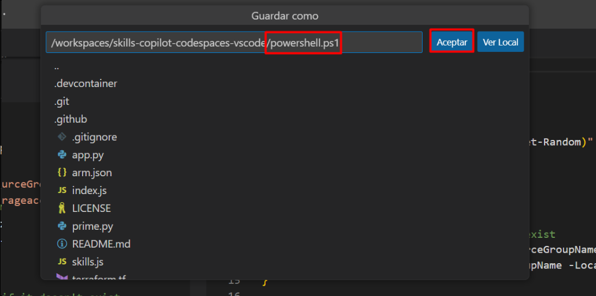
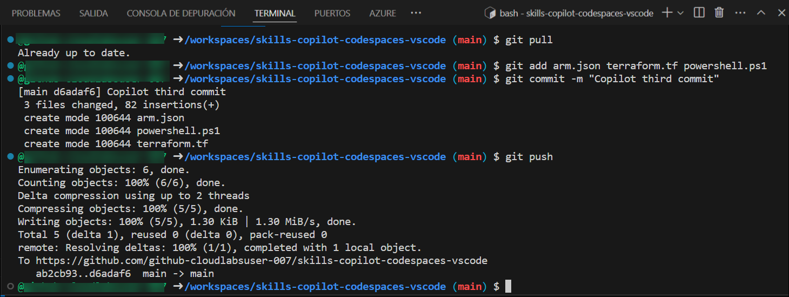

# Lab 4: Using GitHub Copilot to generate ARM & Terraform Templates

## Lab Objective 

In this lab, you will use GitHub Copilot to generate and deploy resources to Azure using ARM, Terraform, and PowerShell. You will interact with GitHub Copilot Chat within Visual Studio Code to generate code and push it to your GitHub repository. This lab will help you understand how to leverage AI-powered code suggestions for infrastructure automation.

### About GitHub Copilot Chat and Visual Studio Code

GitHub Copilot Chat allows you to ask coding questions and receive answers directly within the supported IDE. Copilot Chat can help you with a variety of coding-related tasks, like offering you code suggestions, providing natural language descriptions of a piece of code's functionality and purpose, generating unit tests for your code, and proposing fixes for bugs in your code. For more information, see "[About GitHub Copilot Chat](https://docs.github.com/en/copilot/github-copilot-chat/about-github-copilot-chat)."

### Use cases for GitHub Copilot Chat

There are several situations in which GitHub Copilot Chat can help with coding.

 - Generating unit test cases
 - Explaining code
 - Proposing code fixes
 - Answering coding questions

In this lab, you will utilize Copilot to generate code in ARM, Terraform, and PowerShell.

> **Disclaimer**: GitHub Copilot will automatically suggest an entire function body or code in gray text. Examples of what you'll most likely see in this exercise, but the exact suggestion may vary.

## Task 1: Generate code by chat that uses ARM to deploy resources to Azure

Use GitHub Copilot Chat to generate ARM code that deploys resources to Azure and save it as arm.json.

1. In the LABVM desktop search for **Microsoft Edge** **(1)**, click on **Microsoft Edge** **(2)** browser.

   

1. Navigate to GitHub login page using the provided URL below:
   ```
   https://github.com/login
   ```
   
1. On the **Sign in to GitHub** tab, you will see the login screen. In that screen, enter the  **email** **(1)** and **password** **(2)**. Then click on **Sign in** **(3)**. 

   

    >**Note:** To view the GitHub credentials, access the lab named **GitHub Copilot Lab: GitHub Credentials**, which is present within the First learning path of this course.

      

   >**Note:** Once the lab has been deployed successfully, navigate to the **Environment** tab to view the key-value pairs of the **GitHub UserEmail**, and **GitHub Password**. You can use the copy buttons under the actions column to have the values copied instantly. Alternatively, it is suggested to have the values copied over onto a notepad for easy accessibility. 

     

   >**Note:** If you're unable to copy the username and password, please type them manually to proceed further.
     
1. Navigate to Outlook login page using the provided URL below:
   ```
   https://outlook.office365.com/mail/
   ```
1. Next, to get the authentication code, sign in to Outlook with the git credentials within the Environment tab from the previous step. Once you have logged into Outlook, find the recent email containing the verification code. Enter the verification code, and click on **Verify**.

   >**Note:** The email containing the verification code can somtimes creep into the archive/spam folders within your Outlook.

   

1. Now, right-click on your profile icon in the top right and click on **Your Repositories**.
    
   

1. Click on the repository named **skills-copilot-codespaces-vscode**.

1. Navigate back to the home page of your repository by clicking the **Code** **(1)** tab located at the top left of the screen. Click the **Code** **(2)** button located in the middle of the page.

   

1. Click the **Codespaces (1)** tab on the box that pops up and then click the **+ (2)** button.

   

   >**Note**: If in case pop-up prompt doesn't appear in the browser to open Visual Studio code, manually launch Visual Studio code from the desktop and close it. Next, return to the browser, refresh the page and launch the codespace that was previously created.

1. You will encounter a pop-up prompt. Click **Open** to proceed. Subsequently, another pop-up window will appear within Visual Studio Code (VS Code), where you should once again select **Install Extension and Open URI** to continue.

   

   

1. At the bottom right corner, you will get a prompt to sign in to GitHub.

   

   >**Note:** If you do not get the sign-in prompt within Visual Studio Code, click on **Allow** in the pop-up that appears which will open a window in the browser, refresh the screen and click on **Open** in the pop-up that appears.

1. Next, once you get the popup, click on **Allow**

   

   >**Note**: Wait about 2 minutes for the codespace to spin itself up.

1. Verify your codespace is running. Make sure the VS code looks as shown below:

   

1. Click on **Extensions** **(1)** from the left menu, and the **GitHub Copilot** **(2)** extension should show up in the VS Code extension list. Click the Copilot extension and verify its installation as shown below:

   

1. In the "Search Extensions in Marketplace" search box, type and search for the **GitHub Copilot Chat** extension.

1. Select **GitHub Copilot Chat** from the list of results that show up, and verify that **GitHub Copilot Chat** has been installed.
   
1. If not, click on the **Install** button.

    

1. Once the installation is complete, in the top navigation pane you will able to see the icon for GitHub Copilot next to the search bar or it will be present in the bottom right corner in the visual studio code window.

1. Make sure to sign in to your GitHub account by clicking on the GitHub Copilot icon located in the bottom right corner.

    

    > **Note:** Click "**Allow**" for VS Code to sign in to your GitHub account. A new web page will open. Copy the URL of the page, paste it into a private browser, enter your GitHub credentials, and sign in.

## Task 2- Example: Set the stage with a high-level goal

Ask coding-related questions, and GitHub Copilot Chat processes the query to provide relevant answers or code snippets.

1. In the Visual Studio Code activity bar, click the **GitHub Copilot Chat icon (1)** and select **GitHub Copilot Chat (2)** option to open a chat window.

    

   >**Note**: If the GitHub Copilot extension is not installed, click on Install.

1. At the bottom of the GitHub Copilot Chat window, in the **Ask Copilot a question or type / for topics** text box, type a coding-related question, then press Enter. For example, type "Write an ARM code for deploying a storage account to Azure with the code explanation."

    

1. GitHub Copilot Chat will process your question and provide an answer, with code suggestions when appropriate, in the chat window. 

    

       

    > **Note:** Here's an example of what you are likely to see; however, the precise recommendation could vary.

    > **Note**: Optionally, if GitHub Copilot Chat suggests a follow-up question above the **Ask Copilot a question or type / for topics** text box, click the follow-up question to ask it.

    > **Note**:  If your question is outside the scope of GitHub Copilot Chat, it will tell you and may suggest an alternative question to ask.
   
1. You can review the response from GitHub Copilot in the chat. To insert code into a new file, click on **Ellipsis (...)** **(1)** and select **Insert Into New File** **(2)**.

   

1. Press `CTRL + S` to save the file. Name the file `arm.json` and click on **OK**

   

## Task 3: Generate code by chat that uses Terraform to deploy resources to Azure

Generate a Terraform script to deploy a storage account to Azure and save it as terraform.tf.

1. Back in the Chat window, let us try to generate a terraform code. Enter for instance, type "Write a Terraform code for deploying a storage account to Azure with the code explanation" and hit enter.

1. GitHub Copilot Chat will process your question and provide an answer, with code suggestions when appropriate, in the chat window.

    

    > **Note:** Here's an example of what you are likely to see; however, the precise recommendation could vary.
    
    > **Note**: Optionally, if GitHub Copilot Chat suggests a follow-up question above the **Ask Copilot a question or type / for topics** text box, click the follow-up question to ask it.

    > **Note**:  If your question is outside the scope of GitHub Copilot Chat, it will tell you and may suggest an alternative question to ask.
   
1. You can review the response from GitHub Copilot in the chat. To insert code into a new file, click on **Ellipsis (...)** **(1)** and select **Insert Into New File** **(2)**.

   

1. Press `CTRL + S` to save the file. Name the file `terraform.tf` and click on **OK**

   

## Task 4: Generate code by chat that uses PowerShell to deploy resources to Azure

Use GitHub Copilot Chat to create a PowerShell script to deploy resources and save it as powershell.ps1.

1. Back in the Chat window, let us try to generate a powershell script.For example, type "Write a PowerShell script for deploying a storage account to Azure." and hit enter.

   

1. GitHub Copilot Chat will process your question and provide an answer, with code suggestions when appropriate, in the chat window. 

    

    > **Note:** Here's an example of what you are likely to see; however, the precise recommendation could vary.

    > **Note**: Optionally, if GitHub Copilot Chat suggests a follow-up question above the **Ask Copilot a question or type / for topics** text box, click the follow-up question to ask it.

    > **Note**:  If your question is outside the scope of GitHub Copilot Chat, it will tell you and may suggest an alternative question to ask.
   
1. You can view the response from GitHub Copilot in the chat. To insert code into a new file, click on **Ellipsis (...)** **(1)** and select **Insert Into New File** **(2)**.

   

1. Press `CTRL + S` to save the file. Name the file `powershell.ps1` and click on **OK**.

   

## Task 5: Push code to your repository from the codespace

Add the generated files (arm.json, terraform.tf, powershell.ps1) to your GitHub repository and push the changes.

1. Use the VS Code terminal to add files to the repository. Open VS Code Terminal if it's not opened yet.

1. Run the below command to add the `arm.json` , `terraform.tf` and `powershell.ps1` files to the repository:

   ```
   git add arm.json terraform.tf powershell.ps1
   ```

1. Next, from the VS Code terminal stage, commit the changes to the repository:

   ```
   git commit -m "Copilot third commit"
   ```

1. Finally, from the VS Code terminal, push to code to the repository:

   ```
   git push
   ```

   

   >**Note**: Wait about 60 seconds, then refresh your repository landing page for the next step.

1. You can verify the `arm.json`, `powershell.ps1`, and `terraform.tf` files available in your GitHub repository.

   
    
1. On the GitHub page, locate your profile icon at the top right corner of the screen and click on **Your Profile** option.

1. Copy your GitHub username in order to validate your lab.

   
  
    > **Congratulations** on completing the lab! Now, it's time to validate it. Here are the steps:
    >  - Hit the Validate button for the corresponding task. Paste the GitHub username (1) you copied in the previous step and click on **Submit**(2).
       
      
    
    > - If you receive a success message, you can proceed to the next task. 
    > - If not, carefully read the error message and retry the step, following the instructions in the lab guide.
    > - If you need any assistance, please contact us at labs-support@spektrasystems.com. We are available 24/7 to help you out.

<validation step="24e51569-e264-40ac-b8f3-a565cdd84341" />

  
## Summary

In this lab, you have employed Copilot to automatically generate code in both ARM, Terraform, and PowerShell programming languages.

## You have successfully completed this lab. 
