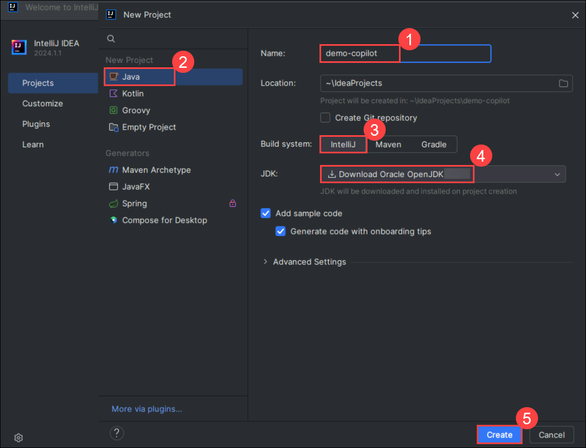

 # Lab 6: Using IDEs such as JetBrains IntelliJ for Java [Optional]

## Lab Overview

IntelliJ IDEA is an Integrated Development Environment (IDE) for Java and Kotlin designed to maximize developer productivity. It does the routine and repetitive tasks for you by providing clever code completion, static code analysis, and refactorings, and lets you focus on the bright side of software development, making it not only productive but also an enjoyable experience. GitHub Copilot, an innovative code generation tool, can be integrated with JetBrains IntelliJ, a widely used IDE for Java development. This integration enhances the Java coding experience by providing intelligent code suggestions and auto-completion within IntelliJ, boosting productivity and code quality.

>**Disclaimer**: GitHub Copilot will automatically suggest an entire function body or code in gray text. Examples of what you'll most likely see in this exercise, but the exact suggestion may vary.

>**Note**: If you are unable to see any suggestions by GitHub Copilot in VS Code, please restart the VS Code once and try again.

## Task 1: Install the GitHub Copilot plugin and create a new project in the IntelliJ IDEA IDE

Set up the GitHub Copilot plugin in IntelliJ IDEA and create a new Java project for coding.

1. Navigate to the desktop and open the **IntelliJ IDEA Community** IDE.

    

2. In the IntelliJ IDEA Agreement, check **I confirm that I have read and accept the terms of this User Agreement (1)** and click on **Continue (2)**.

    

   >**Note:** When the data sharing box appears, click on **Don't Send**.

   

3. If you get a prompt to import, click on **Skip import**.

4. From the left menu, click on **Plugins** **(1)** and select **Marketplace** **(2)**. Search **GitHub Copilot** **(3)**, and once you find the **GitHub Copilot** plugin, click on **Install** **(4)**.

    

   >**Note**: In the Third-Party Plugins notice, click **Accept**.

5. Verify the GitHub Copilot plugin is installed. Next, you need to restart the IDE by clicking on **Restart IDE**. Click on **Restart** in the pop-up once again to restart the IDE.

    .png)

6. Once the **IntelliJ IDEA Community** IDE is restarted, select **Projects** **(1)** from the left menu and click on **New Project** **(2)**.

   

7. In the new project pane, enter the project name as **demo-copilot** **(1)**. Select language as **Java** **(2)** and build system as **IntelliJ** **(3)**. For JDK, select the default **Download Oracle OpenJDK 23** **(4)** and click on **Create** **(5)**.

   

8. Review the created **demo-copilot** project as shown below:

   


## Task 2: Create a basic Java project

After setting up GitHub Copilot, log in, and create a simple Java class with GitHub Copilot suggestions for functions.

1. Click the **icon** as shown in the below image. 

   

1. Click on **Tools (1)**. Click GitHub Copilot, then click **Login to GitHub (2)**.

   

1. In the "Sign in to GitHub" dialog box, to copy the device code and open the device activation window, click **Copy and Open**.

   

1. A device activation window will open in your browser. Paste the device **code (1)** which you have copied in the previous step, then click **Continue (2)**.

   

1. GitHub will request the necessary permissions for GitHub Copilot. To approve these permissions, click **Authorize GitHub Copilot Plugin**.

1. After the permissions have been approved, your JetBrains IDE will show a confirmation.

   

1. In your JetBrains IDE, right-click on the **src (1)**, select **New (2)** and click on **File (3)** to create a new Java (*.java) file named **Test.java**.

   

1. Create a class by typing **class Test**. Copilot will suggest a class body, and you can press **tab** to accept the suggestion.

   

1. Below the bracket of the main function, type the following function header:

   ```
   int calculateDaysBetweenDates(
   ```

1. GitHub Copilot will automatically suggest an entire function body in gray text, as shown below. The exact suggestion may vary.

   

1. Press **Tab** to accept the suggestion.


## Task 3: Getting more suggestions

Learn how to get additional code suggestions from GitHub Copilot if the initial suggestions don't meet your needs.

Sometimes, you may not want to use any of the initial suggestions. You can ask GitHub Copilot to return more.

1. Remove the function you entered and type the following again:

   ```
   int calculateDaysBetweenDates(
   ```

1. Open GitHub Copilot.

   -On macOS, press `Option + Enter`.

   -On Windows or Linux, press `Alt + Enter`.
   
   >**Note**: If the 'Alt + Enter' isn't working, please select Github Co-pilot from the right pane as shown in the below image.

   
   
1. Select "Open Copilot". GitHub Copilot will open a new tab and suggest multiple options, as shown below.

   

1. Pick a suggestion that you want to use, then click "Accept solution".

1. If you don't like any of the returned suggestions, just close the suggestions tab.


## Task 4: Getting code from a comment

Explore how GitHub Copilot can generate entire function implementations just from a comment describing the function's purpose.

GitHub Copilot can understand significantly more context than most code assistants and can generate entire functions from something as simple as a comment.

1. Remove the function you entered and type the following comment:
   
   ```
   // Identify all the images without alternate text
   // and add a red border to them
   void process(java.util.List<Image> images) {  

   ```

2. GitHub Copilot will automatically suggest an implementation.
  
   
 
> **Congratulations** on completing the task! Now, it's time to validate it. Here are the steps:
> - If you receive a success message, you can proceed to the next task.
> - If not, carefully read the error message and retry the step, following the instructions in the lab guide. 
> - If you need any assistance, please contact us at labs-support@spektrasystems.com. We are available 24/7 to help you out.

<validation step="8a3b56fe-e617-420d-99a2-0a23c257a791" />

        
### Summary

In this exercise, you have successfully configured the JetBrains IntelliJ Idea IDE for Java, installed the GitHub Copilot plugin, and explored the basic Java code that produced the suggestions using Copilot.

### You have successfully completed the lab. 
