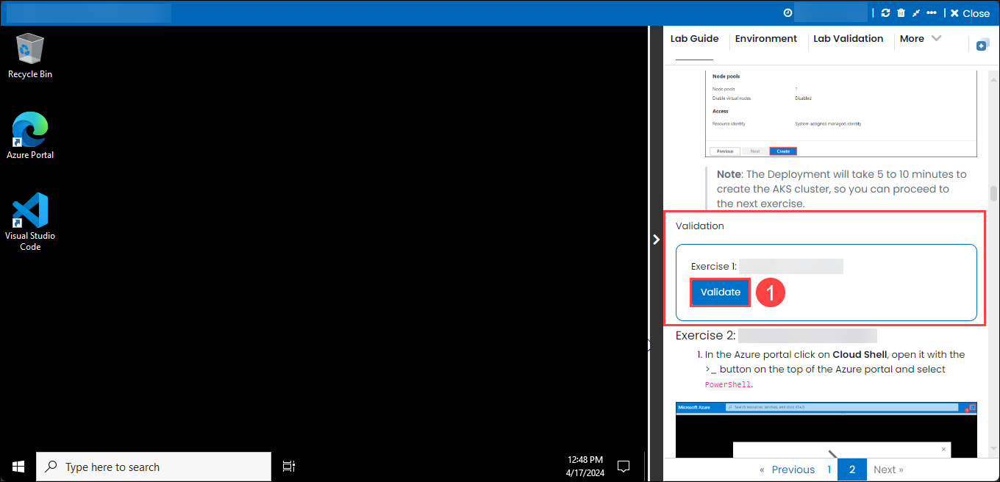

# Getting Started with Your Code Suggestions with GitHub Copilot in Codespaces using VS Code

## Overall Estimated Duration: 60 minutes

## Overview

This lab introduces you to using GitHub Copilot within Codespaces in Visual Studio Code to enhance your coding workflow. GitHub Copilot is an AI-powered code completion tool that assists developers by suggesting whole lines or blocks of code as they type, making the coding process faster and more efficient. In this lab, you will learn how to set up and use GitHub Copilot in a Codespace, explore its various features, and understand how to leverage its capabilities to improve your productivity and code quality. By the end, you'll be familiar with integrating AI-driven code suggestions into your development environment seamlessly.

## Objective

By the end of this lab, you will be able to:

- **Set Up GitHub Codespaces**: Create a new GitHub repository or use an existing one.

- Launch GitHub Codespaces from the repository.

- Ensure Codespaces is configured with VS Code or the browser-based version of VS Code.

- **Install and Enable GitHub Copilot**: Verify if GitHub Copilot is installed and enabled in your Codespace environment.

- If not, follow the steps to install the GitHub Copilot extension from the VS Code marketplace.

- **Understand GitHub Copilot Basics**: Learn about GitHub Copilot's AI-based code suggestion capabilities.

- Understand how Copilot suggests code based on comments, function names, or partially typed code.

- **Practice Writing Code with Copilot**:

- Write simple functions or scripts in a language of choice (e.g., JavaScript, Python, etc.).

- Observe and accept code suggestions made by GitHub Copilot.

- Modify the suggestions if needed and understand how to prompt Copilot for better suggestions.

## Pre-Requisites

Participants should have: Basic knowledge and understanding of the following

- **GitHub Account**: A valid GitHub account. Ensure that you are logged into your GitHub account to access GitHub Codespaces and Copilot.
- **Basic Knowledge of Git and GitHub**: Familiarity with Git version control system and basic GitHub concepts like repositories, branches, commits, and pull requests.

## Explanation of Components

**GitHub Account**: A GitHub Account is required to access GitHub's suite of tools, including GitHub Codespaces and Copilot. With a GitHub account, you can create and manage repositories, collaborate with other developers, and leverage GitHub's cloud-based development environments.

**GitHub Codespaces**: GitHub Codespaces provides a cloud-based development environment that allows developers to code directly in their browsers or in Visual Studio Code. Codespaces leverages Docker-based containers to create fully-featured, isolated development environments with all necessary dependencies pre-installed. This eliminates the "works on my machine" problem by ensuring consistency across different environments. It is highly configurable and can be customized using `devcontainer.json` files.

**Programming Knowledge**: A foundational understanding of programming languages is crucial for utilizing GitHub Copilot effectively. Copilot provides code suggestions based on patterns it has learned from large-scale datasets. Familiarity with programming concepts, such as data structures, control flow, algorithms, and language-specific syntax (e.g., Python, JavaScript, Java, etc.), will help users comprehend and evaluate the suggestions made by Copilot.

**Understanding of Visual Studio Code (VS Code)**:
Visual Studio Code (VS Code) is a source-code editor that supports multiple programming languages and provides powerful features like IntelliSense, debugging, and extensions. Understanding VS Code basics, such as how to open and save files, navigate the integrated terminal, manage extensions, and use shortcuts, enhances the development experience and allows users to maximize the utility of tools like GitHub Copilot within the editor.

## Getting Started with the Lab

Once the environment is provisioned, a virtual machine (JumpVM) and lab guide will get loaded in your browser. Use this virtual machine throughout the workshop to perform the lab. You can see the number on the bottom of the Lab guide to switch to different exercises of the lab guide.
 
## Accessing Your Lab Environment
 
Once you're ready to dive in, your virtual machine and lab guide will be right at your fingertips within your web browser.
 
   

### Virtual Machine & Lab Guide
 
Your virtual machine is your workhorse throughout the workshop. The lab guide is your roadmap to success.
 
## Exploring Your Lab Resources
 
To get a better understanding of your lab resources and credentials, navigate to the **Environment** Details tab.
 
.png)
 
## Utilizing the Split Window Feature
 
For convenience, you can open the lab guide in a separate window by selecting the **Split Window** button from the Top right corner.
 

 
## Managing Your Virtual Machine
 
Feel free to start, stop, or restart your virtual machine as needed from the **Resources** tab. Your experience is in your hands!
 

<!-- ## Lab Validation

1. After completing the task, hit the **Validate** button under the Validation tab integrated within your lab guide. If you receive a success message, you can proceed to the next task, if not, carefully read the error message and retry the step, following the instructions in the lab guide.

   

1. You can also validate the task by navigating to the **Lab Validation** tab, from the upper right corner in the lab guide section.

   

1. If you need any assistance, please contact us at labs-support@spektrasystems.com. -->

## Let's Get Started with Azure Portal
 
1. On your virtual machine, click on the Azure Portal icon as shown below:
 
   
 
2. You'll see the **Sign into Microsoft Azure** tab. Here, enter your credentials:
 
   - **Email/Username:** <inject key="AzureAdUserEmail"></inject>
 
       
 
3. Next, provide your password:
 
   - **Password:** <inject key="AzureAdUserPassword"></inject>
 
       
 
4. If prompted to stay signed in, you can click "No."
 
5. If a **Welcome to Microsoft Azure** pop-up window appears, simply click "Maybe Later" to skip the tour.
 
## Support Contact

The CloudLabs support team is available 24/7, 365 days a year, via email and live chat to ensure seamless assistance at any time. We offer dedicated support channels tailored specifically for both learners and instructors, ensuring that all your needs are promptly and efficiently addressed.

Learner Support Contacts:

- Email Support: labs-support@spektrasystems.com

- Live Chat Support: https://cloudlabs.ai/labs-support

Now, click on Next from the lower right corner to move on to the next page.

.png)

### Happy Learning!!