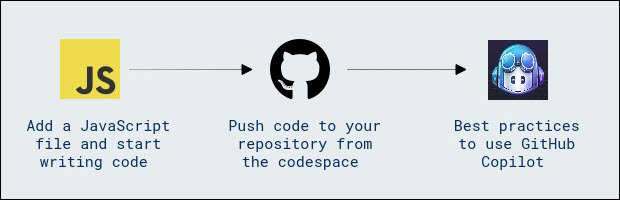

# Getting Started with Your Code Suggestions with GitHub Copilot in Codespaces using VS Code

## Overall Estimated Duration: 60 minutes

## Overview

This lab introduces you to using GitHub Copilot within Codespaces in Visual Studio Code to enhance your coding workflow. GitHub Copilot is an AI-powered code completion tool that assists developers by suggesting whole lines or blocks of code as they type, making the coding process faster and more efficient. In this lab, you will learn how to set up and use GitHub Copilot in a Codespace, explore its various features, and understand how to leverage its capabilities to improve your productivity and code quality. By the end, you'll be familiar with integrating AI-driven code suggestions into your development environment seamlessly.

## Objective

**Code Suggestions with GitHub Copilot in Codespaces using VS Code**: Understand how to use GitHub Copilot within Visual Studio Code in GitHub Codespaces to receive AI-powered code suggestions that enhance coding efficiency and productivity, generate and complete code snippets, and learn to critically evaluate these suggestions to ensure they meet best practices for quality, readability, and security while effectively managing code changes with Git and collaborating through GitHub repositories.

## Pre-Requisites

Participants should have: Basic knowledge and understanding of the following

- **GitHub Account**: A valid GitHub account. Ensure that you are logged into your GitHub account to access GitHub Codespaces and Copilot.
- **Basic Knowledge of Git and GitHub**: Familiarity with Git version control system and basic GitHub concepts like repositories, branches, commits, and pull requests.

## Architecture

In this hands-on lab, the architecture flow includes several essential components. You’ll begin by setting up a development environment using GitHub Codespaces, which provides a cloud-based, customizable workspace with integrated development tools. Next, you'll create a new JavaScript file within the Codespace, link it to an HTML file, and write JavaScript code that interacts with the web page's DOM. The code is managed using Git, allowing for version control and collaboration. You will perform Git operations (`add`, `commit`, `push`) to save your changes and push them to a remote GitHub repository. Throughout the development process, GitHub Copilot will provide AI-powered code suggestions to enhance productivity and maintain high code quality. The architecture integrates development, version control, collaboration, and AI assistance, ensuring a streamlined and efficient workflow.

## Architecture Diagram

## Explanation of Components

1. **GitHub Codespaces**: This is a cloud-based development environment that provides a fully configured, containerized version of Visual Studio Code. Codespaces allow developers to work on their code from anywhere with consistent setups, reducing the "it works on my machine" problem. Codespaces also integrate seamlessly with GitHub repositories, making it easy to clone repositories, work on branches, and manage version control within the cloud environment.

2. **Visual Studio Code (VS Code)**: As the primary code editor in this lab, VS Code provides a feature-rich environment with built-in support for various programming languages, debugging, and extensions. It is used for writing, testing, and debugging JavaScript and other code, with the additional support of extensions like GitHub Copilot to enhance coding productivity. VS Code's intuitive interface and powerful tools, such as IntelliSense, integrated terminal, and source control management, are essential for a smooth development experience.

3. **GitHub Copilot**: GitHub Copilot is an AI-powered code completion tool developed by GitHub in collaboration with OpenAI. It provides real-time code suggestions, autocompletes lines or blocks of code, generates entire functions, and even suggests tests based on the code context. Copilot is particularly useful in this lab for generating code quickly, learning new syntax, and speeding up development by reducing repetitive tasks. It integrates directly into VS Code and can be enabled and configured through its extension marketplace.

4. **Git**: Git is a distributed version control system that is essential for managing code changes and collaboration. In this lab, Git is used within Codespaces to perform operations like `git add`, `git commit`, `git push`, and `git pull` to track changes, maintain code history, and synchronize code with the remote repository on GitHub. This ensures that all code changes are versioned and that developers can collaborate effectively within a shared repository.

## Getting Started with the Lab

Once the environment is provisioned, a virtual machine (JumpVM) and lab guide will get loaded in your browser. Use this virtual machine throughout the workshop to perform the lab. You can see the number on the bottom of the Lab guide to switch to different exercises of the lab guide.
 
## Accessing Your Lab Environment
 
Once you're ready to dive in, your virtual machine and lab guide will be right at your fingertips within your web browser.
 
   

### Virtual Machine & Lab Guide
 
Your virtual machine is your workhorse throughout the workshop. The lab guide is your roadmap to success.
 
## Exploring Your Lab Resources
 
To get a better understanding of your lab resources and credentials, navigate to the **Environment** Details tab.
 
a.png)

b.png)
## Utilizing the Split Window Feature
 
For convenience, you can open the lab guide in a separate window by selecting the **Split Window** button from the Top right corner.
 

 
## Managing Your Virtual Machine
 
Feel free to start, stop, or restart your virtual machine as needed from the **Resources** tab. Your experience is in your hands!
 

 
## Support Contact

The CloudLabs support team is available 24/7, 365 days a year, via email and live chat to ensure seamless assistance at any time. We offer dedicated support channels tailored specifically for both learners and instructors, ensuring that all your needs are promptly and efficiently addressed.

Learner Support Contacts:

- Email Support: cloudlabs-support@spektrasystems.com

- Live Chat Support: https://cloudlabs.ai/labs-support

Now, click on Next from the lower right corner to move on to the next page.

.png)

### Happy Learning!!