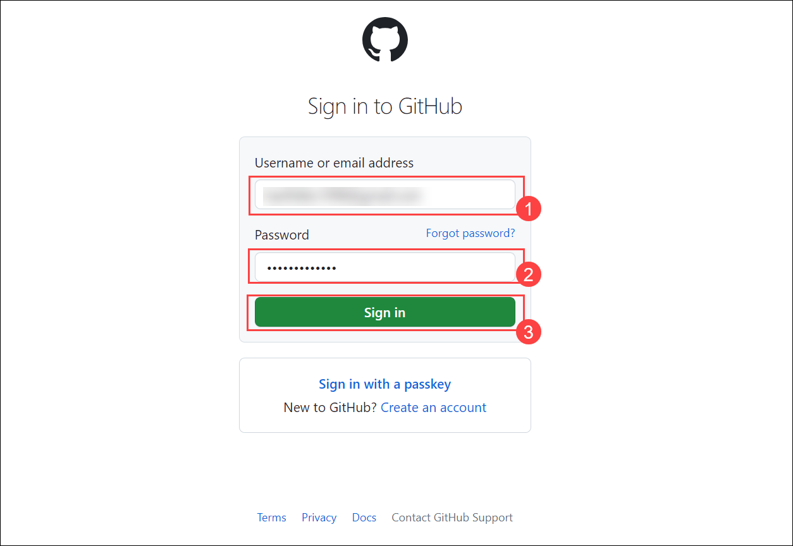
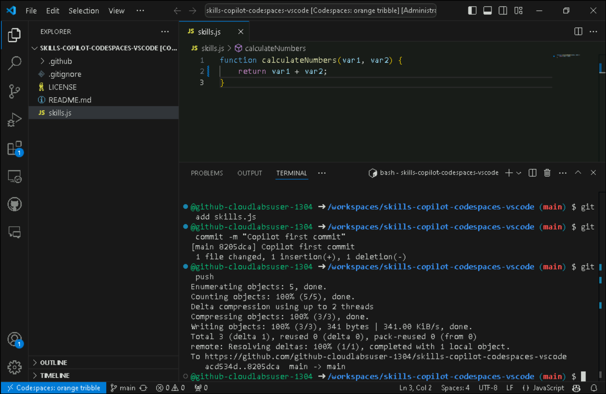
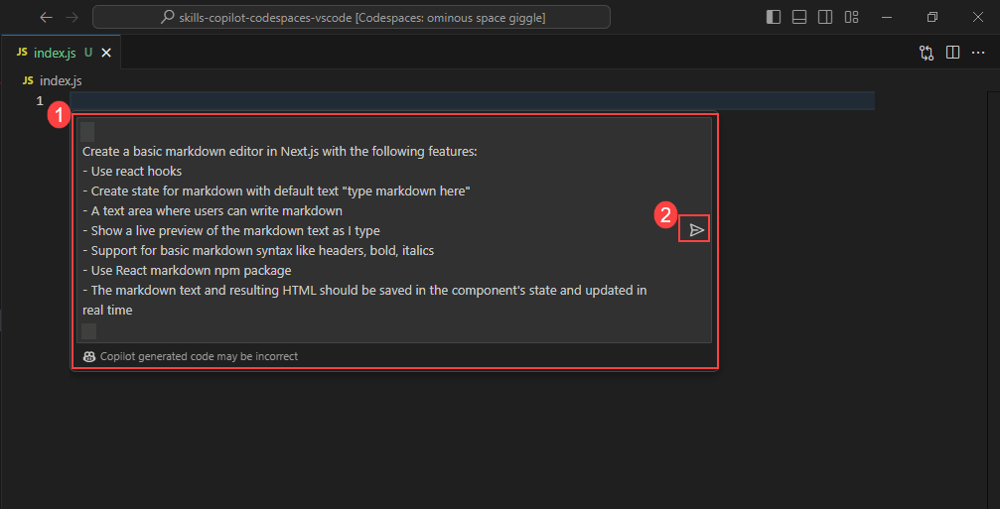

# Hands-On Lab: Code Suggestions with GitHub Copilot in Codespaces using VS Code

## Estimated Duration: 60 minutes

While GitHub Copilot offers recommendations for many languages and frameworks, it excels in particular when it comes to Python, JavaScript, TypeScript, Ruby, Go, C#, and C++. The samples below are in JavaScript, but they should also work in other languages.

In this lab, you will have the opportunity to experiment with and apply JavaScript with the assistance of GitHub Copilot and GitHub Copilot Chat.

>**Disclaimer**: A whole function body will be automatically suggested by GitHub Copilot in gray text. Here's an example of what you are likely to see; however, the precise recommendation could vary.If you do not see code recommendation, try adding a space after the code. 

## Lab objectives

In this lab, you will complete the following tasks:

- Task 1: Add a JavaScript file and start writing code
- Task 2: Push code to your repository from the codespace
- Task 3: Best practices to use GitHub Copilot

### Task 1: Add a JavaScript file and start writing code

1. In the LABVM desktop double-click on **Microsoft Edge**.

   

1. Navigate to GitHub login page using the provided URL below:
   ```
   https://github.com/login
   ```
   
1. On the **Sign in to GitHub** tab, you will see the login screen. In that screen, enter the  **email** **(1)** and **password** **(2)**. Then click on **Sign in** **(3)**. 

   

   >**Note:** Once the lab has been deployed successfully, navigate to the **Environment** tab to view the key-value pairs of the **GitHub UserEmail**, and **GitHub Password**. You can use the copy buttons under the actions column to have the values copied instantly. Alternatively, it is suggested to have the values copied over onto a notepad for easy accessibility. 

     
   
   >**Note:** If you're unable to copy the username and password, please type them manually to proceed further.
          
1. Navigate to Outlook login page using the provided URL below:
   ```
   https://outlook.office365.com/mail/
   ```
1. Next, to get the authentication code, sign in to Outlook with the git credentials within the Environment tab from the previous step. Once you have logged into Outlook, find the recent email containing the verification code. Enter the verification code, and click on **Verify**.

   >**Note:** The email containing the verification code can sometimes creep into the archive/spam folders within your Outlook.

   

1. Right-click on the **Start course** given below, click on the **Copy link**, and navigate to the link inside LabVM in the Edge browser where you have logged into GitHub in the previous steps.

   <!-- For start course, run in JavaScript:
   'https://github.com/new?' + new URLSearchParams({
     template_owner: 'skills',
     template_name: 'copilot-codespaces-vscode',
     owner: '@me',
     name: 'skills-copilot-codespaces-vscode',
     description: 'My clone repository',
     visibility: 'public',
   }).toString()
   -->

   [](https://github.com/new?template_owner=skills&template_name=copilot-codespaces-vscode&owner=%40me&name=skills-copilot-codespaces-vscode&description=My+clone+repository&visibility=public)
   
1. In the new tab, most of the prompts will automatically fill in for you. Leave default for the owner, as you have already logged into GitHub to host the repository **(1)**. Select **Public** repository **(2)** and click the **Create repository** **(3)** button at the bottom of the form.

   

   >**Note**: If the repository is already exists, please delete the existing one and perform the above step again.

1. After your new repository is created, wait about 20 seconds and then refresh the page.

1. Once the repository is created, click on your profile picture and then select **Your organizations**.

   

1. In "Your organization", from the left navigation pane, select **Codespaces**.

   

1. Scroll down and make sure, **Visual Studio Code** is selected, under the **Editor preference** .

     

1. Navigate back to the home page of your repository by clicking the **Code** **(1)** tab located at the top left of the screen. Click the **Code** **(2)** button located in the middle of the page. 

     

1. Click the **Codespaces (1)** tab on the box that pops up and then click the **+ (2)** button.

   >**Note**: If in case you have any existing running codespaces, right click on **...** existing Codespaces and then **Delete.**
   
    

   >**Note**: If in case pop-up prompt doesn't appear in the browser to open Visual Studio code, manually launch Visual Studio code from the desktop and close it. Next, return to the browser, refresh the page and launch the codespace that was previously created.

1. You will encounter a pop-up prompt. Click **Open** to proceed. Subsequently, another pop-up window will appear within Visual Studio Code (VS Code), where you should once again select **Install Extension and Open URI** to continue.

   

   

1. At the bottom right corner, you will get a prompt to sign in to GitHub.

   

   >**Note:** If you do not get the sign-in prompt within Visual Studio Code, click on **Allow** in the pop-up that appears which will open a window in the browser, refresh the screen and click on **Open** in the pop-up that appears.

1. Next, once you get the popup, click on **Allow**

   

   >**Note**: Wait about 2 minutes for the codespace to spin itself up.

1. Click **Authorize Visual-Studio-Code** once the Authorize GitHub for VS code tab appears in the browser.

1. Verify your codespace is running. Make sure the VS code looks as shown below:

   

1. Click on **Extensions** **(1)** from the left menu, and the **GitHub Copilot** **(2)** extension should show up in the VS Code extension list. Click the Copilot extension and verify its installation as shown below:

   

   >**Note**: If the GitHub Copilot extension is not installed, click on Install. If prompted to **Sign In** click on **Sign In** to authorize with your github account.

1. From the VS Code Explorer window, create a New File.

   

2. Name the file `skills.js` and verify your new file looks as shown below:

   

3. In the `skills.js` file, type the following function header:

   ```
   function calculateNumbers(var1, var2)
   ```
   
   > **Note**: A whole function body will be automatically suggested by GitHub Copilot in gray text. Here's an example of what you are likely to see; however, the precise recommendation could vary. If you do not see code recommendation, try adding a space after the code. If still the suggestions are not visible close the visual studio and then re-open it again. 

   .png)

   >**Note:** Suggestions may not be exactly as shown in the picture, but they could be similar.

4. Press `Tab` to accept the suggestion and then press `Ctrl + S` to save the file.

   .png)

### Task 2: Push code to your repository from the codespace

In this task, you will use the VS Code terminal to add the `skills.js` file to the GitHub repository.

1. Open VS Code Terminal by clicking on **Ellipsis (...)** **(1)**, select **Terminal** **(2)** and click on **New Terminal** **(3)**.

   

2. Run the below command to add the `skills.js` file to the GitHub repository.

   ```
   git add skills.js
   ```

3. Next, from the VS Code terminal stage, commit the changes to the repository:

   ```
   git commit -m "Copilot first commit"
   ```

4. Finally, from the VS Code terminal, push the code to the repository:

   ```
   git push
   ```

   

   >**Note**: Wait about 60 seconds, then refresh your GitHub repository landing page for the next step.


### Task 3: Best practices to use GitHub Copilot

### Verify GitHub Copilot Chat extension in VS Code

1. To Verify the GitHub Copilot Chat extension, the following steps are to be performed within Visual Studio Code:
    - Click on the **Extensions (1)** icon in the activity bar present on the left side of the Visual Studio Code Window.
    - In the "Search Extensions in Marketplace" search box, type and search for the **GitHub Copilot Chat (2)** extension.
    - Select **GitHub Copilot Chat (3)** from the list of results that show up, and verify that **GitHub Copilot Chat** has been installed.
    - If not, click on the **Install (4)** button.

   

1. Once the installation is complete, at the top beside the search bar you will able to see the **icon (1)** for GitHub Copilot Chat as shown below. Also to open the chat click on **Open chat (2)**

   

## Task 3.1- Example: Set the stage with a high-level goal

This is most helpful if you have a blank file or an empty codebase. In other words, it can be quite helpful to set the stage for the AI pair programmer if GitHub Copilot has no idea what you want to build or achieve. It helps to prime GitHub Copilot with a big-picture description of what you want it to generate—before you jump in with the details.

When prompting GitHub Copilot, think of the process as having a conversation with someone: How should I break down the problem so we can solve it together? How would I approach pair programming with this person?

1. From the VS Code Explorer window, create a New File.

   

2. Name the file `index.js` and verify your new file looks as shown below:

   

3. Now press `Ctrl + I` to open the GitHub Copilot Chat and paste the following **comments (1)** to create a basic markdown editor and click on **Make request (Enter) (2)** button.

   ```
   Create a basic markdown editor in Next.js with the following features:
   - Use react hooks
   - Create a state for markdown with the default text "type markdown here"
   - A text area where users can write markdown 
   - Show a live preview of the markdown text as I type
   - Support for basic markdown syntax like headers, bold, and italics 
   - Use React markdown npm package 
   - The markdown text and resulting HTML should be saved in the component's state and updated in real-time 
   ```

   

4. This will prompt GitHub Copilot to generate the following code in the image and produce a very simple, unstyled, but functional markdown editor. Now you can clear the contents of index.js file by clicking on **Accept**, then **Cntrl + a** and delete. Now you can proceed with the next tasks.

   .png)

   >**Note:** Suggestions may not be exactly as shown in the picture, but they could be similar.


## Task 3.2- Example: Aim to receive a short output from GitHub Copilot for a simple and specific ask

After you've explained your primary objective to the AI pair programmer, explain the reasoning and procedures it must take to reach that objective. This will help GitHub Copilot gain a clearer understanding of your intended outcome when you break things down. For example, imagine you’re writing a recipe. Rather than writing a paragraph outlining the food you intend to make, you would break down the cooking procedure into distinct parts.
So, instead of asking GitHub Copilot to generate a large amount of code at once, let it generate the code after each step.

1. At the top beside search bar click on **Github copilot icon** and then open a new chat , enter the below step-by-step instructions for reversing a sentence.

    ```
      // take a sentence as input
      // reverse the input sentence
      // the start of the sentence must start with a capital
      // for javascript
    ```

2. The generated outcome would look similar to the below image.

   


## Task 3.3- Example: Give GitHub Copilot an example or two

Not only can people benefit from learning from examples, but so can your AI pair programmer. For example, in order to take the names out of the data array below and put them in a
new array:

```
const data = [
[
   { name: 'John', age: 25 },
   { name: 'Jane', age: 30 }
],
[
   { name: 'Bob', age: 40 }
]
];
```

1. Type the below comment in the chat to generate the output without showing an example to GitHub Copilot.

   ```
    // As an illustration, pull names out of the data array  
   ```

2. It generated an incorrect usage of the map.

   

3. By contrast, type the below comments to provide an example of how to generate the desired output.

    ```
      // Map through an array of arrays of objects
      // Example: Extract names from the data array
      // Desired outcome: ['John', 'Jane', 'Bob']    
    ```

4. Now, we have received our desired outcome. You can copy the desired outcome suggested by Copilot paste it in **index.js** and then **Cntr + S** to save the file.

   

   >**Note:** Suggestions may not be exactly as shown in the picture, but they could be similar.

6. Open the **New Terminal** to push the code.

7. Run the below command to pull the latest changes.

   ```
   git pull
   ```

1. Run the below command to add the `index.js` file to the GitHub repository.
   
   ```
   git add index.js
   ```

8. Next from the VS Code terminal, commit the changes to the repository:

   ```
   git commit -m "Copilot commit"
   ```

9. Finally, from the VS Code terminal, push the code to the repository:

   ```
   git push
   ```

   >**Note**: Wait about 60 seconds, then refresh your GitHub repository landing page for the next step.

<validation step="4beb3a8b-c0f8-4ba4-8115-89d05107f2e5" />
   
> **Congratulations** on completing the task! Now, it's time to validate it. Here are the steps:
> - If you receive a success message, you can proceed to the next task.
> - If not, carefully read the error message and retry the step, following the instructions in the lab guide. 
> - If you need any assistance, please contact us at labs-support@spektrasystems.com. We are available 24/7 to help you out.
 
### Summary

In this lab, you have successfully generated JavaScript code and other best practices using GitHub Copilot and GitHub Copilot Chat.
