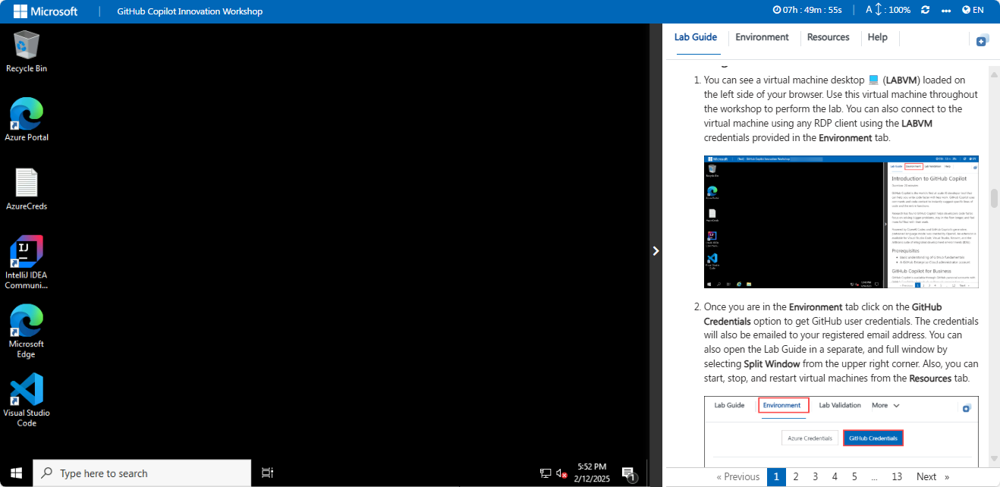
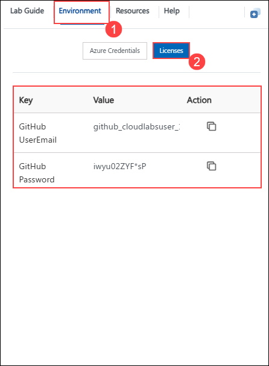

# GitHub Copilot Innovation Workshop

### Overall Estimated Duration: 30 Minutes

## Overview

The purpose of this lab is to explore how AI tools like GitHub Copilot and GitHub Codespaces enhance the development process. By providing contextual suggestions and creating consistent, cloud-hosted development environments, these tools streamline coding and improve efficiency. The lab focuses on various features and applications of GitHub Copilot, demonstrating how it can assist with real-time code completions, bug detection, and optimizations across different programming languages and development tasks.

## Objective

By the end of this lab, you will improve your coding workflow by leveraging AI-powered tools. You will:

- **Leverage Codespaces with VS Code for Copilot**: This hands-on exercise suggests code from comments and context, supports multiple editors and languages, and integrates with GitHub Codespaces for collaborative coding. As a result of enabling Copilot in Codespaces, you will experience increased productivity with real-time code suggestions, improved code quality, and accelerated learning and onboarding.

## Pre-requisites

Fundamental knowledge of **Visual Studio Code** and popular **programming languages** such as Python, Javascript, C# etc.

## Architecture

GitHub Copilot is an AI-powered code completion tool that assists developers by suggesting code snippets and completing code based on the context provided. GitHub Copilot Chat complements this by offering an interactive chat interface where developers can ask questions and receive code suggestions and debugging assistance. Integrated with Visual Studio Code Codespaces, GitHub Copilot benefits from cloud-hosted development environments, ensuring consistency and reliability from anywhere. To enhance web development, Accessibility Insights for Web helps identify and resolve accessibility issues, ensuring inclusive web applications. GitHub Copilot supports various programming languages like Python, JavaScript, and C#, making it a versatile tool for a wide range of coding tasks.

## Architecture Diagram

   

## Explanation of Components

1. **GitHub Copilot**: An AI-powered code completion tool that helps developers by suggesting code snippets and completing code based on the context provided. 

1. **GitHub Copilot Chat**: An interactive chat interface that allows developers to ask questions and receive code suggestions and debugging assistance from GitHub Copilot. 

1. **Codespaces**: Visual Studio Code Codespaces provides cloud-hosted development environments that are accessible from anywhere, ensuring consistency and reliability.

1. **Accessibility Insights for Web**: A browser extension that helps developers find and fix accessibility issues in web applications. 

1. **Programming languages**: They are tools used to write instructions for computers to execute such as Python, Javascript, C# etc.

# Getting Started with the Lab

Welcome to your GitHub Copilot Innovation workshop! We've prepared a seamless environment for you to explore and learn GitHub Copilot Services. Let's begin by making the most of this experience:

## Accessing Your Lab Environment
 
Once you're ready to dive in, your virtual machine and lab guide will be right at your fingertips within your web browser.
   
   

### Virtual Machine & Lab Guide
 
Your virtual machine is your workhorse throughout the workshop. The lab guide is your roadmap to success.

## Exploring Your Lab Resources
 
To get a better understanding of your lab resources and credentials, navigate to the **Environment** tab. Once you are in the **Environment (1)** tab click on the **Licenses (2)** option to get GitHub user credentials. The credentials will also be emailed to your registered email address.
 
   

## Utilizing the Split Window Feature
 
For convenience, you can open the lab guide in a separate window by selecting the **Split Window** button from the top right corner.
 

 
## Utilizing the Zoom In/Out Feature

To adjust the zoom level for the environment page, click the A↕ : 100% icon located next to the timer in the lab environment.

## Managing Your Virtual Machine
 
Feel free to **start**, **stop**, or **restart** your virtual machine as needed from the **Resources** tab. Your experience is in your hands!
 

## Support Contact

1. The CloudLabs support team is available 24/7, 365 days a year, via email and live chat to ensure seamless assistance at any time. We offer dedicated support channels tailored specifically for both learners and instructors, ensuring that all your needs are promptly and efficiently addressed.

   Learner Support Contacts:

   - Email Support: cloudlabs-support@spektrasystems.com
   - Live Chat Support: https://cloudlabs.ai/labs-support

1. Now, click on Next from the lower right corner to move on to the next page.
   
## Happy Learning!!
